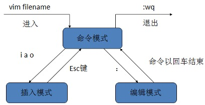
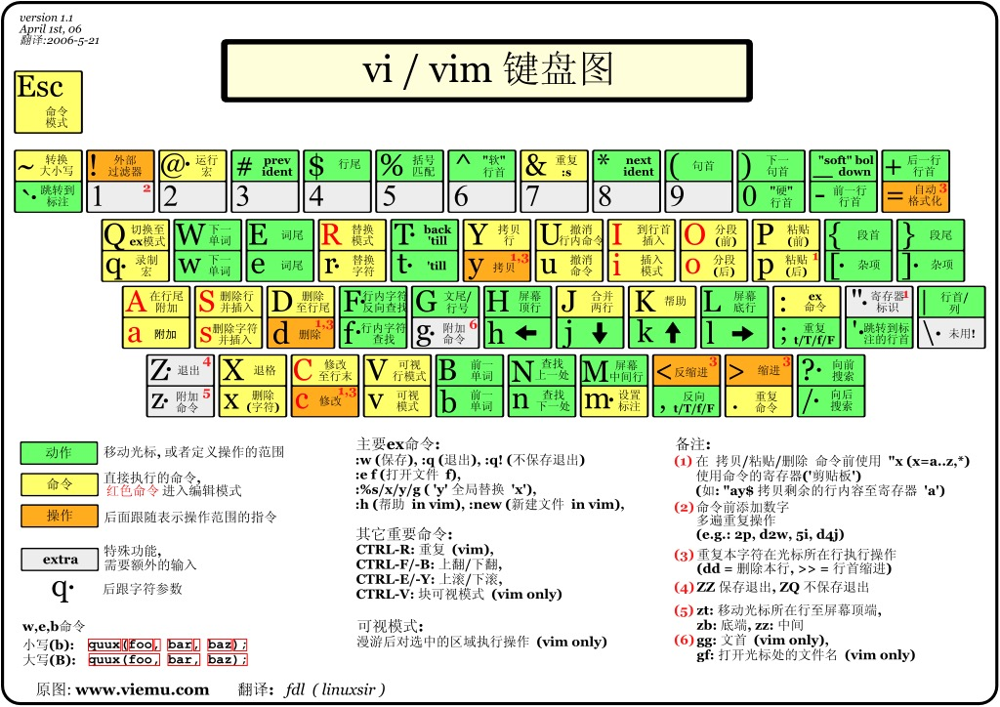

# Vim基础[b,white,center]

[center]

>[TOC]

## 一、Vim简介[b,white]

所有的 *Unix Like* 系统都会内建Vi文书编辑器，其他的文书编辑器则不一定会存在，而目前使用最广泛的是 Vim 编辑器，Vim是从Vi发展出来的一个文本编辑器，代码补完、编译及错误跳转等方便编程的功能特别丰富，在程序员中被广泛使用Vim简单的来说，Vi是老式的字处理器，不过功能已经很齐全了，但是还是有可以进步的地方，Vim则可以说是程序开发者的一项很好用的工具；Vim 的[官方网站](http://www.vim.org)上描述Vim是一个程序开发工具而不是文字处理软件


- - - - - 

## 二、Vim的工作模式[b,white]

Vim的工作模式有三种模式，分别是：
- 命令模式（Command mode）
- 插入模式（Insert mode）
- 底线命令模式/编辑模式（Last line mode）
三种模式之间的关系如下图所示：

[center]

我们使用`vim`打开一个文件后，就进入了命令模式，这时敲击键盘并不能对文件进行修改，因为系统会识别为**命令**，敲击$i$、$a$或$o$后，会进入**插入模式**，这时候我们就可以对文件进行修改；修改完成后，我们就可以按Esc键回到命令模式；而如果要从命令模式转入编辑模式，只需要按`:`即可，在输入完命令后，回车即可结束并退出文件

- - - - - 
## 三、插入命令[white,b]

```table
命令 | 	作用
a	| 在光标后附加文本
A（shift + a）	| 在本行行末附加文本（行尾）
i	| 在光标前插入文本
I（shift+i）	| 在本行开始插入文本（行首）
o	| 在光标下插入新行
O（shift+o）	| 在光标上插入新行
```

- - - - - 

## 四、定位命令[white,b]
```table
命令 |	作用
:set nu |	设置行号
:set nonu | 取消行号
gg | 到第一行
G | 到最后一行
nG	| 到第n行
:n	| 到第n行
```
- `:Set nu`
[center]

图4.1：使用`:set nu`后界面的变化[center,white,b]

- `:set nonu`

[center]

图4.2：使用`:set nu`后界面的变化[center,white,b]

- `gg`
[center]
图4.3：使用`gg`将光标从第4行移动到第1行[center,white,b]
- `G`

[center]
图4.4：使用`G`将光标从第1行移动到最后一行[center,white,b]

- `nG`
[center]
图4.5：使用`4G`使光标跳转到第4行[center,white,b]
- `:n`
[center]
图4.6：使用`:4`使光标跳转到第4行[center,white,b]

- - - - - 

## 五、保存和退出命令[b,white]

```table
命令 | 作用
:w | 保存修改
:w new_filename | 另存为指定文件
:w >> a.txt | 内容追加到 a.txt 文件中（文件需存在）
:wq | 保存修改并退出
shift+zz(ZZ) | 快捷键，保存修改并退出
:q! | 不保存修改退出
:wq! | 保存修改并退出（文件所有者可忽略文件的只读属性）
```
- - - - - 
## 六、删除命令[b,white]

```table
命令 | 作用
x | 删除光标所在处字符（nx删除光标所在处后n个字符）
dd |删除光标所在行（ndd删除n行）
:n1,n2d |删除指定范围的行（eg :1,3d 删除了 123 这三行）
dG |删除光标所在行到末尾的内容
D |删除从光标所在处到行尾
```

- `x`与`nx`

[center]

图6.1：使用`x`删除一个字符（中）和使用`5x`删除5个字符（右图）[center,white,b]

- `dd`与`ndd`

[center]
图6.2：使用`dd`删除第一行（中）和`3dd`删除三行（右图）[center,white,b]

- `:n1,n2d`

[center]

图6.3：使用`:2,4d`删除第二行到第四行[center,white,b]

- `dG`
[center]

图6.4：使用`dG`删除第3行到文末的所有内容[center,white,b]

- `D`
[center]
图6.5：使用`D`删除第3行的内容[center,white,b]


- - - - - 

## 七、复制和剪切命令[b,white]

```table
命令 | 作用
yy、Y |复制当前行
nyy、nY |复制当前行以下 n 行
dd | 剪切当前行
ndd | 剪切当前行以下 n 行
p、P | 粘贴在当前光标所在行下（p）或行上（P）
```

- `p`与`P`的区别，如下图中，将光标定位在第4行后，分别使用`p`（左图）和`P`（右图）：

[center]

- - - - - 

## 八、替换和取消命令[b,white]
```table
命令  | 作用
r |取代光标所在处字符
R（shift + r） |从光标所在处开始替换字符，按Esc结束
u |undo,取消上一步操作
ctrl+r |redo,返回到 undo 之前
```

- - - - -  

## 九、搜索和替换命令[b,white]

```table
命令 | 作用
/string | 向后搜索指定字符串 搜索时忽略大小写 :set ic
?string | 向前搜索指定字符串
n |搜索字符串的下一个出现位置,与搜索顺序相同
N(Shift + n) |搜索字符串的上一个出现位置,与搜索顺序相反
:%s/old/new/g |全文替换指定字符串
:n1,n2s/old/new/g | 在一定范围内替换指定字符串
```

- `:%s/old/new/g`

[center]
图9.1：使用`:%s/CMD/HHH/g`将文件中的CMD替换为HHH[white,center,b]

- 注意：`%`指全文，`s`指开始，`g`指全局替换
- 使用替换命令来添加删除注释：
    - `:% s/^/#/g`：在全部内容的行首添加`#`号注释
    - `:1,10 s/^/#/g`：在1到10行的行首添加`#`号注释
- - - - - 


## 十、可视化模式[white,b]

### 1、可视字符模式[white,b]
使用`v`即可进入可视字符模式，这个模式下相当于鼠标按住左键拖动选定的功能，如下图所示，为进入可视字符模式后，连续按3次向上的方向键得到的界面

[center]
图10.1.1：可视字符模式[white,b,center]

### 2、可视行模式[white,b]

使用`V`即可进入可视行模式，这个模式下可以选择多行同时操作

### 3、可视块模式（列模式）[white,b]

使用`ctrl + v`即可进入可视块模式，这个模式下可以选择多列同时操作，如下图所示，为进入可视块模式后，连续按2次向右箭头，再连续按3次向下箭头得到的界面，如果再使用`d`就可以把右图高亮的那一部分删除
[center]
图10.1.3：可视块模式[white,b,center]

- - - - - 
## 十一、Vim快捷键键位图[white,b]

下面几张图为`Vim`的健位图，图片来自[https://www.runoob.com/w3cnote/all-vim-cheatsheat.html](https://www.runoob.com/w3cnote/all-vim-cheatsheat.html)

[center]


**结语：**`Vim`博大精深，不仅仅是一款文字编辑器，如果能熟练使用，一定会达到事倍功半的效果.[b,white]