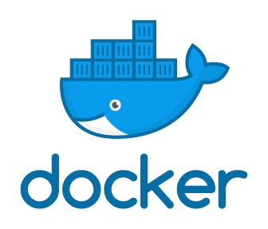

# 《Docker基础》学习笔记[center,b,black]
[center]

> [TOC]

## 一、Docker简介[b,black]

### 1、docker是什么[b,black]
Docker是基于Go语言实现的云开源项目，主要目标是“Build, Ship and Run Any App, Anywhere”，也就是通过对应用组件的封装、分发、部署、运行等生命周期的管理，使用户的APP（可以是一个WEB应用或数据库应用等等）及其运行环境能够做到  “一次封装，到处运行”。 Linux 容器技术的出现就解决了这样一个问题，而 Docker 就是在它的基础上发展过来的。将应用运行在 Docker 容器上面，而 Docker 容器在任何操作系统上都是一致的，这就实现了跨平台、跨服务器。  只需要一次配置好环境，换到别的机子上就可以一键部署好，大大简化了操作 

### 2、docker与虚拟机的区别[b,black]
- 虚拟机（virtual machine）是带环境安装的一种解决方案。它可以在一种操作系统里面运行另一种操作系统，比如在Windows 系统里面运行Linux 系统。应用程序对此毫无感知，因为虚拟机看上去跟真实系统一模一样，而对于底层系统来说，虚拟机就是一个普通文件，不需要了就删掉，对其他部分毫无影响。这类虚拟机完美的运行了另一套系统，能够使应用程序，操作系统和硬件三者之间的逻辑不变。 虚拟机的缺点有： 1、资源占用多，2、冗余步骤多  3、启动慢 （分钟级）
- 由于前面虚拟机存在这些缺点，Linux 发展出了另一种虚拟化技术：Linux 容器（Linux Containers，缩写为 LXC）； Linux 容器不是模拟一个完整的操作系统  ，而是对进程进行隔离。有了容器，就可以将软件运行所需的所有资源打包到一个隔离的容器中。容器与虚拟机不同，不需要捆绑一整套操作系统，只需要软件工作所需的库资源和设置。系统因此而变得高效轻量并保证部署在任何环境中的软件都能始终如一地运行。 
- 比较Docker 和传统虚拟化方式的不同之处： 
    - 传统虚拟机技术是虚拟出一套硬件后，在其上运行一个完整操作系统，在该系统上再运行所需应用进程； 
    - 而容器内的应用进程直接运行于宿主的内核，容器内没有自己的内核，  而且也没有进行硬件虚拟  。因此容器要比传统虚拟机更为轻便
    - 每个容器之间互相隔离，每个容器有自己的文件系统 ，容器之间进程不会相互影响，能区分计算资源。

### 3、Docker下载[b,black]
- docker官网：http://www.docker.com
- docker中文网站：https://www.docker-cn.com/
- Docker Hub官网: https://hub.docker.com/

- - - - - 
## 二、Docker初步[b,black]

### 1、docker基本组成[b,black]
docker主要由三部分组成：镜像（image）、容器（container）、仓库（repository）
- 镜像：Docker 镜像（Image）就是一个只读的模板，可以用来创建 Docker 容器，  一个镜像可以创建很多容器 
- 容器：Docker 利用容器（Container）独立运行的一个或一组应用。  容器是用镜像创建的运行实例，它可以被启动、开始、停止、删除。每个容器都是相互隔离的、保证安全的平台。可以把容器看做是一个简易版的 Linux 环境  （包括root用户权限、进程空间、用户空间和网络空间等）和运行在其中的应用程序。 容器的定义和镜像几乎一模一样，也是一堆层的统一视角，唯一区别在于容器的最上面那一层是可读可写的。 
- 仓库：仓库（Repository）是集中存放镜像文件的场所。 仓库(Repository)和仓库注册服务器（Registry）是有区别的。仓库注册服务器上往往存放着多个仓库，每个仓库中又包含了多个镜像，每个镜像有不同的标签（tag）。仓库分为公开仓库（Public）和私有仓库（Private）两种形式。 最大的公开仓库是 Docker Hub(https://hub.docker.com/) ， 存放了数量庞大的镜像供用户下载。国内的公开仓库包括阿里云 、网易云 等 
 需要正确的理解仓储/镜像/容器这几个概念: 
  
 **小结**：Docker 本身是一个容器运行载体或称之为管理引擎。我们把应用程序和配置依赖打包好形成一个可交付的运行环境，这个打包好的运行环境就似乎 image镜像文件。只有通过这个镜像文件才能生成 Docker 容器。image 文件可以看作是容器的模板。Docker 根据 image 文件生成容器的实例。同一个 image 文件，可以生成多个同时运行的容器实例。image 文件生成的容器实例，本身也是一个文件，称为镜像文件。 一个容器运行一种服务，当我们需要的时候，就可以通过docker客户端创建一个对应的运行实例，也就是我们的容器。至于仓储，就是放了一堆镜像的地方，我们可以把镜像发布到仓储中，需要的时候从仓储中拉下来就可以了。 
 
### 2、永远的Hello World[b,black]
我们使用命令`docker run hello-word`，得到的界面为：

[center]
可以看出，docker先尝试在本地寻找时候有hello-world这个镜像，如果没有，则从Hub上拉下Hello-world的镜像并运行

### 3、底层原理[b,black]

#### （1）Docker是怎么工作的[b,black]
Docker是一个Client-Server结构的系统，Docker守护进程运行在主机上， 然后通过Socket连接从客户端访问，守护进程从客户端接受命令并管理运行在主机上的容器，而容器是一个运行时环境，就是我们前面说到的集装箱

#### （2）为什么Docker比虚拟机快[b,black]
- docker有着比虚拟机更少的抽象层。由亍docker不需要Hypervisor实现硬件资源虚拟化,运行在docker容器上的程序直接使用的都是实际物理机的硬件资源。因此在CPU、内存利用率上docker将会在效率上有明显优势。 
- docker利用的是宿主机的内核,而不需要Guest OS。因此,当新建一个容器时,docker不需要和虚拟机一样重新加载一个操作系统内核。仍而避免引寻、加载操作系统内核返个比较费时费资源的过程,当新建一个虚拟机时,虚拟机软件需要加载Guest OS,返个新建过程是分钟级别的。而docker由于直接利用宿主机的操作系统,则省略了返个过程,因此新建一个docker容器只需要几秒钟。 
  
  
- - - - - 

## 三、Docker常用命令[b,black]

### 1、帮助命令[b,black]

- `docker version`：查看docker版本
[center]

- `docker info`：查看docker的详细信息：
[center]

- `docker --help`：docker帮助文档
[center]

### 2、镜像命令[b,black]

#### （1）docker images[b,black]
- 作用：列出本地主机上的镜像
    - REPOSITORY：表示镜像的仓库源  
    - TAG：镜像的标签
    - IMAGE ID：镜像ID
    - CREATED：镜像创建时间
    - SIZE：镜像大小   
[center]

- 选项：
    - `-a`：列出本地所有的镜像（含中间映像层）
    - `-q`：只显示镜像ID
    - `--digests`：显示镜像的摘要信息
    - `--no-trunc`：显示完整的镜像信息

#### （2）docker search[b,black]
- 作用：从Docker Hub上查找镜像
    - NAME：镜像名字
    - DESCRIPTION：镜像描述
    - STARS：类似于Github上的Star
    - OFFICIAL：是否官方发布
    - AUTOMATED：表示是否是自动构建的镜像仓库
[center]
- 选项：
    - `--limit`：限制展示的行数
    - `--no-trunc`：显示完整的镜像信息

#### （3）docker pull[b,black]
- 作用：从Docker Hub上下载镜像
[center]
- 选项：
    - `-a`：下载所有的仓库中所有镜像
    - `-q`：不输出详细信息，只输出精简信息

#### （4）docker rmi[b,black]
- 作用：删除镜像
- 删除单个镜像：`docker rmi  -f 镜像ID`
- 删除多个镜像：`docker rmi -f 镜像名1:TAG 镜像名2:TAG`
- 删除全部镜像：`docker rmi -f $(docker images -qa)`

### 3、容器命令[b,black]

#### （1）新建并启动容器[b,black]

- 命令：`docker run [OPTIONS] IMAGE [COMMAND] [ARG...]`
- 选项：
    -  `--name="容器新名字"`：为容器指定一个名称；
    -  `-d`：后台运行容器，并返回容器ID，也即启动守护式容器；
    -  `-i`：以交互模式运行容器，通常与`-t`同时使用； 
    - `-t`：为容器重新分配一个伪输入终端，通常与`-i`同时使用； 
    - `-P`：随机端口映射； 
    - `-p`：指定端口映射，有以下四种格式 
        - ip:hostPort:containerPort 
        - ip::containerPort 
        - hostPort:containerPort 
        - containerPort 

#### （2）列出当前所有正在运行的容器[b,black]
- 命令：`docker ps [OPTIONS]`；
- 选项：
     - `-a`：列出当前所有正在运行的容器和历史上运行过的容器 
     - `-l`：显示最近创建的容器
     - `-n`：显示最近n个创建的容器
     - `-q`：静默模式，只显示容器编号
     - `--no-trunc`：不截断输出

#### （3）退出容器[b,black]
- `exit`：容器停止运行并退出
- `ctrl+P+Q`：容器不停止运行并退出

#### （4）启动容器[b,black]
- `docker start 容器ID或者容器名`

#### （5）重启容器[b,black]
- `docker restart 容器ID或者容器名`

#### （6）停止容器[b,black]
- `docker stop 容器ID或者容器名`

#### （7）强行停止容器[b,black]
- `docker kill 容器ID或者容器名`

#### （8）删除已停止的容器[b,black]

- `docker rm 容器ID`
- 一次性删除多个容器：
    - `docker rm -f $(docker ps -a -q)`
    - `docker ps -a -q | xargs docker rm`


#### （9）启动守护式容器[b,black]
- 命令：`docker run -d xxx`
- 注意：如果我们使用`docker run -d centos`运行Centos，然后用`docker ps -a`进行查看，会发现容器已经退出 ，这是因为Docker容器后台运行，就必须有一个前台进程；容器运行的命令如果不是那些 一直挂起的命令（比如运行top，tail），就是会自动退出的。 这个是docker的机制问题，比如你的web容器,我们以nginx为例，正常情况下，我们配置启动服务只需要启动响应的service即可。例如`service nginx start`，但是这样做，nginx为后台进程模式运行,就导致docker前台没有运行的应用。 这样的容器后台启动后,会立即自杀因为他觉得他没事可做了；所以，最佳的解决方案是,将你要运行的程序以前台进程的形式运行 
 
#### （10）查看容器日志[b,black]
- 命令：`docker logs -f -t --tail 容器ID`
- 作用：我们用`docker -d`运行容器后，如果容器内有输出，我们可以用`docker logs`进行查询
- 选项：
     - `-t`：加入时间戳 
     - `-f`：跟随最新的日志打印 
     - `--tail 数字`：显示最后多少条 
- 举例：先用命令`docker run -d centos /bin/sh -c "while true;do echo hello zzyy;sleep 2;done"`运行Centos，然后就可以利用`docker logs -t/-f/--tail 容器ID`查询


#### （11）查看容器内运行的进程[b,black]
- 命令：`docker top 容器ID`
[center]


#### （12）查看容器内部细节[b,black]
- 命令：`docker inspect 容器ID`
[center]

#### （13）进入正在运行的容器并以命令行交互[b,black]
- 说明：如果我们使用`docker run -d `或者退出了容器，而容器还在运行，并且我们想进入容器进行交互，这时候就需要下面两个命令进入容器的交互式界面
- 命令：
    - `docker attach 容器ID`：直接进入容器启动命令的终端，不会启动新的进程
    - `docker exec -it 容器ID bashShell`：是在容器中打开新的终端，并且可以启动新的进程

#### （14）从容器内拷贝文件到主机上[b,black]
- 命令：`docker cp  容器ID:容器内路径 目的主机路径`


### 4、常用命令总结[b,black]

```table
命令 | 作用
attach | 当前 shell 下 attach 连接指定运行镜像 
build | 通过 Dockerfile 定制镜像 
commit | 提交当前容器为新的镜像 
cp | 从容器中拷贝指定文件或者目录到宿主机中
create | 创建一个新的容器，同 run，但不启动容器 
diff | 查看 docker 容器变化 
events | 从 docker 服务获取容器实时事件 
exec | 在已存在的容器上运行命令 
export | 导出容器的内容流作为一个 tar 归档文件[对应 import ] 
history | 展示一个镜像形成历史 
images | 列出系统当前镜像 
import | 从tar包中的内容创建一个新的文件系统映像[对应export] 
info  | 显示系统相关信息 
inspect | 查看容器详细信息 
kill  | kill 指定 docker 容器 
load  | 从一个 tar 包中加载一个镜像[对应 save] 
login | 注册或者登陆一个 docker 源服务器 
logout | 从当前 Docker registry 退出 
logs | 输出当前容器日志信息 
port | 查看映射端口对应的容器内部源端口 
pause | 暂停容器 
ps | 列出容器列表 
pull | 从docker镜像源服务器拉取指定镜像或者库镜像 
push | 推送指定镜像或者库镜像至docker源服务器 
restart | 重启运行的容器 
rm | 移除一个或者多个容器 
rmi | 移除一个或多个镜像[无容器使用该镜像才可删除，否则需删除相关容器才可继续或 -f 强制删除] 
run | 创建一个新的容器并运行一个命令
save | 保存一个镜像为一个 tar 包[对应 load] 
search | 在 docker hub 中搜索镜像 
start | 启动容器 
stop  | 停止容器 
tag  | 给源中镜像打标签 
top  | 查看容器中运行的进程信息 
unpause | 取消暂停容器 
version | 查看 docker 版本号 
wait  | 截取容器停止时的退出状态值   
```


- - - - - - 

## 四、Docker镜像[b,black]

镜像是一种轻量级、可执行的独立软件包，用来打包软件运行环境和基于运行环境开发的软件，它包含运行某个软件所需的所有内容，包括代码、运行时、库、环境变量和配置文件

### 1、UnionFS（联合文件系统）[b,black]
- UnionFS（联合文件系统）：Union文件系统（UnionFS）是一种分层、轻量级并且高性能的文件系统，它支持 对文件系统的修改作为一次提交来一层层的叠加，同时可以将不同目录挂载到同一个虚拟文件系统下(unite several directories into a single virtual filesystem)；Union文件系统是Docker镜像的基础；镜像可以通过分层来进行继承，基于基础镜像（没有父镜像），可以制作各种具体的应用镜像
- 特性：一次同时加载多个文件系统，但从外面看起来，只能看到一个文件系统，联合加载会把各层文件系统叠加起来，这样最终的文件系统会包含所有底层的文件和目录 

### 2、Docker镜像加载原理[b,black]
- docker的镜像实际上由一层一层的文件系统组成，这种层级的文件系统UnionFS，而UnionFS可以分为以下两类：
    - bootfs(boot file system)：主要包含bootloader和kernel，bootloader主要是引导加载kernel, Linux刚启动时会加载bootfs文件系统，  在Docker镜像的最底层是bootfs。  这一层与我们典型的Linux/Unix系统是一样的，包含boot加载器和内核。当boot加载完成之后整个内核就都在内存中了，此时内存的使用权已由bootfs转交给内核，此时系统也会卸载bootfs
    - rootfs (root file system) ：在bootfs之上 包含的就是典型 Linux 系统中的 /dev, /proc, /bin, /etc 等标准目录和文件，rootfs就是各种不同的操作系统发行版，比如Ubuntu，Centos等等。  。
- 这也是为什么平时我们安装进虚拟机的CentOS都是好几个G，而docker里CentOS才几百M，这是由于对于一个精简的操作系统，rootfs可以很小，只需要包括最基本的命令、工具和程序库就可以了，因为底层直接用宿主机的kernel，自己只需要提供rootfs就行了。由此可见对于不同的linux发行版，bootfs基本是一致的，rootfs会有差别, 因此不同的发行版可以公用bootfs
 
 [center]

### 3、镜像的分层[b,black]
我们以docker中的tomcat为例，详细解释docker镜像分层的概念，首先在`docker pull tomcat`的过程中，如下图所示，我们可以看到下载的过程是分层下载的
[center]
而最后的tomcat有649MB，之所以这么多，正是由于docker的分层的特点决定的，从下图中可以看出，tomcat要运行，必须有一个kernel，即bootfs，在kernel之上，必须有一个操作系统，例如：CentOS或者Ubuntu，由于tomcat的运行依赖于Java，因此还必须有Java环境，而我们能看到的只是最外面的一个tomcat镜像，而实际上，这个镜像是被docker自下而上进行打包得到的，因此才会有649MB.
[center]

### 4、Docker采用分层结构的原因[b,black]
这种结构最大的一个好处就是共享资源；比如：有多个镜像都从相同的 base 镜像构建而来，那么宿主机只需在磁盘上保存一份base镜像，同时内存中也只需加载一份base镜像，就可以为所有容器服务了。而且镜像的每一层都可以被共享，这也是为什么我们在`docker pull`第一次往往比较慢，而后面我们删除后再`docker pull`相同的镜像非常快的原因

### 5、Docker镜像特点[b,black]
Docker镜像都是只读的，当容器启动时，一个新的可写层被加载到镜像的顶部。这一层通常被称作“容器层”，“容器层”之下的都叫“镜像层”

### 6、Docker镜像的修改与Commit[b,black]
类似于Git，Docker也有`commit`操作，作用是提交容器副本使之成为一个新的镜像，用法为：
```bash
docker commit -m=“提交的描述信息” -a=“作者” 容器ID 要创建的目标镜像名:[标签名]
```
 

## 五、Docker容器数据卷[b,black]

Docker的理念： 
- 将运用与运行的环境打包形成容器运行 ，运行可以伴随着容器，但是我们对数据的要求希望是持久化的 
- 容器之间希望有可能共享数据 

但是，Docker容器产生的数据，如果不通过`docker commit`生成新的镜像，使得数据做为镜像的一部分保存下来，那么当容器删除后，数据自然也就没有了，所以，为了能保存数据，在docker中我们使用**数据卷**

所谓的卷，就是目录或文件，存在于一个或多个容器中，由docker挂载到容器，但不属于联合文件系统，因此能够绕过Union File System提供一些用于持续存储或共享数据的特性，卷的设计目的就是数据的持久化，完全独立于容器的生存周期，因此Docker不会在容器删除时删除其挂载的数据卷 

**容器卷特点**： 
- 数据卷可在容器之间共享或重用数据 
- 卷中的更改可以直接生效 
- 数据卷中的更改不会包含在镜像的更新中 
- 数据卷的生命周期一直持续到没有容器使用它为止 


### 1、容器内添加数据卷[b,black]

#### （1）直接命令添加[b,black]
- 命令：`docker run -it -v /宿主机目录:/容器内目录 镜像名`，本质是加上一个`-v`的参数，使得容器内的指定目录挂在到宿主机的目录中
- 查看数据卷是否挂载成功：`docker inspect 容器ID`
-  如果数据卷挂在成功，则两者之间的任何操作都可以被同步，即便是容器停止退出后，主机修改数据后，再启动容器，容器的数据也会被同步
- 命令(带权限)：`docker run -it -v /宿主机绝对路径目录:/容器内目录:ro 镜像名`，这里我们加入了一个参数`ro`，是read only的缩写，表示容器内目录下的文件只能读，不能修改，同时也不能在容器内目录下创建文件，相当于只允许在宿主机上修改文件并单向同步到容器内

#### （2）DockerFile添加[b,black]

DockerFile相当于是镜像的描述性文件，我们可以通过新建一个DockerFile，然后构建为新的镜像，这样在运行我们新构建的镜像时，就能自动使用数据卷了，下面以Centos这个官方镜像为例，说明如何通过DockerFile添加数据卷

- 第一步：新建一个名为mydocker的目录并进入该目录
- 第二步：在mydocker这个目录中新建一个名为DockerFile的文件，并输入以下内容：
    - 注意：说明：出于可移植和分享的考虑，之前使用的命令：`docker run -v 主机目录:容器目录`这种方法不能够直接在Dockerfile中实现，这是因为宿主机目录是依赖于特定宿主机的，并不能够保证在所有的宿主机上都存在这样的特定目录，而在DockerFile中可在Dockerfile中使用`VOLUME`指令来给镜像添加一个或多个数据卷，并且会在宿主机上新建与docker内数据卷相同名称的目录，从而解决这个问题，例如下面的命令，就会新建`"/dataVolumeContainer1"`和`"/dataVolumeContainer2"`这样两个目录
```bash
# volume test 
FROM centos # 父镜像
VOLUME ["/dataVolumeContainer1","/dataVolumeContainer2"] # 添加数据卷
CMD echo "finished---------success1" # 提示信息
CMD /bin/bash
```
- 第三步：利用`docker bulid`打包为新的镜像
[center]
可以看出，在`docker build`的过程中，`docker`是按照Dockerfile中的命令一层一层的打包，最后构建出名为`lizhe/centos`的镜像，构建完成后，使用`docker images`命令查看可以看出的确出现了`lizhe/centos`这个镜像
- 第四步：运行新构建的镜像，验证数据卷是否挂载成功；从下图中，可以看到docker内的centos已经有我们想要的两个数据卷了，那么宿主机上对应的容器卷应该在哪个位置呢？
[center]

- 第五步：查找宿主机容器卷的位置：如下图所示，利用`docker inspect 容器ID`可以得到宿主机上容器卷的挂载位置，`dataVolumnContainer1`和`dataVolumnContainer2`分别挂载到了宿主机不同的文件夹下，说明挂载成功，可以实现宿主机与Docker容器之间数据的同步
[center]


### 2、数据卷容器[b,black]
- 命名的容器挂载数据卷，其它容器通过挂载这个(父容器)实现数据共享，挂载数据卷的容器，称之为数据卷容器
- 功能的实现是通过`--volumes-from`这个参数实现的，例如，如果我们已经启动了一个父容器dc01，并且挂载了两个数据卷`dataVolumnContainer1`和`dataVolumnContainer2`，然后我们在`dataVolumnContainer2`中修改文件后，再启动两个容器dc02和dc03，启动命令为`docker run -it --name dc02/dc03 --volumes-from dc01 centos `，这样在dc02或dc03的`dataVolumnContainer2`中，就可以看到在dc01中修改的文件，同时如果我们在dc2或dc03中修改文件，然后进入dc01中，也会看到在dc02或dc03中修改的文件
- 容器之间配置信息的传递，数据卷的生命周期一直持续到没有容器使用它为止. 什么意思呢？就是
    - 删除dc01后，在dc02中修改，那么dc03也能访问
    - 再删除dc02后dc03也能访问
    - 新建dc04继承dc03后再删除dc03，dc04也能访问
- - - - - 
## 六、DockerFile解析[b,black]

### 1、DockerFile简介[b,black]

Dockerfile是用来构建Docker镜像的构建文件，是由一系列命令和参数构成的脚本，类似与Linux中的Shell脚本，利用DockerFile构建的步骤为：
- 编写Dockerfile文件
- `docker build`
- `docker run`

以[DockerHub](https://github.com/CentOS/sig-cloud-instance-images/blob/ccd17799397027acf9ee6d660e75b8fce4c852e8/docker/Dockerfile)上的官方版Centos为例，其Dockerfile为：
```bash
FROM scratch
ADD centos-8-x86_64.tar.xz /
LABEL org.label-schema.schema-version="1.0"     org.label-schema.name="CentOS Base Image"     org.label-schema.vendor="CentOS"     org.label-schema.license="GPLv2"     org.label-schema.build-date="20201204"
CMD ["/bin/bash"]
```

### 2、DockerFile构建过程解析[b,black]


#### （1）脚本规范[b,black]
- 每条保留字指令都必须为大写字母且后面要跟随至少一个参数
- 指令按照从上到下，顺序执行
- \#表示注释
- 每条指令都会创建一个新的镜像层，并对镜像进行提交

#### （2）执行流程[b,black]
- docker从基础镜像运行一个容器
- 执行一条指令并对容器作出修改
- 执行类似docker commit的操作提交一个新的镜像层
- docker再基于刚提交的镜像运行一个新容器
- 执行dockerfile中的下一条指令直到所有指令都执行完成

#### （3）小结[b,black]
- 从应用软件的角度来看，Dockerfile、Docker镜像与Docker容器分别代表软件的三个不同阶段：
    - Dockerfile是软件的原材料 
    - Docker镜像是软件的交付品 
    - Docker容器则可以认为是软件的运行态
- Dockerfile面向开发，Docker镜像成为交付标准，Docker容器则涉及部署与运维，三者缺一不可，合力充当Docker体系的基石 
    - Dockerfile：需要定义一个Dockerfile，Dockerfile定义了进程需要的一切东西；Dockerfile涉及的内容包括执行代码或者是文件、环境变量、依赖包、运行时环境、动态链接库、操作系统的发行版、服务进程和内核进程(当应用进程需要和系统服务和内核进程打交道，这时需要考虑如何设计namespace的权限控制)等等;
    - Docker镜像：在用Dockerfile定义一个文件之后，docker build时会产生一个Docker镜像，当运行 Docker镜像时，会真正开始提供服务;
    - Docker容器，容器是直接提供服务的
  
 

### 3、DockerFile体系结构(保留字指令)[b,black]

- DockerFile共有12个常用的保留字指令：

```table
字指令 | 功能
FROM | 基础镜像，当前新镜像是基于哪个镜像的
MAINTAINER | 镜像维护者的姓名和邮箱地址
RUN | 容器构建时需要运行的命令
EXPOSE | 当前容器对外暴露出的端口
WORKDIR | 指定在创建容器后，终端默认登陆的进来工作目录，一个落脚点
ENV | 用来在构建镜像过程中设置环境变量
ADD | 将宿主机目录下的文件拷贝进镜像且ADD命令会自动处理URL和解压tar压缩包
COPY | 类似ADD，拷贝文件和目录到镜像中。将从构建上下文目录中 <源路径> 的文件/目录复制到新的一层的镜像内的 <目标路径> 位置
VOLUME | 容器数据卷，用于数据保存和持久化工作
CMD | 指定一个容器启动时要运行的命令，Dockerfile中可以有多个CMD指令，但只有最后一个生效，CMD会被docker run之后的参数替换
ENTRYPOINT | 指定一个容器启动时要运行的命令，ENTRYPOINT的目的和CMD一样，都是在指定容器启动程序及参数，但ENTERPOINT不会像CMD一样被docker run之后的参数覆盖
ONBUILD | 当构建一个被继承的Dockerfile时运行命令，父镜像在被子继承后父镜像的onbuild被触发
```

