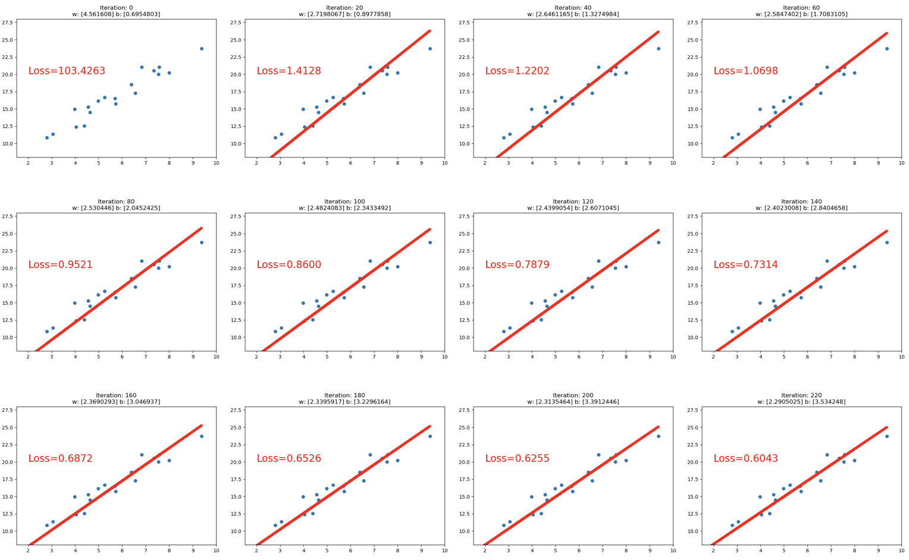
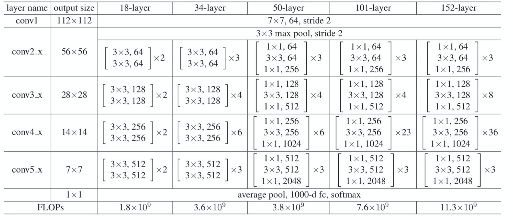

## `PyTorch`框架学习[center]
**目录**
>[TOC]
### 一、`PyTorch`中的`Tensor`（张量）

#### 1、`Tensor`概念

#####（1）张量是什么
张量是一个**多维数组**，它是标量、向量、矩阵的高维拓展
#####（2）`Tensor`与`Variable`
- `Variable`：`Variable`是`torch. Autograd`中的数据类型，主要用于封装 `Tensor`，进行自动求导：
 - `data`：被包装的`Tensor`
 - `grad`: `data`的梯度
 - `grad_fn`：创建`Tensor`的`function`，是自动求导的关键
 - `requires_grad`：指示是否需要梯度
 - `is_leaf`：指示是否是叶子结点（张量）
[center]
- `Tensor`：`Pytorch`0.4.0 版开始，`Variable`并入`Tensor`
 - `dtype`：张量的数据类型，如`torch. Floattensor`，`torch.cuda`
 - `Floattensor shape`：张量的形状，如(64,3,224,224)
 - `device`：张量所在设备——GPU/CPU，是加速的关键
 [center]
**从上图中可以看出，`Tensor`中4个与属性相关，4个与求导相关**
####2、`Tensor`的创建

#####（1）直接创建
- `torch.tensor()`
 - 功能：从数据中直接创建`tensor`
 - 参数：
     - `data`：数据，可以是`list`或`numpy`
     - `dtype`：数据类型，默认与`data`的一致
     - `device`: 所在设备，可选`"cuda"`或`cpu`
     - `requires_grad`：是否需要梯度
     - `pin_ memory`：是否存于锁页内存，一般为`False`
```python
arr = np.ones((3,3))
print("ndarray的数据类型:", arr.dtype)
t = torch.tensor(arr) # use torch.tensor()
print(t)
##################
# ndarray的数据类型: float64
# tensor([[1., 1., 1.],
#         [1., 1., 1.],
#         [1., 1., 1.]], dtype=torch.float64)
```
- `torch.from_numpy(ndarray)`
 - 功能：从`numpy`创建`tensor`
 - 注意事项：从`torch.from_ numpy`创建的`tensor`与原`ndarray`**共享内存**，当修改其中一个的数据，另外一个也将会被改动
[center]
```python
# TODO 通过 torch.from_numpy() 创建张量
arr = np.array([[1,2,3], [4,5,6]])
t = torch.from_numpy(arr)
print("numpy array:" ,arr)
print("tensor:", t)
# numpy array: [[1 2 3]
#  [4 5 6]]
# tensor: tensor([[1, 2, 3],
#         [4, 5, 6]])
print("\n修改arr")
arr[0, 0] = 0
print("numpy array:" ,arr)
print("tensor:", t)
# 修改arr
# numpy array: [[0 2 3]
#  [4 5 6]]
# tensor: tensor([[0, 2, 3],
#         [4, 5, 6]])
print("\n修改tensor")
t[0, 0] = -1
print("numpy array:" ,arr)
print("tensor:", t)
# 修改tensor
# numpy array: [[-1  2  3]
#  [ 4  5  6]]
# tensor: tensor([[-1,  2,  3],
#         [ 4,  5,  6]])
```
**注意：这里如果查看t和arr的内存地址，会发现不相同，这是因为tensor与numpy数组是共享部分内存，而非所有内存，准确说是共享值，所以直接用`id()`得到的内存地址肯定是不同的**（[参考链接](https://blog.csdn.net/qq_33345917/article/details/86552403)）
#####（2）依据数值创建
- `torch.zeros()`
 - 功能：依`size`创建全零张量
 - 参数：
      - `size`：张量的形状，如（3,3)、（3,224,224)
      - `out`：输出的张量
      - `layout`：内存中布局形式，有`strided`，`sparse_coo(多用于稀疏的情况)`等
      - `device`：所在设备，gpu/cpu
      - `requires_grad`：是否需要梯度
```python
out_t = torch.tensor([1])
print(out_t)
# tensor([1])
t = torch.zeros((3, 3), out=out_t)

print(t, "\n", out_t)
print(id(t), id(out_t), id(t) == id(out_t))
# tensor([[0, 0, 0],
#         [0, 0, 0],
#         [0, 0, 0]]) 
#  tensor([[0, 0, 0],
#         [0, 0, 0],
#         [0, 0, 0]])
# 140704226970592 140704226970592 True
```
- `torch.zeros_like()`
 - 功能：依`input`形状创建全0张量
 - 参数：
     - `intput`：创建与`input`同形状的全0张量
     - `dtype`：数据类型
     - `layout`：内存中布局形式
- `torch.ones()`
 - 与`torch.zeros()`类似
- `torch.ones_like()`
 - 与`torch.zeros_like()`类似
- `torch.full()`
 - 与`torch.zeros()`类似
 - 功能：依`size`形状创建全为`fill_value`张量
 - 参数：
     - `size`：指定形状
     - `fill_value`：张量的值
```python
t = torch.full((3,3), fill_value=5)
print(t)
# tensor([[5., 5., 5.],
#         [5., 5., 5.],
#         [5., 5., 5.]])
```
- `torch.full_like()`
 - 与`torch.zeros_like()`类似
 - 依据`input`形状创建全为`fill_value`张量
- `torch_arange`
 - 功能：创建等差的一维张量
 - 注意事项：数值区间为 **[start, end)**，不包含`end`
 - 参数：
       - `start`：数列起始值
       - `end`：数列结東值
       - `step`：数列公差，默认为 1
```python
t = torch.arange(2, 10, 2)
print(t)
# tensor([2, 4, 6, 8])
```
- `torch.linspace()`
 - 功能：创建均分的一维张量
 - 注意事项：数值区间为  **[start, end]**，包含`end`
      - `start`：数列起始值
      - `end`：数列结束值
      - `steps`：数列长度
```python
t = torch.linspace (2, 10, 6)
print(t)
# tensor([ 2.0000,  3.6000,  5.2000,  6.8000,  8.4000, 10.0000])
```
- `torch.eye()`
 - 功能：创建单位对角矩阵（2 维张量）
 - 注意事项：默认为方阵
 - 参数：
     - `n`：矩阵行数
     - `m`：矩阵列数
```python
t = torch.eye(3,4)
print(t)
# tensor([[1., 0., 0., 0.],
#         [0., 1., 0., 0.],
#         [0., 0., 1., 0.]])
```
#####（3）依据概率创建
- `torch.normal()`
 - 功能：生成正态分布（高斯分布）
 - 参数：
     - `mean`：均值
     - `std`：标准差
 - 模式：
1）`mean`为标量，`std`为标量
```python
# mean为标量, std为标量
t_normal = torch.normal(0, 1, size=(4,))
print(t_normal)
# tensor([-1.2037, -2.6311,  0.5868,  1.2614])
```
2）`mean`为标量，`std`为张量
```python
# mean为标量, std为张量
mean = 0
std = torch.arange(1, 5, dtype=torch.float)
t_normal = torch.normal(mean, std)
print("mean:{}\nstd:{}".format(mean, std))
print(t_normal)
# mean:0
# std:tensor([1., 2., 3., 4.])
# tensor([-1.0449,  0.3933, -1.9833, -0.1817])
```
3） `mean`为张量，`std`为标量
```python
# mean为张量, std为标量
mean = torch.arange(1, 5, dtype=torch.float)
std = 1
t_normal = torch.normal(mean, std)
print("mean:{}\nstd:{}".format(mean, std))
print(t_normal)
# mean:tensor([1., 2., 3., 4.])
# std:1
# tensor([2.6778, 1.4530, 3.1085, 3.9316])
```
4） `mean`为张量，`std`为张量
```python
# mean为张量, std为张量
mean = torch.arange(1, 5, dtype=torch.float)
std = torch.arange(1, 5, dtype=torch.float)
t_normal = torch.normal(mean, std)
print("mean:{}\nstd:{}".format(mean, std))
print(t_normal)
# mean:tensor([1., 2., 3., 4.])
# std:tensor([1., 2., 3., 4.])
# tensor([ 0.5354, -0.5579,  2.3737,  5.1949])
```
- `torch.randn()`与`torch.randn_like()`
 - 功能：生成标准正态分布
 - 参数：
     - `size`：张量的形状
- `torch.rand()`与`torch.rand_like()`
 - 功能：在区间**[0,1)** 上，生成均匀分布
 - 参数：
     - `size`：张量的形状
- `torch.randint()`与`torch.randint_like()`
 - 功能：区间**[Iow, high)**生成整数均匀分布
 - 参数：
     - `size`：张量的形状
- `torch.randperm()`
 - 功能：生成从 0 到 $n-1$ 的随机排列
 - 参数：
     - `n`：张量的长度
- `torch.bernoulli()`
 - 功能：以`input`为概率，生成伯努力分布(0-1 分布，两点分布）
 - 参数：
     - `input`：概率值

####3、`Tensor`的操作

#####（1）张量的拼接与切分
###### **张量的拼接**
- `torch.cat()`
 - 功能:将张量按维度`dim`进行拼接
 - 参数：
     - `tensors`: 张量序列
     - `dim` : 要拼接的维度（如果是$n$维张量，则`dim`可选的值为$0 \sim (n-1)$）
`torch.cat()`拼接不一定局限于两个张量的拼接，可以同时进行多个张量的拼接[red]
```python
t = torch.ones((2, 3))
t_0 = torch.cat([t, t], dim=0)
t_1 = torch.cat([t, t, t], dim=1)
print("t_0:{} shape:{}\nt_1:{} shape:{}".format(t_0, t_0.shape, t_1, t_1.shape))

# t_0:tensor([[1., 1., 1.],
#         [1., 1., 1.],
#         [1., 1., 1.],
#         [1., 1., 1.]]) shape:torch.Size([4, 3])
# t_1:tensor([[1., 1., 1., 1., 1., 1., 1., 1., 1.],
#         [1., 1., 1., 1., 1., 1., 1., 1., 1.]]) shape:torch.Size([2, 9])
```
- `torch.stack()`
 - 功能:在**新创建**的维度`dim`上进行拼接
     - `tensors`：张量序列
     - `dim`：要拼接的维度
```python
a = torch.tensor([[1, 2, 3],
                  [11, 22, 33]])
b = torch.tensor([[4, 5, 6],
                  [44, 55, 66]])
c = torch.stack([a, b], dim=0)
d = torch.stack([a, b], dim=1)
e = torch.stack([a, b], dim=2)
print("c:{} shape:{}\nd:{} shape:{}\ne:{} shape:{}".
      format(c, c.shape, d, d.shape, e, e.shape))

# c:tensor([[[ 1,  2,  3],
#          [11, 22, 33]],
#
#         [[ 4,  5,  6],
#          [44, 55, 66]]]) shape:torch.Size([2, 2, 3])
# d:tensor([[[ 1,  2,  3],
#          [ 4,  5,  6]],
#
#         [[11, 22, 33],
#          [44, 55, 66]]]) shape:torch.Size([2, 2, 3])
# e:tensor([[[ 1,  4],
#          [ 2,  5],
#          [ 3,  6]],
#
#         [[11, 44],
#          [22, 55],
#          [33, 66]]]) shape:torch.Size([2, 3, 2])
```
**代码分析：**`c,d,e`按照不同的维度进行拼接，本质上的拼接过程为：
[center]
（[参考链接](https://blog.csdn.net/Teeyohuang/article/details/80362756)）
###### **张量的切分**
- `torch.chunk()`
 - 功能：将张量按维度`dim`进行平均切分
 - 返回值：张量列表
 - 注意事项：若不能整除，最后一份张量小于其他张量（内部实现是将选取的`dim`的值除需要切分的数目再向上取整，因此最后一份必然小于其他张量）
 - 参数：
     - `input`：要切分的张量
     - `chunks`：要切分的份数
     - `dim`：要切分的维度
```python
a = torch.ones((2, 7))  # 7
list_of_tensors = torch.chunk(a, dim=1, chunks=3)  # 3

for idx, t in enumerate(list_of_tensors):
    print("第{}个张量：{}, shape is {}".format(idx + 1, t, t.shape))
    
# 第1个张量：tensor([[1., 1., 1.],
#         [1., 1., 1.]]), shape is torch.Size([2, 3])
# 第2个张量：tensor([[1., 1., 1.],
#         [1., 1., 1.]]), shape is torch.Size([2, 3])
# 第3个张量：tensor([[1.],
#         [1.]]), shape is torch.Size([2, 1])
```
- `torch.split()`
 - 功能：将张量按维度`dim`进行切分
 - 返回值:张量列表
 - 参数：
      - `tensor`：要切分的张量
      - `split_size_or_sections`：两种模式
                - 如果为`int`，则表示每一份的长度
                - 如果为`list`，则表示按照`list`中的元素进行切分
        - `dim`：要切分的维度
```python
t1 = torch.ones((2, 5))
t2 = torch.ones((2, 5))

# int模式
list_of_tensors1 = torch.split(t1, 2, dim=1)
for idx, t in enumerate(list_of_tensors1):
    print("第{}个张量：{}, shape is {}".format(idx+1, t, t.shape))
# 第1个张量：tensor([[1., 1.],
#         [1., 1.]]), shape is torch.Size([2, 2])
# 第2个张量：tensor([[1., 1.],
#         [1., 1.]]), shape is torch.Size([2, 2])
# 第3个张量：tensor([[1.],
#         [1.]]), shape is torch.Size([2, 1])

# list模式
list_of_tensors2 = torch.split(t2, [2, 1, 2], dim=1)
for idx, t in enumerate(list_of_tensors2):
    print("第{}个张量：{}, shape is {}".format(idx, t, t.shape))
# 第0个张量：tensor([[1., 1.],
#         [1., 1.]]), shape is torch.Size([2, 2])
# 第1个张量：tensor([[1.],
#         [1.]]), shape is torch.Size([2, 1])
# 第2个张量：tensor([[1., 1.],
#         [1., 1.]]), shape is torch.Size([2, 2])
```
#####（2）张量索引
- `torch.index_select()`
 - 功能：在维度`dim`上，按`index`索引数据
 - 返回值：依`index`索引数据拼接的张量
 - 参数：
     - `input`：要索引的张量
     - `dim`：要索引的维度
     - `index`：要索引数据的序号（`index`的类型必须是一个`tensor`，且数据类型是`torch.long`不能是`torch.float`）
```python
t = torch.randint(0, 9, size=(3, 3))
idx = torch.tensor([0, 2], dtype=torch.long)
t_select = torch.index_select(t, dim=0, index=idx)
print("t:\n{}\nt_select:\n{}".format(t, t_select))

# t:
# tensor([[4, 5, 0],
#         [5, 7, 1],
#         [2, 5, 8]])
# t_select:
# tensor([[4, 5, 0],
#         [2, 5, 8]])
```
- `torch.masked_select()`
 - 功能：按**mask**中的`True`进行索引
 - 返回值：一维张量
 - 参数：
     - `input`：要索引的张量
     - `mask`：与`input`同形状（维度相同）的布尔类型张量
通过`torch.masked_select()`索引需要先利用条件构建`mask`，然后再将构建好的`mask`放到`torch.masked_select()`中[red]
```python
t = torch.randint(0, 9, size=(3, 3))
mask = t.le(5)  # ge is mean greater than or equal/   gt: greater than  le  lt
t_select = torch.masked_select(t, mask)
print("t:\n{}\nmask:\n{}\nt_select:\n{} ".format(t, mask, t_select))

# t:
# tensor([[4, 5, 0],
#         [5, 7, 1],
#         [2, 5, 8]])
# mask:
# tensor([[ True,  True,  True],
#         [ True, False,  True],
#         [ True,  True, False]])
# t_select:
# tensor([4, 5, 0, 5, 1, 2, 5])
```
#####（3）张量变换
- `torch.reshape()`
 - 功能：变换张量形状
 - 注意事项：当张量在内存中是连续时，新张量与`input`共享数据内存
 - 参数：
     - `input`：要变换的张量
     - `shape`：新张量的形状

```python
t = torch.randperm(8)
t_reshape = torch.reshape(t, (-1, 2, 2))  # -1
print("t:{}\nt_reshape:\n{}".format(t, t_reshape))
print("-----------------------------------------")

t[0] = 1024
print("t:{}\nt_reshape:\n{}".format(t, t_reshape))
print("t.data 内存地址:{}".format(id(t.data)))
print("t_reshape.data 内存地址:{}".format(id(t_reshape.data)))

# t:tensor([5, 4, 2, 6, 7, 3, 1, 0])
# t_reshape:
# tensor([[[5, 4],
#          [2, 6]],
# 
#         [[7, 3],
#          [1, 0]]])
# -----------------------------------------
# t:tensor([1024,    4,    2,    6,    7,    3,    1,    0])
# t_reshape:
# tensor([[[1024,    4],
#          [   2,    6]],
# 
#         [[   7,    3],
#          [   1,    0]]])
# t.data 内存地址:140486772613024
# t_reshape.data 内存地址:140486772613024
```

- `torch.transpose()`
 - 功能：交换张量指定的两个维度
 - 参数：
     - `input`：要变换的张量
     - `dim0`：要交换的维度
     - `dim1`: 要交换的维度
```python
t = torch.rand((2, 3, 4))
t_transpose = torch.transpose(t, dim0=1, dim1=2) 
print("t shape:{}\nt_transpose shape: {}".format(t.shape, t_transpose.shape))

# t shape:torch.Size([2, 3, 4])
# t_transpose shape: torch.Size([2, 4, 3])
```
- `torch.t()`
 - 功能：二维张量转置，对矩阵而言，等价于`torch.transpose(input, 0, 1)`，只能用于二维张量

- `torch.squeeze()`
 - 功能：压缩长度为1的维度(轴)
 - 参数：
     - `dim`：若为`None`，移除所有长度为1的轴，若指定维度，当且仅当该轴长度为1时，可以被移除
```python
t = torch.rand((1, 2, 3, 1))
t_sq = torch.squeeze(t)
t_0 = torch.squeeze(t, dim=0)
t_1 = torch.squeeze(t, dim=1)
print(t.shape)
print(t_sq.shape)
print(t_0.shape)
print(t_1.shape)

# torch.Size([1, 2, 3, 1])
# torch.Size([2, 3])
# torch.Size([2, 3, 1])
# torch.Size([1, 2, 3, 1])
```
- `torch.usqueeze`
 - 功能：依据`dim`扩展维度
```python
t = torch.rand((3,3))
t_unsqueeze = torch.unsqueeze(t, dim=1)
print(t.shape)
print(t_unsqueeze.shape)
print(t_unsqueeze)

# torch.Size([3, 3])
# torch.Size([3, 1, 3])
# tensor([[[0.7576, 0.2793, 0.4031]],
# 
#         [[0.7347, 0.0293, 0.7999]],
# 
#         [[0.3971, 0.7544, 0.5695]]])
```

####4、`Tensor`的数学运算
关于`Tensor`的数学运算大致可以分为三类：
- 加减乘除
- 对数，指数，幂函数
- 三角函数
由于`Tensor`的数学运算接口参数相当简单，因此不一一展开叙述，仅展示各种类的函数名，并以`torch.add()`做为例子叙述参数作用
#####（1）加减乘除
- `torch.add()`
 - 功能：逐元素计算$input + alpha × other$
 - 参数：
      - `input`：第一个张量
      - `alpha`：乘项因子
      - `other`：第二个张量
```python
t_0 = torch.randn((3, 3))
t_1 = torch.ones_like(t_0)
t_add = torch.add(t_0, 10, t_1)

print("t_0:\n{}\nt_1:\n{}\nt_add_10:\n{}".format(t_0, t_1, t_add))

# t_0:
# tensor([[ 0.6614,  0.2669,  0.0617],
#         [ 0.6213, -0.4519, -0.1661],
#         [-1.5228,  0.3817, -1.0276]])
# t_1:
# tensor([[1., 1., 1.],
#         [1., 1., 1.],
#         [1., 1., 1.]])
# t_add_10:
# tensor([[10.6614, 10.2669, 10.0617],
#         [10.6213,  9.5481,  9.8339],
#         [ 8.4772, 10.3817,  8.9724]])
```
- `torch.addcdiv()`
 - 功能：$out_i = input_i + value \times \frac{tensor1_i}{tensor2_i}$
- `torch.addcmul()`
 - 功能：$out_i = input_i + value \times tensor1_i \times tensor2_i$
- `torch.sub()`
- `torch.div()`
- `torch.mul()`
#####（2）对数，指数，幂函数
- `torch.log(input, out=None)`
- `torch.log10(input, out=None)`
- `torch.log2(input, out=None)`
- `torch.exp(input, out=None) `
- `torch.pow()`
#####（3）三角函数
 - `torch.abs(input, out=None)`
 - `torch.acos(input, out=None)`
 - `torch.cosh(input, out=None)`
 - `torch.cos(input, out=None)`
 - `torch.asin(input, out=None)`
 - `torch.atan(input, out=None)`
 - `torch.atan2(input, other, out=None)`
####5、实战：利用`Tensor`实现线性回归

#####（1）求解步骤
- 确定模型：$y = \omega x + b$
- 选择损失函数：这里选择$MSE$作为损失函数：
$$f = \frac{1}{m} \sum_{i=1}^{m}\left(y_{i}-\hat{y}_{i}\right)^2$$
- 求解梯度并更新$\omega$和$b$直到收敛：
$$
\begin{aligned}
&\omega=\omega - LR \times \omega \cdot grad\\
&b=b-LR * w \cdot grad
\end{aligned}
$$
(`LR`为学习率)
#####（2）代码实现
```python
# 设置学习率参数
lr = 0.05

# 生成数据
x = torch.rand(20, 1) * 10
y = 2 * x + (5 + torch.randn(20, 1))

# 构建线性回归参数
w = torch.randn((1), requires_grad=True)
b = torch.zeros((1), requires_grad=True)
print(w)
print(b)

# 构造损失函数
for iteration in range(1000):
    # 前向传播
    y_pred = torch.add(torch.mul(w, x), b)
    # 计算loss
    loss = (0.5 * (y - y_pred) ** 2).mean()
    # 反向传播
    loss.backward()

    # 更新参数
    b.data.sub_(lr * b.grad)
    w.data.sub_(lr * w.grad)

    # 清零张量的梯度   20191015增加
    w.grad.zero_()
    b.grad.zero_()

    # 绘图
    if iteration % 20 == 0:
        plt.scatter(x.data.numpy(), y.data.numpy())
        plt.plot(x.data.numpy(), y_pred.data.numpy(), 'r-', lw=5)
        plt.text(2, 20, 'Loss=%.4f' % loss.data.numpy(), fontdict={'size': 20, 'color':  'red'})
        plt.xlim(1.5, 10)
        plt.ylim(8, 28)
        plt.title("Iteration: {}\nw: {} b: {}".format(iteration, w.data.numpy(), b.data.numpy()))
        plt.pause(0.5)

        if loss.data.numpy() < 0.6:
            print(loss.data.numpy())
            print(b)
            print(w)
            break
```
代码中设计到一个属性——`sub_`，需要注意与`sub`属性区分开，`sub_`保留了张量的各种属性，而`sub`只是赋值，属性并不保留[red]
[center]

###二、 `Pytorch`的计算图与动态图机制

####1、计算图（Computational Graph）
- 计算图是一个用来描述运算的**有向无环图**
- 计算图有两个主要元素：**结点**(*Node*)和**边**(*Edge*)：
 - **结点**表示数据：向量，矩阵，张量等
 - **边**表示运算，如加减乘除卷积等
- 例子：利用**计算图**表示$y=(x+w) *(w+1)$
[center]
- 第一步：创建$x$和$w$
- 第二步：令$a=x+w, b=w+1, y=a * b$
这样就可以得到如上图所示的**计算图**，利用计算图来描述运算的好处不仅仅是让运算更加简洁，还有一个更加重要的作用是使梯度求导更加方便，例如上图中，如果需要求解$\frac{\partial y}{\partial w}$，则可以按照下图所示的步骤求解：
[center]
计算过程为：
$$
\begin{aligned}
\frac{\partial y}{\partial w} = & \frac{\partial y}{\partial a} \frac{\partial a}{\partial w}+\frac{\partial y}{\partial b} \frac{\partial b}{\partial w} \\
= & b * 1+a * 1\\
= & b + a \\
= & (w+1)+(x+w) \\
= & 2 * w+x+1 \\
= & 2 * 1+2+1 \\
= & 5
\end{aligned}
$$
本质上，$y$对$w$求导就是在计算图中找到所有$y$到$w$的路径，把路径上的导数进行求和[red]
```python
w = torch.tensor([1.], requires_grad=True)
x = torch.tensor([2.], requires_grad=True)
a = torch.add(w, x)     # retain_grad()
b = torch.add(w, 1)
y = torch.mul(a, b)
y.backward()
print(w.grad)
# tensor([5.]) 与理论值相符
```
- 计算图深入分析（以上图为例）：
 - 张量的属性中有一个与梯度相关的属性——`is_leaf`，也就是**叶子节点**，功能就是是指示张量是否是叶子节点，如果是用户创建的节点，则为**叶子节点**（$x,w$），而通过计算得到的节点则不是**叶子节点**（$a,b,y$）
 - 叶子节点是整个计算图的根基，例如前面求导的计算图，在前向传导中的$a,b,y$都要依据创建的叶子节点$x,y$进行计算的；在反向传播过程中，所有梯度的计算也都要依赖叶子节点
 - 设置叶子节点主要目的是为了节省内存，`Pytorch`在梯度反向传播结束之后，非叶子节点的梯度都会被释放掉，而叶子结点的梯度会保留下来，如果想保留非叶子结点梯度，可以使用`retain_grad()`进行保留
 - 张量的属性中还有一个属性——`grad_fn`，作用是**记录创建该张量时所用的方法（函数）**，在梯度反向传播的时候会用到这个属性，例如上图中，`y`在反向传播的时候会记录`y`是用乘法得到的，所用在求解`a`和`b`的梯度的时候就会用到乘法的求导法则去求解`a`和`b`的梯度。而求解$a,b$的梯度时，由于$a$和$b$是通过加法得到的，不对使用链式法则求导
```python
print("is_leaf:\n", w.is_leaf, x.is_leaf, a.is_leaf, b.is_leaf, y.is_leaf)
# is_leaf:
#  True True False False False
# 查看梯度
print("gradient:\n", w.grad, x.grad, a.grad, b.grad, y.grad)
# gradient:
#  tensor([5.]) tensor([2.]) None None None
# 查看 grad_fn
print("grad_fn:\n", w.grad_fn, x.grad_fn, a.grad_fn, b.grad_fn, y.grad_fn)
# grad_fn:
#  None None <AddBackward0 object at 0x7f8f839f1a50> <AddBackward0 object at 0x7f8f81e77c90> <MulBackward0 object at 0x7f8f839feb50>
```
####2、动态图机制
根据计算图搭建方式，可将计算图分为**动态图**和**静态图**：
- 动态图：运算与搭建同时进行（灵活易调节）
- 静态图：先搭建图，后运算（高效但不灵活）
 $\qquad \qquad \qquad$[center]

上图右边为静态，是先将图搭建好之后，再放数据进去，左边为动态图，是根据每一步的计算搭建的

###三、`PyTorch`中自动求导系统（`torch.autograd`）
训练深度学习模型本质上就是不断更新权值，而权值的更新需要求解梯度，因此求解梯度非常关键。然而求解梯度十分繁琐，`pytorch`提供自动求导系统，利用这个自动求导系统，我们不需要手动计算梯度，只需要搭建好前向传播的**计算图**，然后根据`pytorch`中的`autograd`方法就可以得到所有张量的梯度
####1、`torch.autograd`

#####（1）`torch.autograd.backward`
- 功能：自动求取梯度
- 参数：
 - `tensor`：用于求导的张量，例如损失函数
 - `retain_graph`：保存计算图，由于pytorch采用动态图机制，在每一次反向传播结束之后，计算图都会释放掉。如果想继续使用计算图，就需要设置参数`retain_graph`为`True`
 - `create_graph`：创建导数计算图，用于高阶求导
 - `grad_tensors`：多梯度权重；当有多个损失函数需要去计算梯度的时候，就要设计各个损失函数之间的权重比例
- 例子：$y=(x+w) * (w+1)$，求$\frac{\partial y}{\partial w}$
 - 计算图：
 - [center]
 - 计算过程：
$$
\begin{aligned}
\frac{\partial y}{\partial w} = & \frac{\partial y}{\partial a} \frac{\partial a}{\partial w}+\frac{\partial y}{\partial b} \frac{\partial b}{\partial w} \\
= & b * 1+a * 1\\
= & b + a \\
= & (w+1)+(x+w) \\
= & 2 * w+x+1 \\
= & 2 * 1+2+1 \\
= & 5
\end{aligned}
$$
**代码实现**

```python
w = torch.tensor([1.], requires_grad=True)   # 创建叶子张量，并设定requires_grad为True，因为需要计算梯度；
x = torch.tensor([2.], requires_grad=True)   # 创建叶子张量，并设定requires_grad为True，因为需要计算梯度；

a = torch.add(w, x)   # 执行运算并搭建动态计算图
b = torch.add(w, 1)
y = torch.mul(a, b)

y.backward(retain_graph=True)  # 对y执行backward方法就可以得到x和w两个叶子节点
print(w.grad)   
# tensor([5.])
```
- 几点说明：
 - 代码中用到的`y.backward()`方法用于反向传播，如果不写这行代码，则`w.grad = None`，从底层代码看，`.backward()`方法调用了`torch.autograd`中的`backward()`方法
  - `backward()`中的`retain_grad`参数，如果设置为`True`，则表示保存计算图，如果还想执行一次反向传播 ，必须将`retain_grad`参数设置为`retain_grad=True`，因为如果没有设置`retain_grad=True`，则每进行一次`backward`之后，计算图都会被清空，没法再进行一次`backward()`操作
- `backward()`中的`grad_tensors`参数用于设置多梯度权重，以下面的代码为例说明：
```python
w = torch.tensor([1.], requires_grad=True)
x = torch.tensor([2.], requires_grad=True)

a = torch.add(w, x)  # retain_grad()
b = torch.add(w, 1)

y0 = torch.mul(a, b)  # y0 = (x+w) * (w+1)
y1 = torch.add(a, b)  # y1 = (x+w) + (w+1)    dy1/dw = 2

loss = torch.cat([y0, y1], dim=0)  # [y0, y1]
grad_tensors = torch.tensor([1., 2.])

loss.backward(gradient=grad_tensors)  # gradient 传入 torch.autograd.backward()中的grad_tensors

print(w.grad)

# tensor([9.])
```
上面的代码中有一行`grad_tensors = torch.tensor([1., 2.])`表示的意思是对`y0`的梯度乘1，对`y1`的梯度乘2，所以是$5+2\times2=9$

#####（2）`torch.autograd.grad`
- 功能：求取梯度
- 参数：
 - `outputs`：用于求导的张量，如损失函数
 - `inputs`：需要梯度的张量，如上面代码中的`w`
 - `create_graph`：创建导数计算图，用于高阶求导
 - `retain_graph`：保存计算图
 - `grad_outputs`：多梯度权重
- 代码（实现$y = x^2$二阶求导）：
```python
x = torch.tensor([3.], requires_grad=True)
y = torch.pow(x, 2)  # y = x**2

grad_1 = torch.autograd.grad(y, x, create_graph=True)  # grad_1 = dy/dx = 2x = 2 * 3 = 6
print(grad_1)
# (tensor([6.], grad_fn=<MulBackward0>),)

grad_2 = torch.autograd.grad(grad_1[0], x)  # grad_2 = d(dy/dx)/dx = d(2x)/dx = 2
print(grad_2)
# (tensor([2.]),)
```
- 注意事项：
 - `autograd`的梯度不自动清零，如果重复调用，会不断累加，为了能够实现梯度清零，需要用方法`.grad.zero_()`（**这里的下划线代表原地操作**）进行梯度自动清零处理：
 - 依赖于叶子结点的结点，`requires_grad`默认为`True`，不需要重复设置
 - 叶子结点不可执行*in-place*（原位操作）：在`pytorch`中，经常用加后缀`_`的方法表示原位操作，例如`.add_()`等，表示在不改变数据内存地址的前提下，对数据的值进行修改，但是叶子结点不能进行原位操作，具体原因仍然通过下面的计算图说明：
[center]

如果要求解w的梯度，需要用到$\frac{\partial y}{\partial a}$而$\frac{\partial y}{\partial a}=w+1$，也就是在反向传播的时候是需要用到叶子张量$w$的。而在前向传播的时候，$y$会记录$w$的地址，到反向传播的时候，在用到$w+1$的时候根据地址去寻找$w$的数据。如果在反向传播之前改变了$w$的地址当中的数据，梯度求解就会出错，这就是叶子结点不能执行原位操作的原因[red]
```python
#################### 梯度不自动清零 ##########################
w = torch.tensor([1.], requires_grad=True)
x = torch.tensor([2.], requires_grad=True)

for i in range(4):
    a = torch.add(w, x)
    b = torch.add(w, 1)
    y = torch.mul(a, b)

    y.backward()
    print(w.grad)

    # w.grad.zero_()

# 不注释 w.grad.zero_() ：
# tensor([5.])
# tensor([5.])
# tensor([5.])
# tensor([5.])

# 注释 w.grad.zero_()：
# tensor([5.])
# tensor([10.])
# tensor([15.])
# tensor([20.])

################# 与叶子节点相关联requires_grad默认为True #########################

w = torch.tensor([1.], requires_grad=True)
x = torch.tensor([2.], requires_grad=True)

a = torch.add(w, x)
b = torch.add(w, 1)
y = torch.mul(a, b)

print(a.requires_grad, b.requires_grad, y.requires_grad)

# True True True

################# 与叶子节点无法in-place操作 #########################
w = torch.tensor([1.], requires_grad=True)
x = torch.tensor([2.], requires_grad=True)

a = torch.add(w, x)
b = torch.add(w, 1)
y = torch.mul(a, b)

w.add_(1)

y.backward()

# Traceback (most recent call last):
#   File "/tmp/pytorch学习/WeekOne/lesson-5.py", line 99, in <module>
#     w.add_(1)
# RuntimeError: a leaf Variable that requires grad has been used in an in-place operation.
```


####2、实战：逻辑回归的`Pytorch`实现

#####（1）逻辑回归理论
- 逻辑回归是**线性**的**二分类模型**：
- 模型表达式：$y=f(W X+b)$，其中$f(x)=\frac{1}{1+e^{-x}}$，称之为*Sigmoid*函数，也称为*Logistic*函数，大致图像为：
[center]
- 分类依据：
$$
f(x)=\left\{\begin{array}{l}
0,0.5>y \\
1,0.5 \leqslant y
\end{array}\right.
$$
- 逻辑回归与线性回归的关系：
 - 线性回归是分析自变量$X$与因变量$y$（**标量**）之间关系的方法而逻辑回归是分析自变量$X$与因变量$y$（**概率**）之间关系的方法
 - 线性回归模型中自变量为$X$，因变量为$y$，两者之间的关系为$y = WX + b$，而逻辑回归相当于是在线性回归的基础上加了一个激活函数`sigmoid`，从`sigmoid`函数的曲线图可以看出，基本没有激活函数`sigmoid`，逻辑回归模型仍然可以进行二分类的，将$WX+b>0$分类为类别1，当$WX+b<0$时判别为类别0，但是为了更好地描述分类置信度，所以采用`sigmoid`函数将输出映射到0-1，符合一个概率取值
 - 逻辑回归还有一个别名是**对数几率回归**，几率是概率取值$\frac{y}{1-y}$，表示的是样本$x$为正样本的可能性，对数几率回归公式为：$\ln \frac{y}{1-y}=W X+b$，下面推导该公式与之前的逻辑回归公式等价：
$$
\begin{aligned}
& \ln \frac{y}{1-y}=W X+b \\ 
\Rightarrow&\frac{y}{1-y}=e^{W X+b}\\
\Rightarrow&y=e^{W X+b}-y * e^{W X+b}\\
\Rightarrow&y\left(1+e^{W X+b}\right)=e^{W X+b}\\
\Rightarrow&y=\frac{e^{W X+b}}{1+e^{W X+b}}=\frac{1}{1+e^{-(W X+b)}}\\
\Rightarrow& y = f(WX+b), \quad f(x) = \frac{1}{1+e^{-x}}
\end{aligned}
$$
#####（2）`Pytorch`实现
```python
# 第一步：生成数据

# 参数：
sample_nums = 100
mean_value = 1.7
bias = 1.5

# 生成二分类数据
n_data = torch.ones(sample_nums, 2)
x0 = torch.normal(mean_value * n_data, 1) + bias
y0 = torch.zeros(sample_nums)
x1 = torch.normal(-mean_value * n_data, 1) + bias
y1 = torch.ones(sample_nums)
train_x = torch.cat((x0, x1), 0)
train_y = torch.cat((y0, y1), 0)

# 第二步：选择模型
class LR(nn.Module):
    def __init__(self):
        super(LR, self).__init__()
        self.features = nn.Linear(2, 1)
        self.sigmoid = nn.Sigmoid()

    def forward(self, x):
        x = self.features(x)
        x = self.sigmoid(x)
        return x


lr_net = LR()   # 实例化逻辑回归模型

# 第三步：选择损失函数
loss_fn = nn.BCELoss()

# 第四步：选择优化器
lr = 0.01  # 学习率
optimizer = torch.optim.SGD(lr_net.parameters(), lr=lr, momentum=0.9)

# 第五步：训练模型
for iteration in range(1000):

    # 前向传播
    y_pred = lr_net(train_x)

    # 计算 loss
    loss = loss_fn(y_pred.squeeze(), train_y)

    # 反向传播
    loss.backward()

    # 更新参数
    optimizer.step()

    # 清空梯度
    optimizer.zero_grad()

    # 绘图
    if iteration % 20 == 0:

        mask = y_pred.ge(0.5).float().squeeze()  # 以0.5为阈值进行分类
        correct = (mask == train_y).sum()  # 计算正确预测的样本个数
        acc = correct.item() / train_y.size(0)  # 计算分类准确率

        plt.scatter(x0.data.numpy()[:, 0], x0.data.numpy()[:, 1], c='r', label='class 0')
        plt.scatter(x1.data.numpy()[:, 0], x1.data.numpy()[:, 1], c='b', label='class 1')

        w0, w1 = lr_net.features.weight[0]
        w0, w1 = float(w0.item()), float(w1.item())
        plot_b = float(lr_net.features.bias[0].item())
        plot_x = np.arange(-6, 6, 0.1)
        plot_y = (-w0 * plot_x - plot_b) / w1

        plt.xlim(-5, 7)
        plt.ylim(-5, 7)
        plt.plot(plot_x, plot_y)

        plt.text(-8, 1, 'Loss=%.4f' % loss.data.numpy(), fontdict={'size': 20, 'color': 'red'})
        plt.title("Iteration: {}\nw0:{:.2f} w1:{:.2f} b: {:.2f} accuracy:{:.2%}".format(iteration, w0, w1, plot_b, acc))
        plt.legend()

        #plt.show()
        plt.pause(0.5)

        if acc > 0.99:
            plt.show()
            break
```
**最终结果：**
[center]

### 四、数据读取机制中的`Dataloader`与`Dataset`
前面学习到机器学习训练的五个步骤为：
- 数据
- 模型
- 损失函数
- 优化器
- 迭代训练
而这里的**数据**模块可以细分为四个子模块：
- **数据收集**：在进行实验之前，需要收集数据，数据包括原始样本和标签
- **数据划分**：有了原始数据之后，需要对数据集进行划分，把数据集划分为训练集、验证集和测试集；训练集用于训练模型，验证集用于验证模型是否过拟合，也可以理解为用验证集挑选模型的超参数，测试集用于测试模型的性能，测试模型的泛化能力；
- **数据读取**：数据读取的核心，细分为两个子模块——`Sampler`和`DataSet`；
 - `Sample`的功能是生成索引，也就是样本的序号
 - `Dataset`是根据索引去读取数据以及对应的标签
- **数据预处理**：把数据读取进来往往还需要对数据进行一系列的预处理，比如说数据的中心化，标准化，旋转或者翻转等等，`pytorch`中数据预处理是通过`transforms`进行处理
[center]

####1、`Dataloader`
```python
DataLoader(dataset, 
           batch_size=1,
           shuffle=False,
           sampler=None, 
           batch_sampler=None, 
           num_workers=0, 
           collate_fn=None, 
           pin_memory=False, 
           drop_last=False,
           timeout=0, 
           worker_init_fn=None, 
           multiprocessing_context=None)
```
- **功能**：构建可迭代的数据装载器
- **参数**：从上面的代码中可以看到，`Dataloader`的参数非常多，共有11个参数，但常用的就是下面五个：
 - `dataset`：`Dataset`类，决定数据从哪里读取及如何读取
 - `batchsize`：批大小
 - `num_works`：是否多进程读取数据
 - `shuffle`：每个epoch是否乱序
 - `drop_last`：当样本数不能被batchsize整除时，是否舍弃最后一批数据
- **解释**：重点解释一下**epoch**，**iteration**，**batchsize**：
 - `epoch`：所有训练样本都已输入到模型中，称为一个`epoch`，1个`epoch`表示过了1遍训练集中的所有样本
 - `iteration`：一批样本输入到模型中，称之为一个`iteration`（training step），每次迭代更新1次网络结构的参数
 - `batchsize`：批大小，表示一次迭代所使用的样本量，决定一个`epoch`中有多少个`iteration`
 - **举例：**如果定义10000次迭代为1个**epoch**，若每次迭代的**batchsize**设为256，那么1个**epoch**相当于过了**2560000**个训练样本
 - `drop_last`作用：

```table
样本总数 | Batchsize | drop_last | Epoch 
87 | 8 | true | = 10 iteration 
87 | 8 | false | = 11 iteration 
```

####2、`Dataset`

```python
class Dataset(object):
    def __getitem__(self, index):
        raise NotImplementedError
    def __add__(self, other)
        return ConcatDataset([self,other])
```
- **功能**：用来定义数据从哪里读取，以及如何读取的问题，`Dataset`抽象类，所有自定义的`Dataset`需要继承它，并且复写`__getitem__()`
- **参数**：
 - `getitem`：接收一个索引，返回一个样本

####3、实战：人民币二分类的数据读取
对人民币二分类的数据进行读取，从以下三个方面了解`Pytorch`的读取机制：
- 读哪些数据
- 从哪读数据
- 怎么读数据
- - - - - 
- 设置了数据读取的路径
```python
    dataset_dir = os.path.join("/tmp/pytorch学习/WeekTwo/lesson-6/", "data", "RMB_data")
    split_dir = os.path.join("/tmp/pytorch学习/WeekTwo/lesson-6/", "data", "rmb_split")
    train_dir = os.path.join(split_dir, "train")
    valid_dir = os.path.join(split_dir, "valid")
    test_dir = os.path.join(split_dir, "test")
```

- 进行数据预处理
 - `Resize`是对数据进行缩放
 - `RandomCrop`是对数据进行裁剪（起到数据增强的效果）
 - `ToTensor`是对数据进行转换，把图像转换成张量数据
```python
train_transform = transforms.Compose([
    transforms.Resize((32, 32)),
    transforms.RandomCrop(32, padding=4),
    transforms.ToTensor(),
    transforms.Normalize(norm_mean, norm_std),
])

valid_transform = transforms.Compose([
    transforms.Resize((32, 32)),
    transforms.ToTensor(),
    transforms.Normalize(norm_mean, norm_std),
])
```
注意：训练集中用到了`RandomCrop`进行裁剪，但测试集中不需要要进行数据增强操作[red]

- 构建`Dataset`和`DataLoader`
 - `Dataset`：必须是用户自己构建的，在`Dataset`中会传入两个主要参数：
      - `data_dir`：数据的路径（从哪里读取数据）
      - `transform`：数据预处理
 - `Dataloader`：构建数据迭代器，有两个主要参数：
      - `Dataset`：前面构建好的`RMBDataset`
      - `batch_size`：`shuffle=True`表示每一个*epoch*中样本都是乱序的

**Dataset构建代码：**
```python
# 构建MyDataset实例
train_data = RMBDataset(data_dir=train_dir, transform=train_transform)
valid_data = RMBDataset(data_dir=valid_dir, transform=valid_transform)
```
`RMBDataset`的具体实现
```python
class RMBDataset(Dataset):
    def __init__(self, data_dir, transform=None):
        """
        rmb面额分类任务的Dataset
        :param data_dir: str, 数据集所在路径
        :param transform: torch.transform，数据预处理
        """
        self.label_name = {"1": 0, "100": 1}   # 初始化部分
        self.data_info = self.get_img_info(data_dir)  # data_info存储所有图片路径和标签，在DataLoader中通过index读取样本
        self.transform = transform

    def __getitem__(self, index):  # 函数功能是根据index索引去返回图片img以及标签label
        path_img, label = self.data_info[index]
        img = Image.open(path_img).convert('RGB')     # 0~255

        if self.transform is not None:
            img = self.transform(img)   # 在这里做transform，转为tensor等等

        return img, label

    def __len__(self):   # 函数功能是用来查看数据的长度，也就是样本的数量
        return len(self.data_info)

    @staticmethod
    def get_img_info(data_dir):   # 函数功能是用来获取数据的路径以及标签
        data_info = list()
        for root, dirs, _ in os.walk(data_dir):
            # 遍历类别
            for sub_dir in dirs:
                img_names = os.listdir(os.path.join(root, sub_dir))
                img_names = list(filter(lambda x: x.endswith('.jpg'), img_names))

                # 遍历图片
                for i in range(len(img_names)):
                    img_name = img_names[i]
                    path_img = os.path.join(root, sub_dir, img_name)
                    label = rmb_label[sub_dir]
                    data_info.append((path_img, int(label)))

        return data_info    # 有了data_info，就可以返回上面的__getitem__()函数中的self.data_info[index]，根据index索取图片和标签
```
注意：构建了两个`Dataset`，一个用于训练，一个用于验证[red]


**Dataloader构建代码：**
```python
# 构建DataLoder
train_loader = DataLoader(dataset=train_data, batch_size=BATCH_SIZE, shuffle=True)
valid_loader = DataLoader(dataset=valid_data, batch_size=BATCH_SIZE)
```
####4、数据读取源码分析
- 数据读取的三个步骤对应的源码如下：
```table
步骤  | 源码实现
读哪些数据 | sampler.py输出的Index
从哪读数据  | Dataset中的参数data_dir
怎么读数据 | Dataset的getitem()实现根据索引去读取数据
```
- 流程图：首先在`for`循环中去使用`DataLoader`，进入`DataLoader`之后是否采用多进程进入`DataLoaderlter`，进入`DataLoaderIter`之后会使用`sampler`去获取`Index`，拿到索引之后传输到`DatasetFetcher`，在`DatasetFetcher`中会调用`Dataset`，`Dataset`根据给定的`Index`，在`getitem`中从硬盘里面去读取实际的`Img`和`Label`，读取了一个`batch_size`的数据之后，通过一个`collate_fn`将数据进行整理，整理成`batch_Data`的形式，接着就可以输入到模型中训练
[center]
- **总结：读哪些是由`Sampler`决定的，从哪读是由`Dataset`决定的，怎么读是由`getitem`决定的**

###五、图像预处理（图像增强）——`transforms`

####1、`transforms`运行机制
- `torchvision`是`Pytorch`的计算机视觉工具包，在`torchvision`中有三个主要的模块：
 - `torchvision.transforms`：常用的图像预处理方法，在`transforms`中提供了一系列的图像预处理方法，例如数据的标准化，中心化，旋转，翻转等等
 - `torchvision.datasets`：定义了一系列常用的公开数据集的datasets，比如常用的MNIST，CIFAR-10，ImageNet等等；
 - `torchvision.model`，提供大量常用的预训练模型，例如AlexNet，VGG，ResNet，GoogLeNet等等；
- 深度学习是由数据驱动的，数据的数量以及分布对模型的优劣起到决定性作用，所以需要对数据进行一定的预处理以及数据增强，用来提升模型的泛化能力，`torchvision.transforms`中常用的图像预处理方法包括：
 - 数据中心化
 - 数据标准化
 - 缩放
 - 裁剪
 - 旋转
 - 翻转
 - 填充
 - 噪声添加
 - 灰度变换
 - 线性变换
 - 仿射变换
 - 亮度、饱和度及对比度变换
之所以需要对数据做**数据增强**，是为了提高模型的泛化能力，（做数据增强，如果生成了与测试样本很相似的图片，那么模型的泛化能力自然可以得到提高）[red]
[center]

####2、数据标准化——`transforms.normalize`
 - 功能：逐channel的对图像进行标准化：$output = \frac{input - mean}{std}$
 - 参数：
     - `mean`：各通道的均值
     - `std`：各通道的标准差
     - `inplace`：是否原地操作

####3、裁剪：`transform——Crop`

`Pytorch`中通过裁剪达到数据增强的目的

#####（1）`transforms.CenterCrop`
- 功能：从图像中心裁剪图片
- 参数：
 - `size`：所需裁剪图片尺寸
- 示例：
```python
transforms.Resize((224, 224)),
transforms.CenterCrop(196),     # 512
```
第一步行代码将原始图片限制在$224\times224$的范围，第二行是将图片裁剪为$196\times196$，最后再尝试将图片裁剪为$512\times512$，得到下面从左到右的三张图片：

从左到右依次为$224\times224$，$196\times196$，$512\times512$[center]
#####（2）`transforms.RandomCrop`
```python
transforms.RandomCrop(size, padding=None,
                      pad_if_needed=False,
                      fill=0, 
                      padding_mode='constant')
```
- 功能：从图片中**随机**裁剪出尺寸为size的图片
- 参数：
 - `size`：所需裁剪图片尺寸
 - `padding`：设置填充大小（有三种模式）
     - 当为一个整数a时，上下左右均填充a个像素
     - 当为一个元组(a,b)时，上下填充b个像素，左右填充a个像素
     - 当为一个列表(a,b,c,d)时，左，上，右，下分别填充a，b，c，d（记忆对应关系：顺时针转动）
 - `pad_if_need`：若图像小于设定size，则填充
 - `padding_mode`：填充模式，共4种模式
     - `constant`：像素值由`fill`设定
     - `edge`：像素值由图像边缘像素决定
     - `reflect`：镜像填充，最后一个像素不镜像，例如：`[1,2,3,4] -> [3,2,1,2,3,4,3,2]`（由于最后一个像素不镜像，所以跳过1和4，分别从2和3开始进行镜像填充）；
     - `symmetric`：镜像填充，最后一个像素镜像， 例如：`[1,2,3,4] -> [2,1,1,2,3,4,4,3]`（最后一个像素镜像，所以不会跳过1和4，分别从1和4开始进行镜像填充）
- 示例：

- - - - - 
**`padding`为一个整数a**
```python
transforms.RandomCrop(224, padding=16)
```


左图为原始图片，右图为裁剪后的图片，裁剪出来的图片左边和上边都有一块黑色的填充区域。为什么右边和下边没有呢？这是因为经过填充之后的图片的尺寸应该是$224+16+16$，比$224$大$32$个像素。在这个大的图片上进行$(224,224)$的随机选取，由于图像选取左上角的这一部分，所以右边和下边是没有黑色的填充区域的

- - - - - 
**`padding`为一个元组(a,b)**

```python
transforms.RandomCrop(224, padding=(16, 64))
```


左图为原始图片，右图为裁剪后的图片，分别对左右、上下设置不同的填充，可以看到左右的填充区域相比于上下是更小的

- - - - - 
**`fill`参数**

```python
transforms.RandomCrop(224, padding=16) # 左图
transforms.RandomCrop(224, padding=16, fill=(255, 0, 0)) # 右图
```


`fill`参数用于控制填充的颜色，如果不写`fill`参数，则默认为黑色，如果需要自定义填充颜色，需要往`fill`传入一个表示`RGB`的三元组

- - - - - 

**`pad_if_needed`参数**

```python
transforms.RandomCrop(512, pad_if_needed=True)
```


当`size`大于图片尺寸的时候，`pad_if_needed`参数必须打开（为`True`），否则会报错，可以看到在超出图片的范围全部填充上像素值为0的像素点，也就是黑色的

- - - - - 

**`padding_mode`为`constant`模式**

```python
transforms.RandomCrop(224, padding=64, padding_mode='constant')
```

`padding_mode`默认采用`constant`模式，在采用`constant`的时候，采用`fill`参数去设置填充的像素点的像素值

- - - - - 

**`padding_mode`为`edge`模式**

```python
transforms.RandomCrop(224, padding=64, padding_mode='edge')
```


这种模式是采用图片的边界值对图片进行填充，上图中填充的区域是左边和上边，左边和上边的每一个像素值，都是用图片的最边缘的像素点进行填充，

- - - - - 

**`padding_mode`为`reflect`模式**

```python
transforms.RandomCrop(224, padding=64, padding_mode='reflect')
```

`padding_mode='reflect’`就是对图片进行镜像操作，填充区域是对原始图片的边缘区域进行镜像。`padding_mode='symmetric’`和`padding_mode='reflect’`功能相差不多，只是相差一个像素值点

- - - - - 

**`padding_mode`为`symmetric`模式**

```python
transforms.RandomCrop(1024, padding=1024, padding_mode='symmetric')
```


- - - - - 


#####（3）`transforms.RandomResizedCrop`
```python
RandomResizedCrop(size,
                  scale=(0.08, 1.0),
                  ratio=(3 / 4, 4 / 3), 
                  interpolation)
```

- 功能：随机大小、长宽比裁剪图片
- 参数：
 - `size`：所需裁剪图片尺寸
 - `scale`：随机裁剪面积比例，默认`(0.08, 1)`
 - `ratio`：随机长宽比，默认`(3/4，4/3)`
 - `interpolation`：插值方法（裁剪出来的图片尺寸可能小于`size`，所以需要进行插值处理，插值方法有三种）
      - `PIL.Image.NEAREST`
      - `PIL.Image.BILINEAR`（默认方法）
      - `PIL.Image.BICUBIC`
- 示例：

- - - - - 

```python
transforms.RandomResizedCrop(size=224, scale=(0.08, 1))
```


所得图片比原始图片小得多，这个比例是在`(0.08,1)`之间随机选取得到的，选取得到一个比例之后，再根据`ratio`长宽比设定图像的长和宽，裁剪得到一个图片。裁剪得到图片之后，再`resize`到设定的`size`大小尺寸。如果想固定到某个比例，比如裁剪为原来图片的50%，则可将`scale`设置为`scale = (0.5, 0.,5)`


#####（4）`FiveCrop`
- 功能：在图像的上下左右以及中心裁剪出尺寸为`size`的5张图片
- 参数：
 - `size`：设置裁剪的大小
- 示例：
```python
transforms.FiveCrop(112)
```

#####（5）`TenCrop`
```python
transforms.TenCrop(size, vertical_flip=False)
```
- 功能：在图像的上下左右以及中心裁剪出尺寸为`size`的5张图片，`TenCrop`对这5张图片 进行水平或者垂直镜像获得10张图片
- 参数：
 - `size`：所需裁剪图片尺寸
 - `vertical_flip`：是否垂直翻转
- 示例：
```python
transforms.TenCrop(112, vertical_flip=True)
```

####4、翻转、旋转：`transforms —— Flip and Rotation`


#####（1）翻转：`Flip`

######1）`RandomHorizontalFlip`
- 功能：依概率**水平（左右）**翻转图片
- 参数：
 - `p`：翻转概率（即有多大的概率将图片进行翻转）
######2）`RandomVerticalFlip`
- 功能：依概率**垂直（上下）**翻转图片
- 参数：
 - `p`：翻转概率（即有多大的概率将图片进行翻转）

#####（2）旋转：`Rotation`
```python
RandomRotation(degrees,
               resample=False,
               expand=False, 
               center=None)
```
- 功能：随机旋转图片
- 参数：
 - `degrees`：旋转角度；
     - 当为$a$时，在$(-a, a)$之间选择旋转角度
     - 当为$(a,b)$时，在$(a,b)$之间选择旋转角度
  - `resample`：重采样方法
  - `expand`：是否扩大图片，以保持原图信息
  - `center`：旋转点设置，默认中心旋转

注意：当使用`expand`扩大图片时，因为每张图片旋转的角度不同，最后得到的图片的大小是不一样的，最后拼接的时候可能出现报错的问题，所以在使用`expand`的时候，需要注意对图片进行缩放，将所有照片缩放到统一的尺寸[red]

####5、图像变换：`transform —— Data Augmentation`

#####（1）`Pad`
```python
transforms.Pad(padding, 
               fill=0,
               padding_mode='constant')
```
- 功能：对图片**边缘**进行填充
- 参数：
 - `padding`：设置填充大小，与之前的`RandomCrop`相似，共有三种模式：
     - 当为一个整数a时，上下左右均填充a个像素
     - 当为一个元组(a,b)时，上下填充b个像素，左右填充a个像素
     - 当为一个列表(a,b,c,d)时，左，上，右，下分别填充a，b，c，d（记忆对应关系：顺时针转动）
 - `padding_mode`:填充模式，有4种模式：
     - `constant`：像素值由`fill`设定
     - `edge`：像素值由图像边缘像素决定
     - `reflect`：镜像填充，最后一个像素不镜像，例如：`[1,2,3,4] -> [3,2,1,2,3,4,3,2]`（由于最后一个像素不镜像，所以跳过1和4，分别从2和3开始进行镜像填充）；
     - `symmetric`：镜像填充，最后一个像素镜像， 例如：`[1,2,3,4] -> [2,1,1,2,3,4,4,3]`（最后一个像素镜像，所以不会跳过1和4，分别从1和4开始进行镜像填充）
 - `fill`：设置填充的像素值，(R, G, B) or (Gray)，只有当`padding_mode = 'constant'`的时候才有效果
- 示例：
```python
transforms.Pad(padding=32, fill=(255, 0, 0), padding_mode='constant'),
transforms.Pad(padding=(8, 64), fill=(255, 0, 0), padding_mode='constant'),
transforms.Pad(padding=(8, 16, 32, 64), fill=(255, 0, 0), padding_mode='constant'),
transforms.Pad(padding=(8, 16, 32, 64), fill=(255, 0, 0), padding_mode='symmetric'),
```
#####（2）`ColorJitter`
```python
transforms.ColorJitter(brightness=0, 
                       contrast=0,
                       saturation=0, 
                       hue=0)
```
- 功能：调整亮度、对比度、饱和度和色相
- 参数：
 - `brightness`：亮度调整因子，共有两种模式：
     - 当为一个整数$a$时，从$[\max\{0, 1-a\}, 1+a]$中随机选择
     - 当为一个元组$(a, b)$时，从$[a, b]$中随机选择
  - `contrast`：对比度参数，模式同`brightness`
  - `saturation`：饱和度参数，模式同`brightness`
  - `hue`：色相参数，共有两种模式：
       - 当为一个整数$a$时，从$[-a, a]$中选择参数（注意：$0\leq a \leq0.5$）
- 示例：
```python
transforms.ColorJitter(brightness=0.5),
transforms.ColorJitter(contrast=0.5),
transforms.ColorJitter(saturation=0.5),
transforms.ColorJitter(hue=0.3),
```
#####（3）`Grayscale`
```python
Grayscale(num_output_channels)
```
- 功能：将图片转换为灰度图
- 参数：
 - `num_ouput_channels`：输出通道数只能设1或3
`Grayscale`相对于是`p=1`的`RandomGrayscale`[red]
#####（4）`RandomGrayscale`
```python
RandomGrayscale(num_output_channels, p=0.1)
```
- 功能：依概率将图片转换为灰度图
- 参数：
 - `num_ouput_channels`：输出通道数只能设1或3
 - `p`：概率值，图像被转换为灰度图的概率
#####（5）`RandomAffine`
```python
RandomAffine(degrees, 
             translate=None,
             scale=None, 
             shear=None, 
             resample=False, 
             fillcolor=0)
```
- 功能：对图像进行**仿射变换**，仿射变换是二维的线性变换，由五种基本原子变换构成，分别是：
 - 旋转
 - 平移
 - 缩放
 - 错切
 - 翻转
- 参数：
 - `degrees`：旋转角度设置
 - `translate`：平移区间设置，如`(a, b)`表示`a`设置宽(width)，`b`设置高(height) 图像在宽维度平移的区间为$ - \ width_{img} \times a < dx < width_{img} \times a $
 - `scale`：缩放比例(以面积为单位) 
 - `fill_color`：填充颜色设置
- 示例：
```python
transforms.RandomAffine(degrees=30),
transforms.RandomAffine(degrees=0, translate=(0.2, 0.2), fillcolor=(255, 0, 0)),
transforms.RandomAffine(degrees=0, scale=(0.7, 0.7)),
transforms.RandomAffine(degrees=0, shear=(0, 0, 0, 45)),
transforms.RandomAffine(degrees=0, shear=90, fillcolor=(255, 0, 0)),
```
#####（6）`RandomErasing`
- 功能：对图像进行随机遮挡
- 参数：
 - `p`：概率值，执行该操作的概率
 - `scale`：遮挡区域的面积
 - `ratio`：遮挡区域长宽比
 - `value`：设置遮挡区域的值
- 示例
```python
transforms.RandomErasing(p=1, scale=(0.02, 0.33), ratio=(0.3, 3.3), value=(254/255, 0, 0)),
transforms.RandomErasing(p=1, scale=(0.02, 0.33), ratio=(0.3, 3.3), value='1234'),
```
#####（7）`transforms.Lambda`
```python
transforms.Lambda(lambd)
```
- 功能：用户自定义`lambda`方法
- 参数：
 - `lambd`：`lambda`匿名函数
- 示例：
```python
transforms.TenCrop(200, vertical_flip=True),
transforms.Lambda(lambda crops: torch.stack([transforms.Totensor()(crop) for crop in crops])),
```
####6、Transforms的操作：`Transforms Operation`

#####（1）`transforms.RandomChoice`
- 功能：从一系列`transforms`方法中随机挑选一个
- 示例：
```python
transforms.RandomChoice([transforms1, transforms2, transforms3])
```
#####（2）`transforms.RandomApply`
- 功能：依据概率执行一组`transforms`操作
- 示例：
```python
transforms.RandomApply([transforms1, transforms2, transforms3], p=0.5)
```
#####（3）`transforms.RandomOrder`
- 功能：对一组`transforms`操作打乱顺序
- 示例：
```python
transforms.RandomOrder([transforms1, transforms2, transforms3])
```
####7、自定义Transforms：`User-Defined Transforms`
自定义`Transforms`需要通过类实现：
```python
class YourTransforms(object): 
    def __init__(self, ...):
       pass
    def __call__(self, img): 
       ...
       return img
```
实现的方法写如`__call__`中，`__init__`中传入参数

####8、`Transformation`方法小结

`Pytorch`中提供的`Transformation`方法共有22种，分为四大类：
- 裁剪
 - transforms.CenterCrop
 - transforms.RandomCrop
 - transforms.RandomResizedCrop
 - transforms.FiveCrop
 - transforms.TenCrop
- 翻转和旋转
 - transforms.RandomHorizontalFlip
 - transforms.RandomVerticalFlip
 - transforms.RandomRotation
- 图像变换
 - transforms.Pad
 - transforms.ColorJitter
 - transforms.Grayscale
 - transforms.RandomGrayscale
 - transforms.RandomAffine
 - transforms.LinearTransformation
 - transforms.RandomErasing
 - transforms.Lambda
 - transforms.Resize
 - transforms.Totensor
 - transforms.Normalize
- transforms的操作
 - transforms.RandomChoice
 - transforms.RandomApply
 - transforms.RandomOrder

### 六、模型创建与` nn.Module`

#### 1、模型创建步骤
模型的创建示意图如下：
[center]
从上图中可以看出，模型的创建与**权值初始化**共同构成了**模型**，模型的创建只要包括了：
- 构建网络层：卷积层，池化层，激活函数等；
- 拼接网络层：网络层有构建网络层后，需要进行网络层的拼接，拼接成$LeNet$，$AlexNet$和$ResNet$等
创建好模型后，需要对模型进行权值初始化，`PyTorch`中的初始化方法主要有：`Xavier`，`Kaiming`，均匀分布，正态分布等方法。

#### 2、`nn.Module`
- 第一部分中讲到的**模型的创建**与**权值初始化**在`PyTorch`中均需要通过`nn.Module`来完成，`nn.Module`是整个模块的根基
- `nn.Module`是`torch.nn`中的模块，`torch.nn`中一共有四个模块，如下图所示：[center]
- `nn.Module`中有八个重要的属性用于管理整个模型：
 - `parameters`： 存储管理`nn.Parameter`类
 - `modules`：存储管理`nn.Module`类
 - `buffers`：存储管理缓冲属性，如BN层中的`running_mean`
 - `***_hooks`：共有5个，存储管理钩子函数
```python
self._parameters = OrderedDict()
self._buffers = OrderedDict() 
self._backward_hooks = OrderedDict() 
self._forward_hooks = OrderedDict() 
self._forward_pre_hooks = OrderedDict()
self._state_dict_hooks = OrderedDict() 
self._load_state_dict_pre_hooks = OrderedDict() 
self._modules = OrderedDict()
```

#### 3、以`LeNet`模型为例探究`nn.Module`
- 如图所示，`LeNet`由很多网络层构成，包括两个**卷积层**，两个**池化层**和三个**全连接层**（`LeNet: Conv1 -> pool1 -> Conv2 -> pool2 -> fc1 -> fc2 -> fc3`）
[center]
- 将上图转为一个计算图的形式，如下图所示，计算图有两个主要的概念：一个是节点一个是边，节点就是张量数据，边就是运算，在图中就是箭头
[center]
- 构建模型有两要素，第一是构建子模块，比如`LeNet`是由很多网络层构成的，所以首先得构建子模块中的网络层；构建好网络层后，第二是拼接子模块，按照一定**拓扑结构**拼接子模块就可以得到模型，构建子模块需要用到`__init__()`函数，而拼接子模块需要用到`forward()`函数，下面针对这两个函数进行讲解

##### （1）初始化部分：`__init__()`

```python
class LeNet(nn.Module):
    def __init__(self, classes):
        super(LeNet, self).__init__()    # 继承父类nn.Module的初始化
        self.conv1 = nn.Conv2d(3, 6, 5)    # 卷积层，卷积核为5*5，输入通道为3，输出通道为6
        self.conv2 = nn.Conv2d(6, 16, 5)    # 卷积层
        self.fc1 = nn.Linear(16*5*5, 120)c    # 全连接层
        self.fc2 = nn.Linear(120, 84)	# 全连接层
        self.fc3 = nn.Linear(84, classes)	# 全连接层
```


#####（2）拼接部分：`forward()`
```python
def forward(self, x):
    out = F.relu(self.conv1(x))  # import torch.nn.functional as F
    out = F.max_pool2d(out, 2)
    out = F.relu(self.conv2(out))
    out = F.max_pool2d(out, 2)
    out = out.view(out.size(0), -1)
    out = F.relu(self.fc1(out))
    out = F.relu(self.fc2(out))
    out = self.fc3(out)
    return out
```

##### （3）`nn.Module`的属性构建
`nn.Module`的属性构建会在`module`类中进行属性赋值的时候会被`setattr()`函数拦截，在这个函数当中会判断即将要赋值的数据类型是否是`nn.parameters`类，如果是的话就会存储到`parameters`字典中；如果是`module`类就会存储到`modul`字典中

#### 4、`nn.Module`小结
- 一个`module`可以包含多个子`module`
- 一个`module`相当于一个运算，必须实现`forward()`函数
- 每个`module`都有8个字典管理它的属性

### 七、模型容器与`AlexNet`构建

#### 1、模型容器：`Containers`

`PyTorch`的`Containers`中有三个常用的模块：
- `nn.Sequential`：按顺序包装多个网络层
- `nn.ModuleList`：像python的list一样包装多个网络层
- `nn.ModuleDict`：像python的dict一样包装多个网络层
下面分别介绍这三个常用的模块

##### （1）容器之Sequential

`nn.Sequential`是`nn.module`的容器，用于按顺序包装一组网络层


[center]
`LeNet: Conv1 -> pool1 -> Conv2 -> pool2 -> fc1 -> fc2 -> fc3`，前4步为`features`，后3步为`classifier`

```python
class LeNetSequential(nn.Module):
    def __init__(self, classes):
        super(LeNetSequential, self).__init__()
        self.features = nn.Sequential(
            nn.Conv2d(3, 6, 5),
            nn.ReLU(),
            nn.MaxPool2d(kernel_size=2, stride=2),
            nn.Conv2d(6, 16, 5),
            nn.ReLU(),
            nn.MaxPool2d(kernel_size=2, stride=2),)

        self.classifier = nn.Sequential(
            nn.Linear(16*5*5, 120),
            nn.ReLU(),
            nn.Linear(120, 84),
            nn.ReLU(),
            nn.Linear(84, classes),)

    def forward(self, x):
        x = self.features(x)
        x = x.view(x.size()[0], -1)
        x = self.classifier(x)
        return x
```
从上面的代码中可以看出，在`__init__()`模块中，采用`sequential()`对卷积层和池化层进行包装，把`sequential`类属性赋予`feature`，然后对三个全连接层进行`sequential`包装，赋值为`classifier`类属性，这就完成了模型构建的第一步。`foward`构建了前向传播过程，只有三行，非常简洁。

**小结**：`nn.Sequential`是`nn.module`的容器，用于按顺序包装一组网络层：
- 顺序性：各网络层之间严格按照顺序构建；
- 自带`forward()`：自带的`forward`里，通过`for`循环依次执行前向传播运算；

##### （2）容器之ModuleList

- `nn.ModuleList`是`nn.module`的容器，用于包装一组网络层，以迭代的方式调用网络层，主要方法包括：
 - `append()`：在`ModuleList`后面添加网络层；
 - `extend()`：拼接两个`ModuleList`；
 - `insert()`：指定在`ModuleList`中位置插入网络层

```python
class ModuleList(nn.Module):
    def __init__(self):
        super(ModuleList, self).__init__()
        self.linears = nn.ModuleList([nn.Linear(10, 10) for i in range(20)])

    def forward(self, x):
        for i, linear in enumerate(self.linears):
            x = linear(x)
        return x
```

##### （3）容器之ModuleDict
- `nn.ModuleLDict`是`nn.module`的容器，用于包装一组网络层，以索引方式调用网络层；主要方法有：
 - `clear()`：清空ModuleDict
 - `items()`：返回可迭代的键值对(key-value)
 - `keys()`：返回字典的键(key)
 - `values()`：返回字典的值(value)
 - `pop()`：返回一对键值，并从字典中删除

```python
class ModuleDict(nn.Module):
    def __init__(self):
        super(ModuleDict, self).__init__()
        self.choices = nn.ModuleDict({
            'conv': nn.Conv2d(10, 10, 3),
            'pool': nn.MaxPool2d(3)
        })

        self.activations = nn.ModuleDict({
            'relu': nn.ReLU(),
            'prelu': nn.PReLU()
        })

    def forward(self, x, choice, act):
        x = self.choices[choice](x)
        x = self.activations[act](x)
        return x

net = ModuleDict()

fake_img = torch.randn((4, 10, 32, 32))

output = net(fake_img, 'conv', 'relu')

```

##### 容器小结
 - `nn.Sequential`：顺序性，各网络层之间严格按顺序执行，常用于`block`构建
- `nn.ModuleList`：迭代性，常用于大量重复网构建，通过`for`循环实现重复构建
- `nn.ModuleDict`：索引性，常用于可选择的网络层

#### 2、`AlexNet`构建

- **AlexNet**：2012年以高出第二名10多个百分点的准确率获得**ImageNet**分类任务冠 军，开创了卷积神经网络的新时代
- **AlexNet**特点如下:
 - 采用`ReLU`：替换饱和激活函数，减轻梯度消失
 - 采用`LRN`(Local Response Normalization)：对数据归一化，减轻梯度消失
 - `Dropout`：提高全连接层的鲁棒性，增加网络的泛化能力
 - `Data Augmentation`：TenCrop，色彩修改
- `AlexNet`结构
[center]
```python
class AlexNet(nn.Module):

    def __init__(self, num_classes=1000):
        super(AlexNet, self).__init__()
        self.features = nn.Sequential(  # sequential，将卷积池化的一系列操作打包构成一个feature提取
            nn.Conv2d(3, 64, kernel_size=11, stride=4, padding=2),
            nn.ReLU(inplace=True),
            nn.MaxPool2d(kernel_size=3, stride=2),
            nn.Conv2d(64, 192, kernel_size=5, padding=2),
            nn.ReLU(inplace=True),
            nn.MaxPool2d(kernel_size=3, stride=2),
            nn.Conv2d(192, 384, kernel_size=3, padding=1),
            nn.ReLU(inplace=True),
            nn.Conv2d(384, 256, kernel_size=3, padding=1),
            nn.ReLU(inplace=True),
            nn.Conv2d(256, 256, kernel_size=3, padding=1),
            nn.ReLU(inplace=True),
            nn.MaxPool2d(kernel_size=3, stride=2),
        )
        self.avgpool = nn.AdaptiveAvgPool2d((6, 6))  # 构建一个池化层
        self.classifier = nn.Sequential(  #采用sequential构建一个分类器
            nn.Dropout(),
            nn.Linear(256 * 6 * 6, 4096),
            nn.ReLU(inplace=True),
            nn.Dropout(),
            nn.Linear(4096, 4096),
            nn.ReLU(inplace=True),
            nn.Linear(4096, num_classes),
        )

    def forward(self, x):
        x = self.features(x)
        x = self.avgpool(x)
        x = torch.flatten(x, 1)
        x = self.classifier(x)
        return x
```

### 八、神经网络中的卷积层

#### 1、不同维度的卷积

- **卷积运算**：卷积核在输入信号（图像）上滑动，相应位置上进行乘加
- **卷积核**：又称为滤波器，过滤器，可认为是某种模式，某种特征

**如下图所示，卷积过程类似于用一个模板去图像上寻找与它相似的区域，与卷积核模式越相似，激活值越高，从而实现特征提取**


[center]

- 例如：将`AlexNet`卷积核可视化，发现卷积核学习到的是**边缘**，**条纹**，**色彩**这一些细节模式
 [center]

- 卷积的维度：一般情况下，卷积核在几个维度上滑动就是几维卷积，通常有**一维**，**二维**，**三维**（下图从左到右）。

#### 2、卷积：`nn.Conv1d()`与`nn.Conv2d()`

#####（1）`nn.Conv1d()`
```python
torch.nn.Conv1d(in_channels,
	            out_channels,
	 			kernel_size,
	 			stride=1,
	 			padding=0,
	 			dilation=1,
	 			groups=1,
	 			bias=True)
```

- 一维卷积可以应用在对文本中，将一段文字通过`word_embedding`之后连接成一段一维长向量，然后以一个字或者几个字的词嵌入长度为卷积核进行卷积
- 一维卷积层，输入的尺度为$(N, C_{in}, L)$，输出尺度为$(N, C_{out}, L_{out})$
 - $N$代表批数量大小
 - $C_{in}$代表输入数据的通道数
 - $L$代表输入数据的长度
 - $C_{out}$代表输出数据的通道数
 - $L_{out}$表示输入数据长度经过卷积后的长度
- 参数：
 - `in_channels(int)`：输入信号通道
 - `out_channels(int)`：卷积产生的通道
 - `kerner_size(int or tuple)`：卷积核的尺寸
 - `stride(int or tuple,optional)`：卷积步长
 - `padding(int or tuple,optional)`是否对输入数据填充0（Padding可以将输入数据的区域改造成是卷积大小的整数倍，这样对不满足卷积核大小的部分数据就不会忽略了。通过Padding参数指定填充区域的高度和宽度）
 - `dilation(int or tuple,‘optional’)`：卷积核之间的空格
 - `groups(int,optional)`：将输入数据分成组（`in_channels`应该被组数整除）
 - `bias(bool,optional)`：如果`bias=True`，添加偏置

- 实例：
```python
m = nn.Conv1d(16, 33, 3, stride=2)
inputs = autograd.Variable(torch.randn(20, 16, 50))
output = m(inputs)
```

##### （2）`nn.Conv2d()`
- 功能：对多个二维信号进行二维卷积
- 参数：
 - `in_channels`：输入通道数
 - `out_channels`：输出通道数，等价于卷积核个数
 - `kernel_size`：卷积核尺寸
 - `stride`：步长
 - `padding`：填充个数
 - `dilation`：空洞卷积大小
 - `groups`：分组卷积设置
 - `bias`：偏置，在卷积求和之后加上偏置的值
- `padding`的作用：
[center]
上图左边为不加`padding`，右边加`paddiing`，可以看出加`padding`后，输出的个数更多
- `dilation`的作用：
[center]
- 尺寸计算：通过输入的参数，可以计算输出的尺寸大小
 - 简化版：$out _{\text {size }}=\frac{In_{\text {size }}-\text { kernel }_{s i z e}}{\text { stride }}+1$
 - 完整版：$H_{o u t}=\left\lfloor\frac{H_{i n}+2 * \operatorname{padding}[0]-\operatorname{dilation}[0] *(\operatorname{kernel}[0]-1)-1}{\operatorname{stride}[0]}+1\right\rfloor$

- 实例
```python
conv_layer = nn.Conv2d(3, 1, 3)   # input:(i, o, size) weights:(o, i , h, w)，输入为三个通道，卷积核个数1个，输出通道为1
nn.init.xavier_normal_(conv_layer.weight.data)  # 卷积层初始化

# calculation
img_conv = conv_layer(img_tensor)  # 图片进入卷积层
# 卷积前尺寸:torch.Size([1, 3, 512, 512])
# 卷积后尺寸:torch.Size([1, 1, 510, 510])
```
- `Conv2d`是继承于`ConvNd`类的，而`ConvNd`又继承于`module`基本类，所以`Conv2d`也是一个`nn.module`，这样就创建好了一个卷积层
```python
class Conv2d(_ConvNd):
    def __init__(self, in_channels, out_channels, kernel_size, stride=1,
                 padding=0, dilation=1, groups=1,
                 bias=True, padding_mode='zeros'):
        kernel_size = _pair(kernel_size)
        stride = _pair(stride)
        padding = _pair(padding)
        dilation = _pair(dilation)
        super(Conv2d, self).__init__(
            in_channels, out_channels, kernel_size, stride, padding, dilation,
            False, _pair(0), groups, bias, padding_mode)
```
#### 3、转置卷积：`nn.ConvTranspose`

##### （1）概述
- 转置卷积又称**部分跨越卷积**(Fractionally-strided Convolution) ，用于对图像进行**上采样**(UpSample)
- 转置卷积与正常卷积的区别：
如下图所示，如何假设图像尺寸为$4\times4$，卷积核为$3\times3$，`padding=0`，`stride=1`
[center]
对于上图这种正常卷积操作的，`PyTorch`会首先将图像拉成一个向量的形式，$4\times4$的图像会变成$I_{16\times1}$的二维矩阵，16是图像的所有像素，1是一张图片,$3\times3$的卷积核会变成$K_{4\times16}$的矩阵，16是通过9个卷积核权值进行补零得到的16个数，4是输出像素值的总的个数。得到这两个矩阵之后，通过矩阵运算得到输出的特征图，即：
$$O_{4\times1}=K_{4\times16} \cdot I_{16 \times 1}$$

得到的是$O_{4\times1}$，因此输出的***size*为$2\times2$

转置卷积实现的是**上采样**，即输入的尺寸小于输出的尺寸，如下图所示，图像尺寸为$2\times2$，卷积核为$3\times3$，`padding=0`，`stride=1`
[center]

对于上图这种正常卷积操作的，`PyTorch`会首先将图像拉成一个向量的形式，$2\times2$的图像会变成$I_{4\times1}$的二维矩阵，4是图像的所有像素，1是一张图片,$3\times3$的卷积核会变成$K_{16\times4}$的矩阵，16是输出的像素个数，而4是卷积核中9个值的某些值，这里和正常卷积不同，正常卷积是补零，这里是剔除一些卷积核权值（卷积核有9个权值，但是能与图像相乘的最多只能有4个，所以会采取剔除的方法，从九个权值中挑选出来对应的四个权值与图像进行相乘），得到两个矩阵后，通过矩阵相乘的方法就可以实现一个转置卷积
$$O_{16 \times 1}=K_{16 \times 4} \cdot I_{4 \times 1}$$
得到的是$O_{16\times1}$，因此输出的***size*为$4\times4$

**之所以称之为转置卷积，就是因为正常卷积为$K_{4 \times 16}$，而转置卷积为$K_{16 \times 4}$，在形状上是转置了，但是矩阵元素不会转置，这也是不建议称为逆卷积或者反卷积的原因，因为这两个是不可逆的**

##### （2）`PyTorch`实现——`nn.ConvTranspose2d`

```python
nn.ConvTranspose2d(in_channels,
                   out_channels,
                   kernel_size,
                   stride=1,
                   padding=0,
                   output_padding=0,
                   groups=1,
                   bias=True,
                   dilation=1,
                   padding_mode='zores')
```

- 功能：转置卷积实现上采样
- 参数：
 - `in_channels`：输入通道数
 - `out_channels`：输出通道数
 - `kernel_size`：卷积核尺寸
 - `stride`：步长
 - `padding`：填充个数
 - `dilation`：空洞卷积大小
 - `groups`：分组卷积设置
 - `bias`：偏置
- 尺寸计算：
 - 简化版：$out_{\text {size}}=\left(In_{\text {size}}-1\right) *$stride$+$kernel$_{\text {size}}$
 - 完整版：$H_{o u t}=\left(H_{i n}-1\right) * \operatorname{stride}[0]-2 *$ padding $[0]+$ dilation $[0] *(\text {kernel_size}[0]-1)+$output_padding$[0]+1$

- 实例
```python
conv_layer = nn.ConvTranspose2d(3, 1, 3, stride=2)   # input:(i, o, size)
nn.init.xavier_normal_(conv_layer.weight.data)

# calculation
img_conv = conv_layer(img_tensor)

```
[center]

通过图片可以发现，经过转置卷积上采样之后，图像有一个奇怪的现象，有一格一格的方块，像一个棋盘，这是转置卷积的通病，称为**棋盘效应**，它是由于不均匀重叠导致的

### 九、池化、线性、激活函数层

#### 1、池化层（*Pooling Layer*）
#####（1）概述
- **池化运算**：对信号进行“收集”并“总结”，类似水池收集水资源，因为得名池化层
- **收集**：一个多变少的过程，如下图所示，输入为$4\times4$，输出为$2\times2$
[center]
- **总结**：总结有两种方式，一种是取最大值，一种是取平均值
[center]

#####（2）`PyTorch`实现


###### <1> `nn.MaxPool2d()`
```python
nn.MaxPool2d(kernel_size, 
             stride=None,
             padding=0, 
             dilation=1,
             return_indices=False,
             ceil_mode=False)
```
- 功能：对二维信号（图像）进行最大值池化
- 参数：
 - `kernel_size`：池化核尺寸；
 - `stride`：步长；
 - `padding`：填充个数；
 - `dilation`：池化核间隔大小；
 - `ceil_mode`：池化过程中有一个除法操作，当不能整除时，如果参数设置为True，尺寸向上取整，默认参数值是False，向下取整；
 - `return_indices`：记录池化像素索引，记录最大值像素所在的位置索引，通常在最大值反池化中使用
- 实例：
```python
maxpool_layer = nn.MaxPool2d((2, 2), stride=(2, 2))   # input:(i, o, size) weights:(o, i , h, w)
img_pool = maxpool_layer(img_tensor)
```
[center]
上图右边为池化后的图片

###### <2> `nn.AvgPool2d`
```python
nn.AvgPool2d(kernel_size, 
             stride=None,
             padding=0, 
             ceil_mode=False，
             count_include_pad=True,
             divisor_override=None)
```
- 功能：对二维信号(图像)进行平均值池化
- 参数：
 - `kernel_size`：池化核尺寸；
 - `stride`：步长；
 - `padding`：填充个数；
 - `ceil_mode`：尺寸向上取整；
 - `count_include_pad`：如果参数值为True，使用填充值用于计算；
 - `divisor_override`：求平均值的时候，可以不使用像素值的个数作为分母，而是使用除法因子；
- 实例：
```python
avgpoollayer = nn.AvgPool2d((2, 2), stride=(2, 2))   # input:(i, o, size) weights:(o, i , h, w)
img_pool = avgpoollayer(img_tensor)
```
[center]
###### <3> `nn.MaxUnpool2d`
```python
nn.MaxUnpool2d(kernel_size, 
               stride=None, 
               padding=0)
forward(self, input, indices, output_size=None)
```
- **功能**：对二维信号（图像）进行最大值池化上采样，将小尺寸图片池化为大尺寸图片。如下图中的反池化过程将一个$2\times2$的图片反池化为一个$4\times4$的图片，这里涉及像素值应该放到哪一个位置的问题，放到哪一个位置由最大值池化中记录的最大值像素所在的位置，所在的索引。把最大值池化层中的最大值像素所在的位置传入到反池化层中，会根据从最大值池化中得到的索引将像素值放到对应的位置。所以最大值反池化层和池化层是类似的。唯一不同就是在`forward()`函数中要传入一个`indices`，也就是反池化需要的索引值
[center]
- **参数**：
 - `kernel_size`：池化核尺寸
 - `stride`：步长
 - `padding`：填充个数
#### 2、线性层（*Linear Layer*）
线性层又称**全连接层**，其每个神经元与上一层所有神经元相连 实现对前一层的线性组合，线性变换
[center]

##### `PyTorch`实现：`nn.Linear`
- 功能： 对一维信号（向量）进行线性组合
- 参数：
 - `in_features`：输入结点数；
 - `out_features`：输出结点数；
 - `bias`：是否需要偏置
- 计算公式：
$$y=x W^{T}+bias$$
#### 3、激活函数层（*Activation Layer*）
激活函数对特征进行非线性变换，赋予多层神经网络具有深度的意义，这是因为如果只有线性层，则神经网络中的多层的线性层等于一层线性层，如下图所示：
[center]
黄色为输入层$X$，蓝色为隐藏层$H_1$和$H_2$，绿色为输出层$out$，中间的三层变换为线性变换，记为$W_1,W_2,W_3$，则
$$\begin{aligned}Output =H_2 \times {W}_{3} =H_{1} \times {W}_{2} \times{W}_{3} ={X} \times({W}_{1} \times {W}_{2} \times {W}_{3} ) ={X} \times{W} \end{aligned}$$


##### （1）`nn.sigmoid`
[center]
- 计算公式：$y=\frac{1}{1+e^{-x}}$
- 梯度公式：${y}^{\prime}={y} \times(\mathbf{1}-{y})$
- 特性：
 - 输出值在（0，1），符合概率；
 - 导数范围是[0，0.25]，容易导致梯度消失；
 - 输出为非0均值，破坏数据分布；
#####（2）`nn.tanh`
[center]
- 计算公式：$y=\frac{\sin x}{\cos x}=\frac{e^{x}-e^{-x}}{e^{-}+e^{-x}}=\frac{2}{1+e^{-2 x}}+1$
- 梯度公式：$y^{\prime}=1-y^{2}$
- 特性：
 - 输出值在（-1，1），数据符合0均值；
 - 导数范围是（0，1），易导致梯度消失；
##### （3）`nn.ReLU`
[center]
- 计算公式：$y=\max (0, x)$
- 梯度公式：
[center]
- 特性：
 - 输出值均为正数，负半轴导致死神经元
 - 导数是1，缓解梯度消失，但易引发梯度爆炸
- 改进：
 - `nn.LeakyReLU`：引入**负半轴斜率**
 - `nn.PReLU`：引入**可学习斜率**
 - `nn.RReLU`：引入**均匀分布上下限**

[center]

### 十、权值初始化

#### 1、梯度消失与爆炸

[center]

上图中，$H_2 = H_1 \times W_2$，则$W_2$的梯度为：
$$\Delta W_2  = \frac{\partial{Loss}}{\partial{W_2}} =  \frac{\partial{Loss}}{\partial{out}}\times\frac{\partial{out}}{\partial{H_2}}\times \frac{\partial{H_2}}{\partial{W_2}} = \frac{\partial{Loss}}{\partial{out}}\times\frac{\partial{out}}{\partial{H_2}}\times H_1$$

可以看到，$W_2$的梯度是与$H_1$相关的，而$H_1$是第一层神经元的输出，因此：
$$
\begin{array}{l}
\text { 梯度消失: } \mathrm{H}_{1} \rightarrow \mathbf{0} \qquad \Rightarrow \qquad \Delta \mathrm{W}_{2} \rightarrow \mathbf{0} \\
\text { 梯度爆炸 }: \mathrm{H}_{1} \rightarrow \infty \qquad  \Rightarrow  \qquad \Delta \mathrm{W}_{2} \rightarrow \infty
\end{array}
$$

以$H_1$中的第一个为例$H_{11}$为例，显然，$\mathrm{H}_{11}=\sum_{i=0}^{n} X_{i} \times W_{1 i}$，则：
$$
\begin{array}{l}Var(H_{11}) = \sum_{i=0}^{n}Var(X_i)\times Var(W_{1i}) \qquad \text{这里必须有独立性假设和零均值假设}\\ = n \times (1 \times 1) = n \qquad \qquad \qquad \qquad  \qquad \qquad \text{这里认为方差均为1}
\end{array}
$$
从这里可以看出，输入的数据的方差为1，但仅仅经过了一个前向传播，方差变为了$n$，标准差就变为了$\sqrt{n}$，同理，如果传播到$H_2$，则标准差就变为$n$，因此越往后面传播，标准差越大，数据的范围也越来越大，最终超过数据可表示的范围，引发`nan`。如何控制神经网络中的方差呢？很简单，我们只需要让$Var(H_1) = n\times Var(X)Var(W)=1$即可，那么就需要$Var(W) = \frac{1}{n}$，即每一层传播的方差均为$\frac{1}{n}$，这样就能使整个神经元的方差稳定下来。

#### 2、Xavier方法与Kaiming方法
- **方差一致性**：保持数据尺度维持在恰当范围，通常方差为1
- 针对神经网络中存在激活函数的情况，应该如何初始化以满足方差一致性？这里介绍两种初始化方法：**Xavier**初始化和**Kaiming**初始化

##### （1）`Xavier`方法
**Xavier**初始化方法是针对于饱和函数例如*Sigmoid*函数或者*Tanh*函数使用的

对于某一层神经网络，同时考虑前向传播和后向传播，则必须满足下面两个等式：
$$
\begin{aligned}
n_i \times Var(W) = 1 \\
n_{i+1} \times Var(W ) = 1
\end{aligned}
$$
$n_i$为输入层神经元个数，$n_{i+1}为输出层神经元个数；$因此，$Var(W) = \frac{2}{n_i+n_{i+1} }$，通常$Xavier$采用的是**均匀分布**，则设$W \sim [-a,a]$，根据：
$$
Var(W) = \frac{a^2}{3} =  \frac{2}{n_i+n_{i+1} } \Rightarrow a = \frac{\sqrt{6}}{\sqrt{n_i+n_{i+1}}}
$$
因此我们得到$W$的分布为：$W \sim U \left[-\frac{\sqrt{6}}{\sqrt{n_i+n_{i+1}}}, \frac{\sqrt{6}}{\sqrt{n_i+n_{i+1}}} \right]$

**代码实例：**

##### （2） `Kaiming`方法

**Xavier**初始化方法是针对于`ReLU`函数及其变种

对于`ReLU`激活函数：$Var(W) = \frac{2}{n_i}$
对于`ReLU`变种：$Var(W) = \frac{2}{(1 + a^2)\times n_i}$，$a$为负半轴斜率

**代码实例：**

#### 3、常用初始化方法

不良的初始化会引起输出值过大或过小，从而引发梯度爆炸或梯度消失，导致模型无法正常训练，`PyTorch`中提供了**十种初始化方法**，可分为四大类：
- `Xavier`方法：
 - Xavier均匀分布
 - Xavier正态分布
- `Kaiming`方法：
 - Kaiming均匀分布
 - Kaiming正态分布

- 常见分布初始化：
 - 均匀分布
 - 正态分布
 - 常数分布

- 特殊矩阵初始化：
 - 正交矩阵初始化
 - 单位矩阵初始化
 - 稀疏矩阵初始化

函数：`nn.init.calculate_gain(nonlinearity, param=None)`：
- 功能：计算激活函数的方差变化尺度
- 主要参数：
 - `nonlinearity`：激活函数名称
 - `param`：激活函数的参数，如*Leaky ReLU*的`negative_slop`
- 实例：
```python
x = torch.randn(10000)
out = torch.tanh(x)

gain = x.std() / out.std()
print('gain:{}'.format(gain))

tanh_gain = nn.init.calculate_gain('tanh')
print('tanh_gain in PyTorch:', tanh_gain)


# gain:1.5982500314712524
# tanh_gain in PyTorch: 1.6666666666666667
```

### 十一、损失函数

#### 1、损失函数概念

##### （1）概述
损失函数用于衡量**模型输出**与**真实标签**的差异，需要注意区分损失函数，代价函数，目标函数三者的区别：

- 损失函数：$Loss = f(\hat{y},y)$
- 代价函数：$Cost = \frac{1}{N}\sum_{i=1}^{N}f(\hat{y}_i,y_i)$
- 目标函数：$Obj = Cost + Regulation$

##### （2）`PyTorch`中的Loss

```python
class _Loss(Module):
	def __init__(self, size_average=None, reduce=None,reduction='mean'): 
		super(_Loss, self).__init__()
		if size_average is not None or reduce is not None: 
			self.reduction = _Reduction.legacy_get_string(size_average, reduce) 
		else:
			self.reduction = reduction
```
从上面的代码中可以看出，`PyTorch`的`_Loss`类是继承的`Module`，因此可以把`Loss`视为一个网络层，这里需要注意的是`size_average`和`reduce`这两个参数之后会把舍弃，其功能完全由`reduction`参数替代

#### 2、交叉熵损失函数

交叉熵等于信息熵加上相对熵：$H(P,Q) = -\sum_{i=1}^{N}P(x_i)\log Q(x_i)$

`PyTorch`实现：`nn.CrossEntropyLoss`：

```python
nn.CrossEntropyLoss(weight=None, 
                    size_average=None,
                    ignore_index=-100, 
                    reduce=None, 
                    reduction='mean')
```

- **功能：**`nn.LogSoftmax()`与`nn.NLLLoss()`结合，进行交叉熵计算
- **主要参数：**
 - `weight`：各类别的loss设置权值
 - `ignore_index`：忽略某个类别
 - `reduction`：计算模式，可为`none/sum/mean`，`"none"`表示逐个元素计算，`"sum"`表示所有元素求和，返回标量，`"mean"`表示加权平均，返回标量
- 计算公式：
$$
\operatorname{loss}(x, \text { class })=-\log \left(\frac{\exp (x[\text { class }])}{\sum_{j} \exp (x[j])}\right)=-x[\text { class }]+\log \left(\sum_{j} \exp (x[j])\right)
$$

$$
\operatorname{loss}(x, \text { class })=\operatorname{weight}[\text { class }]\left(-x[\text { class }]+\log \left(\sum_{j} \exp (x[\mathrm{j}])\right)\right)
$$

- 实例：

```python
# def loss function
loss_f_none = nn.CrossEntropyLoss(weight=None, reduction='none')
loss_f_sum = nn.CrossEntropyLoss(weight=None, reduction='sum')
loss_f_mean = nn.CrossEntropyLoss(weight=None, reduction='mean')

# forward
loss_none = loss_f_none(inputs, target)
loss_sum = loss_f_sum(inputs, target)
loss_mean = loss_f_mean(inputs, target)

# view
print("Cross Entropy Loss:\n ", loss_none, loss_sum, loss_mean)

# Cross Entropy Loss:
#   tensor([1.3133, 0.1269, 0.1269]) tensor(1.5671) tensor(0.5224)
```
手动计算验证：

```python
idx = 0

input_1 = inputs.detach().numpy()[idx]      # [1, 2]
target_1 = target.numpy()[idx]              # [0]

# 第一项
x_class = input_1[target_1]

# 第二项
sigma_exp_x = np.sum(list(map(np.exp, input_1)))
log_sigma_exp_x = np.log(sigma_exp_x)

# 输出loss
loss_1 = -x_class + log_sigma_exp_x

print("第一个样本loss为: ", loss_1)
    
# 第一个样本loss为:  1.3132617
```
如果带`weight`参数：
```python
# def loss function
weights = torch.tensor([1, 2], dtype=torch.float)
# weights = torch.tensor([0.7, 0.3], dtype=torch.float)

loss_f_none_w = nn.CrossEntropyLoss(weight=weights, reduction='none')
loss_f_sum = nn.CrossEntropyLoss(weight=weights, reduction='sum')
loss_f_mean = nn.CrossEntropyLoss(weight=weights, reduction='mean')

# forward
loss_none_w = loss_f_none_w(inputs, target)
loss_sum = loss_f_sum(inputs, target)
loss_mean = loss_f_mean(inputs, target)

# view
print("\nweights: ", weights)
print(loss_none_w, loss_sum, loss_mean)
# weights:  tensor([1., 2.])
# tensor([1.3133, 0.2539, 0.2539]) tensor(1.8210) tensor(0.3642)
```
**这里注意：mean模式下是除以总权值份数，即1+2+2=5而非样本个数3**
- 小结：交叉熵损失函数多用于分类问题，共有三种模式可以选择
#### 3、NLL/BCE/BCEWithLogits Loss

##### （1）`nn.NLLLoss`
```python
nn.NLLLoss(weight=None, 
           size_average=None,
           ignore_index=-100, 
           reduce=None, 
           reduction='mean')
```
- 功能：实现负对数似然函数中的负号功能（仅仅是取负号，不要被名称迷惑）
- 计算公式：
$$
\ell(x, y)=L=\left\{l_{1}, \dots, l_{N}\right\}^{\prime}, \quad l_{n}=-w_{y_{n}} x_{n, y_{n}}
$$
- 主要参数：
 - `weight`：各类别的loss设置权值
 - `ignore_index`：忽略某个类别
 - `reduction`：计算模式，可为`none/sum/mean`，`"none"`表示逐个元素计算，`"sum"`表示所有元素求和，返回标量，`"mean"`表示加权平均，返回标量
- 实例：

```python
weights = torch.tensor([1, 1], dtype=torch.float)

loss_f_none_w = nn.NLLLoss(weight=weights, reduction='none')
loss_f_sum = nn.NLLLoss(weight=weights, reduction='sum')
loss_f_mean = nn.NLLLoss(weight=weights, reduction='mean')

# forward
loss_none_w = loss_f_none_w(inputs, target)
loss_sum = loss_f_sum(inputs, target)
loss_mean = loss_f_mean(inputs, target)

# view
print("\nweights: ", weights)
print("NLL Loss", loss_none_w, loss_sum, loss_mean)

# weights:  tensor([1., 1.])
# NLL Loss tensor([-1., -3., -3.]) tensor(-7.) tensor(-2.3333)
```

这里的结果`[-1,-3,-3]`是这样计算的，由于第一个样本类别为0，因此`[1,2]`中取第一个元素并取负，因此为-1，第二个样本和第三个样本类别为1，因此`[1,3]`中取第二个元素并取负，因此为-3

##### （2）`nn.BCELoss`

```python
nn.BCELoss(weight=None, 
           size_average=None, 
           reduce=None, 
           reduction='mean')
```
- 功能：二分类交叉熵
- 计算公式：（注意输入值取值在$[0,1]$）
$$
l_{n}=-w_{n}\left[y_{n} \cdot \log x_{n}+\left(1-y_{n}\right) \cdot \log \left(1-x_{n}\right)\right]
$$
- 主要参数：
 - `weight`：各类别的loss设置权值
 - `ignore_index`：忽略某个类别
 - `reduction`：计算模式，可为`none/sum/mean`，`"none"`表示逐个元素计算，`"sum"`表示所有元素求和，返回标量，`"mean"`表示加权平均，返回标量
- 实例：
```python
inputs = torch.tensor([[1, 2], [2, 2], [3, 4], [4, 5]], dtype=torch.float)
target = torch.tensor([[1, 0], [1, 0], [0, 1], [0, 1]], dtype=torch.float)

target_bce = target

# itarget
inputs = torch.sigmoid(inputs)

weights = torch.tensor([1, 1], dtype=torch.float)

loss_f_none_w = nn.BCELoss(weight=weights, reduction='none')
loss_f_sum = nn.BCELoss(weight=weights, reduction='sum')
loss_f_mean = nn.BCELoss(weight=weights, reduction='mean')

# forward
loss_none_w = loss_f_none_w(inputs, target_bce)
loss_sum = loss_f_sum(inputs, target_bce)
loss_mean = loss_f_mean(inputs, target_bce)

# view
print("\nweights: ", weights)
print("BCE Loss", loss_none_w, loss_sum, loss_mean)

# weights:  tensor([1., 1.])
# BCE Loss tensor([[0.3133, 2.1269],
#         [0.1269, 2.1269],
#         [3.0486, 0.0181],
#         [4.0181, 0.0067]]) tensor(11.7856) tensor(1.4732)
```

从上面的代码可以看出，一共得到了8个值，充分说明了**逐个计算**的含义，下面手动计算验证：

```python
idx = 0

x_i = inputs.detach().numpy()[idx, idx]
y_i = target.numpy()[idx, idx]              #

# loss
# l_i = -[ y_i * np.log(x_i) + (1-y_i) * np.log(1-y_i) ]      # np.log(0) = nan
l_i = -y_i * np.log(x_i) if y_i else -(1-y_i) * np.log(1-x_i)

# 输出loss
print("BCE inputs: ", inputs)
print("第一个loss为: ", l_i)

# 第一个loss为:  0.31326166
```

##### （3）`nn.BCEWithLogitsLoss`
当不希望神经网络中出现$Sigmoid$函数，而计算损失函数时需要$Sigmoid$函数的时候，就可以使用`nn.BCEWithLogitsLoss`

```python
nn.BCEWithLogitsLoss(weight=None, 
                     size_average=None,
                     reduce=None, 
                     reduction='mean', 
                     pos_weight=None)
```

- 功能：结合`Sigmoid`与二分类交叉熵
- 计算公式：
$$
l_{n}=-w_{n}\left[y_{n} \cdot \log \sigma\left(x_{n}\right)+\left(1-y_{n}\right) \cdot \log \left(1-\sigma\left(x_{n}\right)\right)\right] \qquad \sigma\text{就是Sigmoid函数}
$$
- 主要参数：
 - `pos_weight`：正样本的权值，这个参数用于平衡样本权值，例如有100个正样本和300个负样本，则可把这个参数设置为3，这样的话正负样本就相互平衡了
 - `weight`：各类别的loss设置权值
 - `ignore_index`：忽略某个类别
 - `reduction`：计算模式，可为`none/sum/mean`，`"none"`表示逐个元素计算，`"sum"`表示所有元素求和，返回标量，`"mean"`表示加权平均，返回标量
- 注意事项：由于这里已经有$Sigmoid$函数，所以网络最后不能再加`Sigmoid`函数
- 实例：
```python
inputs = torch.tensor([[1, 2], [2, 2], [3, 4], [4, 5]], dtype=torch.float)
target = torch.tensor([[1, 0], [1, 0], [0, 1], [0, 1]], dtype=torch.float)

target_bce = target

# inputs = torch.sigmoid(inputs)

weights = torch.tensor([1, 1], dtype=torch.float)

loss_f_none_w = nn.BCEWithLogitsLoss(weight=weights, reduction='none')
loss_f_sum = nn.BCEWithLogitsLoss(weight=weights, reduction='sum')
loss_f_mean = nn.BCEWithLogitsLoss(weight=weights, reduction='mean')

# forward
loss_none_w = loss_f_none_w(inputs, target_bce)
loss_sum = loss_f_sum(inputs, target_bce)
loss_mean = loss_f_mean(inputs, target_bce)

# view
print("\nweights: ", weights)
print(loss_none_w, loss_sum, loss_mean)

# weights:  tensor([1., 1.])
# tensor([[0.3133, 2.1269],
#         [0.1269, 2.1269],
#         [3.0486, 0.0181],
#         [4.0181, 0.0067]]) tensor(11.7856) tensor(1.4732)
```

**`pos_weight`参数：**

```python
inputs = torch.tensor([[1, 2], [2, 2], [3, 4], [4, 5]], dtype=torch.float)
target = torch.tensor([[1, 0], [1, 0], [0, 1], [0, 1]], dtype=torch.float)

target_bce = target

# itarget
# inputs = torch.sigmoid(inputs)

weights = torch.tensor([1], dtype=torch.float)
pos_w = torch.tensor([3], dtype=torch.float)        # 3

loss_f_none_w = nn.BCEWithLogitsLoss(weight=weights, reduction='none', pos_weight=pos_w)
loss_f_sum = nn.BCEWithLogitsLoss(weight=weights, reduction='sum', pos_weight=pos_w)
loss_f_mean = nn.BCEWithLogitsLoss(weight=weights, reduction='mean', pos_weight=pos_w)

# forward
loss_none_w = loss_f_none_w(inputs, target_bce)
loss_sum = loss_f_sum(inputs, target_bce)
loss_mean = loss_f_mean(inputs, target_bce)

# view
print("\npos_weights: ", pos_w)
print(loss_none_w, loss_sum, loss_mean)

# pos_weights:  tensor([3.])
# tensor([[0.9398, 2.1269],
#         [0.3808, 2.1269],
#         [3.0486, 0.0544],
#         [4.0181, 0.0201]]) tensor(12.7158) tensor(1.5895)
```

可以看出，第二段代码加上`pos_weight=3`后，输出结果中，为1的位置均乘上了3

#### 4、其余14种损失函数介绍

##### （1）`nn.L1Loss`
```python
nn.L1Loss(size_average=None, 
          reduce=None, 
          reduction='mean’)
```

- 功能：计算*input*和*target*之差的绝对值，可选返回同维度的张量或者是一个标量
- 计算公式：
$$
\ell(x, y)=L=\left\{l_{1}, \ldots, l_{N}\right\}^{\top}, \quad l_{n}=\left|x_{n}-y_{n}\right|
$$
- 参数：
 - `reduction`：计算模式，可为`none/sum/mean`，`"none"`表示逐个元素计算，`"sum"`表示所有元素求和，返回标量，`"mean"`表示加权平均，返回标量
- 实例：
```python
inputs = torch.ones((2, 2))
target = torch.ones((2, 2)) * 3

loss_f = nn.L1Loss(reduction='none')
loss = loss_f(inputs, target)

print("input:{}\ntarget:{}\nL1 loss:{}".format(inputs, target, loss))

# input:tensor([[1., 1.],
#         [1., 1.]])
# target:tensor([[3., 3.],
#         [3., 3.]])
# L1 loss:tensor([[2., 2.],
#         [2., 2.]])
```

##### （2）`nn.MSELoss`
```python
nn.MSELoss(size_average=None, 
          reduce=None, 
          reduction='mean’)
```
- 功能：计算*input*和*target*之差的平方，可选返回同维度的张量或者是一个标量
- 计算公式：
$$
\ell(x, y)=L=\left\{l_{1}, \ldots, l_{N}\right\}^{\top}, \quad l_{n}=\left(x_{n}-y_{n}\right)^2
$$
- 参数：
 - `reduction`：计算模式，可为`none/sum/mean`，`"none"`表示逐个元素计算，`"sum"`表示所有元素求和，返回标量，`"mean"`表示加权平均，返回标量
- 实例：
```python
inputs = torch.ones((2, 2))
target = torch.ones((2, 2)) * 3

loss_f = nn.MSELoss(reduction='none')
loss = loss_f(inputs, target)

print("input:{}\ntarget:{}\nMSE loss:{}".format(inputs, target, loss))

# input:tensor([[1., 1.],
#         [1., 1.]])
# target:tensor([[3., 3.],
#         [3., 3.]])
# MSE loss:tensor([[4., 4.],
#         [4., 4.]])
```

##### （3）`SmoothL1Loss`

```python
nn.SmoothL1Loss(size_average=None, 
                reduce=None, 
                reduction='mean’)
```

- 功能：计算平滑$L1$损失，属于*Huber Loss*中的一种（固定参数$\delta$固定为1）
- 计算公式与补充说明：
计算平滑$L1$损失，属于*Huber Loss*中的一种，*Huber Loss* 常用于回归问题，其最大的特点是对离群点(outliers)、噪声不敏感，具有较强的鲁棒性，其计算公式为：
$$
L_{\delta}(y, f(x))=\left\{\begin{array}{ll}
\frac{1}{2}(y-f(x))^{2} & \text { for }|y-f(x)| \leq \delta \\
\delta|y-f(x)|-\frac{1}{2} \delta^{2} & \text { otherwise }
\end{array}\right.
$$
这里的$\delta$理解为误差控制率，即当误差绝对值小于$\delta$，采用$L2$损失；若大于$\delta$，采用$L1$损失。如果固定$\delta=1$，就是这里的`SmoothL1Loss`，其计算公式就变为：
$$
\operatorname{loss}(x, y)=\frac{1}{n} \sum_{i} z_{i}
$$
where $z_{i}$ is given by:
$$
z_{i}=\left\{\begin{array}{ll}
0.5\left(x_{i}-y_{i}\right)^{2}, & \text { if }\left|x_{i}-y_{i}\right|<1 \\
\left|x_{i}-y_{i}\right|-0.5, & \text { otherwise }
\end{array}\right.
$$
`SmoothL1Loss`与`L1Loss`的区别如下图所示：

[center]

- 参数：
 - `reduction`：计算模式，可为`none/sum/mean`，`"none"`表示逐个元素计算，`"sum"`表示所有元素求和，返回标量，`"mean"`表示加权平均，返回标量
- 实例：
```python
inputs = torch.ones((2, 2))
target = torch.ones((2, 2)) * 3

loss_f = nn.SmoothL1Loss(reduction='none')
loss = loss_f(inputs, target)

print("input:{}\ntarget:{}\nSmooth L1 loss:{}".format(inputs, target, loss))

# input:tensor([[1., 1.],
#         [1., 1.]])
# target:tensor([[3., 3.],
#         [3., 3.]])
# Smooth L1 loss:tensor([[1.5000, 1.5000],
#         [1.5000, 1.5000]])
```


##### （4）`PoissonNLLLoss`

```python
nn.PoissonNLLLoss(log_input=True, 
                  full=False, 
                  size_average=None, 
                  eps=1e-08, 
                  reduce=None, 
                  reduction='mean')
```
- 功能：计算泊松分布的负对数似然损失函数，用于*target*服从泊松分布的分类任务
- 计算公式：

$$
\left\{
\begin{array}{lc}
\operatorname{loss} = \exp(input) - target \times input & \qquad log\_input = True \\
\operatorname{loss} = \exp(input) - target \times \log (input+eps) & \qquad log\_input = False \\
\end{array}\right.
$$

- 主要参数：
 - `log_input`：输入是否为对数形式，决定计算公式
 - `full`：计算所有loss，默认为`False`
 - `eps`：修正项，避免`log(input)`为`nan`

- 实例：

```python
inputs = torch.randn((2, 2))
target = torch.randn((2, 2))

loss_f = nn.PoissonNLLLoss(log_input=True, full=False, reduction='none')
loss = loss_f(inputs, target)
print("input:{}\ntarget:{}\nPoisson NLL loss:{}".format(inputs, target, loss))

# --------------------------------- compute by hand

idx = 0
loss_1 = torch.exp(inputs[idx, idx]) - target[idx, idx]*inputs[idx, idx]
print("第一个元素loss:", loss_1)

# input:tensor([[ 0.7218,  0.0206],
#         [-0.2426,  0.7005]])
# target:tensor([[ 8.7604e-01,  1.3784e+00],
#         [-9.6065e-01,  2.9672e-04]])
# Poisson NLL loss:tensor([[1.4258, 0.9924],
#         [0.5514, 2.0146]])
# 第一个元素loss: tensor(1.4258)
```

##### （5）`nn.KLDivLoss`
```python
nn.KLDivLoss(size_average=None, 
             reduce=None, 
             reduction='mean')
```

- 功能：计算*input*和*target*之间的$KL$散度(*Kullback–Leibler divergence*)
- 计算公式：
$$
l(x, y)=L:=\left\{l_{1}, \ldots, l_{N}\right\}, \quad l_{n}=y_{n} \cdot\left(\log y_{n}-x_{n}\right)
$$
- 注意事项：
 - 函数要求输入服从概率分布，即在0到1之间，因此需提前将输入计算*log-probabilities*，可以通过`nn.logsoftmax()`实现
 - 从上面的公式可以看出，并没有对$x_n$求$\log$，这是与交叉熵不同的地方
- 主要参数：
 - `reduction`：计算模式，可为`none/sum/mean/batchsize`，`"none"`表示逐个元素计算，`"sum"`表示所有元素求和，返回标量，`"mean"`表示加权平均，`"batchsize"`返回标量*batchsize*维度求平均值
- 实例：
```python
inputs = torch.tensor([[0.5, 0.3, 0.2], [0.2, 0.3, 0.5]])
inputs_log = torch.log(inputs)
target = torch.tensor([[0.9, 0.05, 0.05], [0.1, 0.7, 0.2]], dtype=torch.float)

loss_f_none = nn.KLDivLoss(reduction='none')
loss_f_mean = nn.KLDivLoss(reduction='mean')
loss_f_bs_mean = nn.KLDivLoss(reduction='batchmean')

loss_none = loss_f_none(inputs, target)
loss_mean = loss_f_mean(inputs, target)
loss_bs_mean = loss_f_bs_mean(inputs, target)

print("loss_none:\n{}\nloss_mean:\n{}\nloss_bs_mean:\n{}".format(loss_none, loss_mean, loss_bs_mean))

# --------------------------------- compute by hand
idx = 0
loss_1 = target[idx, idx] * (torch.log(target[idx, idx]) - inputs[idx, idx])
print("第一个元素loss:", loss_1)

# loss_none:
# tensor([[-0.5448, -0.1648, -0.1598],
#         [-0.2503, -0.4597, -0.4219]])
# loss_mean:
# -0.3335360586643219
# loss_bs_mean:
# -1.000608205795288
# 第一个元素loss: tensor(-0.5448)
```
**说明**：从上面的代码可以看出`mean`和`batchmean`的区别，上面的代码中如果是`mean`，是除以6，而如果是`batchmean`则是除以2

##### （6）`nn.MarginRankingLoss`
```python
nn.MarginRankingLoss(margin=0.0, 
                     size_average=None, 
                     reduce=None, 
                     reduction='mean')
```
- 功能：计算两个向量之间的相似度，当两个向量之间的距离大于`margin`，则 loss 为正，小于 margin，loss 为 0；用于排序任务该方法，计算两组数据之间的差异，返回一个$n\times n $的loss矩阵
- 计算公式与说明：
$$
\operatorname{loss}(x, y)=\max (0,-y *(x 1-x 2)+\operatorname{margin})
$$
**说明：**$y$的取值为+1或-1，从上面的公式可以看出，当$y = 1$时，希望$x1$比$x2$大，当$x1>x2$时，不产生loss；而当$y = -1$时，希望$x2$比$x1$大，当$x2>x1$时，不产生loss
- 主要参数：
 - `margin`：边界值，$x1$与$x2$之间的差异值
- 实例
```python
x1 = torch.tensor([[1], [2], [3]], dtype=torch.float)
x2 = torch.tensor([[2], [2], [2]], dtype=torch.float)

target = torch.tensor([1, 1, -1], dtype=torch.float)

loss_f_none = nn.MarginRankingLoss(margin=0, reduction='none')

loss = loss_f_none(x1, x2, target)

print(loss)
# tensor([[1., 1., 0.],
#         [0., 0., 0.],
#         [0., 0., 1.]])
```

##### （7）`nn.MultiLabelMarginLoss`

```python
nn.MultiLabelMarginLoss(size_average=None, 
                       reduce=None, 
                       reduction='mean')
```

- 功能：用于一个样本属于多个类别时的分类任务。例如一个四分类任务，样本$x$属于第 0 类，第 1 类，不属于第 2 类，第 3 类。
- 计算公式：
$$
\operatorname{loss}(x, y)=\sum_{i j} \frac{\max (0,1-(x[y[j]]-x[i]))}{x \cdot \operatorname{size}(0)}
$$
$x[y[j]]$表示样本$x$所属类的输出值，$x[i]$表示不等于该类的输出值。
- 参数：
 - `reduction`：计算模式，可为`none/sum/mean`，`"none"`表示逐个元素计算，`"sum"`表示所有元素求和，返回标量，`"mean"`表示加权平均，返回标量
- 实例：

```python
x = torch.tensor([[0.1, 0.2, 0.4, 0.8]])
y = torch.tensor([[0, 3, -1, -1]], dtype=torch.long)

loss_f = nn.MultiLabelMarginLoss(reduction='none')

loss = loss_f(x, y)

print(loss)

# tensor([0.8500])

# --------------------------------- compute by hand
# flag = 0
x = x[0]
item_1 = (1-(x[0] - x[1])) + (1 - (x[0] - x[2]))    # [0]
item_2 = (1-(x[3] - x[1])) + (1 - (x[3] - x[2]))    # [3]

loss_h = (item_1 + item_2) / x.shape[0]
print(loss_h)
# tensor(0.8500)
```

##### （8）`nn.SoftMarginLoss`

```python
nn.SoftMarginLoss(size_average=None, 
                  reduce=None, 
                  reduction='mean')
```

- 功能：计算二分类的*logistic*损失
- 计算公式：
$$
\operatorname{loss}(x, y)=\sum_{i} \frac{\log (1+\exp (-y[i] * x[i]))}{\text { x.nelement()}}
$$
- 参数：
 - `reduction`：计算模式，可为`none/sum/mean`，`"none"`表示逐个元素计算，`"sum"`表示所有元素求和，返回标量，`"mean"`表示加权平均，返回标量
- 实例：

```python
inputs = torch.tensor([[0.3, 0.7], [0.5, 0.5]])
target = torch.tensor([[-1, 1], [1, -1]], dtype=torch.float)

loss_f = nn.SoftMarginLoss(reduction='none')

loss = loss_f(inputs, target)

print("SoftMargin: ", loss)
# SoftMargin:  tensor([[0.8544, 0.4032],
#         [0.4741, 0.9741]])

# --------------------------------- compute by hand
idx = 0
inputs_i = inputs[idx, idx]
target_i = target[idx, idx]
loss_h = np.log(1 + np.exp(-target_i * inputs_i))
print(loss_h)
# tensor(0.8544)
```

##### （9）`nn.MultiLabelSoftMarginLoss`

```python
nn.MultiLabelSoftMarginLoss(weight=None, 
                            size_average=None, 
                            reduce=None, 
                            reduction='mean')
```
- 功能：`SoftMarginLoss`的多标签版本
- 计算公式：
$$
\begin{aligned}
& \qquad \qquad  \operatorname{loss}(x, y)= - \frac{1}{C} \sum_i [A +B] \\
& \text{其中：} \\
& \qquad \qquad  A = y[i] \cdot \log \left((1+\exp (-x[i]))^{-1}\right) \\
& \qquad \qquad  B = (1-y[i]) \cdot\log \left(\frac{\exp (-x[i])}{(1+\exp (-x[i]))}\right) \\
& \qquad \qquad  C \text{为类别总数}
\end{aligned}
$$
- 主要参数：
 - `weight`：为每个类别的*loss*设置权值。`weight`必须是`float`类型的`tensor`，其长度要 于类别$C$一致，即每一个类别都要设置有`weight`。
- 实例：
```python
inputs = torch.tensor([[0.3, 0.7, 0.8]])
target = torch.tensor([[0, 1, 1]], dtype=torch.float)

loss_f = nn.MultiLabelSoftMarginLoss(reduction='none')
loss = loss_f(inputs, target)

print("MultiLabel SoftMargin: ", loss)
# MultiLabel SoftMargin:  tensor([0.5429])
# --------------------------------- compute by hand


i_0 = torch.log(torch.exp(-inputs[0, 0]) / (1 + torch.exp(-inputs[0, 0])))
i_1 = torch.log(1 / (1 + torch.exp(-inputs[0, 1])))
i_2 = torch.log(1 / (1 + torch.exp(-inputs[0, 2])))

loss_h = (i_0 + i_1 + i_2) / -3

print(loss_h)
# tensor(0.5429)
```

##### （10）`nn.MultiMarginLoss`
```python
nn.MultiMarginLoss(p=1, 
                   margin=1.0, 
                   weight=None, 
                   size_average=None, 
                   reduce=None, 
                   reduction='mean')
```
- 功能：计算多分类的折页损失
- 计算公式：
$$
\operatorname{loss}(x, y)=\frac{\left.\sum_{i} \max (0, w[y] *(\operatorname{margin}-x[y]+x[i]))^{p}\right)}{\mathrm{x}.\operatorname{size}(0)}
$$
**注意：**$x \in\{0, \cdots, \text { x.size }(0)-1\}\ $且$ \ y \in\{0, \cdots, \text { y.size }(0)-1\}$；同时$0 \leq y[j] \leq \mathrm{x} . \operatorname{size}(0)-1$且$i \neq y[j]$ for all $i$ and $j$
- 主要参数：
 - `p(int)`：默认值为 1，仅可选 1 或者 2
 - `margin(float)`：默认值为 1
 - `weight(Tensor)`：为每个类别的*loss*设置权值。`weight`必须是`float`类型的`tensor`，其长度要 于类别$C$一致，即每一个类别都要设置有`weight`
- 实例：
```python
x = torch.tensor([[0.1, 0.2, 0.7], [0.2, 0.5, 0.3]])
y = torch.tensor([1, 2], dtype=torch.long)

loss_f = nn.MultiMarginLoss(reduction='none')

loss = loss_f(x, y)

print("Multi Margin Loss: ", loss)
# Multi Margin Loss:  tensor([0.8000, 0.7000])
# --------------------------------- compute by hand
x = x[0]
margin = 1

i_0 = margin - (x[1] - x[0])
# i_1 = margin - (x[1] - x[1])
i_2 = margin - (x[1] - x[2])

loss_h = (i_0 + i_2) / x.shape[0] # x.shape[0]=3

print(loss_h)
# tensor(0.8000)
```

##### （11）`nn.TripletMarginLoss`

```python
nn.TripletMarginLoss(margin=1.0, 
                     p=2.0, 
                     eps=1e-06, 
                     swap=False, 
                     size_average=None, 
                     reduce=None, 
                     reduction='mean')
```

- 功能：计算三元组损失，人脸验证中常用。如下图 Anchor、Negative、Positive，目标是让 Positive 元和 Anchor 元之间的距离尽可能的小，Positive 元和 Negative 元之间的距离尽可能的大
[center]
- 计算公式：
$$
\begin{aligned}
& \qquad \qquad L(a, p, n)=\max \left\{d\left(a_{i}, p_{i}\right)-d\left(a_{i}, n_{i}\right)+\text { margin, } 0\right\} \\
& \text{其中} \\
& \qquad \qquad d\left(x_{i}, y_{i}\right)=\left\|\mathbf{x}_{i}-\mathbf{y}_{i}\right\|_{p_{p}}
\end{aligned}
$$
- 主要参数：
 - `margin(float)`：边界值，默认值为 1
 - `p(int)`：范数的阶，默认为2
- 实例：
```python
anchor = torch.tensor([[1.]])
pos = torch.tensor([[2.]])
neg = torch.tensor([[0.5]])

loss_f = nn.TripletMarginLoss(margin=1.0, p=1)
loss = loss_f(anchor, pos, neg)

print("Triplet Margin Loss", loss)
# Triplet Margin Loss tensor(1.5000)
# --------------------------------- compute by hand
margin = 1
a, p, n = anchor[0], pos[0], neg[0]

d_ap = torch.abs(a-p)
d_an = torch.abs(a-n)

loss = d_ap - d_an + margin

print(loss)
# tensor([1.5000])
```
##### （12）`nn.HingeEmbeddingLoss`
```python
nn.HingeEmbeddingLoss(margin=1.0,
                      size_average=None, 
                      reduce=None, 
                      reduction='mean’)
```


- 功能：计算两个输入的相似性，常用于非线性embedding和半监督学习
- 注意：输入$x$应为两个输入之差的绝对值
- 计算公式：
$$
l_{n}=\left\{\begin{array}{ll}
x_{n}, & \text { if } y_{n}=1 \\
\max \left\{0, \Delta-x_{n}\right\}, & \text { if } y_{n}=-1
\end{array}\right.
$$
- 主要参数：
 - `margin`：边界值，默认值为1
- 实例：
```python
inputs = torch.tensor([[1., 0.8, 0.5]])
target = torch.tensor([[1, 1, -1]])

loss_f = nn.HingeEmbeddingLoss(margin=1, reduction='none')
loss = loss_f(inputs, target)

print("Hinge Embedding Loss", loss)
# Hinge Embedding Loss tensor([[1.0000, 0.8000, 0.5000]])
# --------------------------------- compute by hand
margin = 1.
loss = max(0, margin - inputs.numpy()[0, 2])

print(loss)
# 0.5
```

##### （13）`nn.CosineEmbeddingLoss`

```python
nn.CosineEmbeddingLoss(margin=0.0, 
                       size_average=None, 
                       reduce=None, 
                       reduction='mean')
```
- 功能：采用余弦相似度计算两个输入的相似性（使用余弦相似度说明不关注大小的相似性而是关注方向的相似性）
- 计算公式：
$$
\operatorname{loss}(x, y)=\left\{\begin{array}{ll}
1-\cos \left(x_{1}, x_{2}\right), & \text { if } y=1 \\
\max \left(0, \cos \left(x_{1}, x_{2}\right)-\operatorname{margin}\right), & \text { if } y=-1
\end{array}\right.
$$
- 主要参数：
 - `margin`：可取值$[-1, 1]$，推荐为$[0, 0.5]$
- 实例：
```python
x1 = torch.tensor([[0.3, 0.5, 0.7], [0.3, 0.5, 0.7]])
x2 = torch.tensor([[0.1, 0.3, 0.5], [0.1, 0.3, 0.5]])

target = torch.tensor([[1, -1]], dtype=torch.float)
loss_f = nn.CosineEmbeddingLoss(margin=0., reduction='none')

loss = loss_f(x1, x2, target)

print("Cosine Embedding Loss", loss)
# Cosine Embedding Loss tensor([[0.0167, 0.9833]])
# --------------------------------- compute by hand
margin = 0.

def cosine(a, b):
    numerator = torch.dot(a, b)
    denominator = torch.norm(a, 2) * torch.norm(b, 2)
    return float(numerator/denominator)

l_1 = 1 - (cosine(x1[0], x2[0]))

l_2 = max(0, cosine(x1[0], x2[0]))

print(l_1, l_2)
# 0.016662120819091797 0.9833378791809082
```
##### （14）`nn.CTCLoss`

```python
nn.CTCLoss(blank=0, 
           reduction='mean', 
           zero_infinity=False)
```
- 功能：计算$CTC$损失，解决时序类数据的分类
- 主要参数：
 - `blank`：blank label
 - `zero_infinity`：无穷大的值或梯度置0
- 实例：
```python
T = 50      # Input sequence length
C = 20      # Number of classes (including blank)
N = 16      # Batch size
S = 30      # Target sequence length of longest target in batch
S_min = 10  # Minimum target length, for demonstration purposes

# Initialize random batch of input vectors, for *size = (T,N,C)
inputs = torch.randn(T, N, C).log_softmax(2).detach().requires_grad_()

# Initialize random batch of targets (0 = blank, 1:C = classes)
target = torch.randint(low=1, high=C, size=(N, S), dtype=torch.long)

input_lengths = torch.full(size=(N,), fill_value=T, dtype=torch.long)
target_lengths = torch.randint(low=S_min, high=S, size=(N,), dtype=torch.long)

ctc_loss = nn.CTCLoss()
loss = ctc_loss(inputs, target, input_lengths, target_lengths)

print("CTC loss: ", loss)

# CTC loss:  tensor(6.5103, grad_fn=<MeanBackward0>)
```


#### 5、损失函数总结
`PyTorch`提供了18种损失函数，即：
- nn.CrossEntropyLoss
- nn.NLLLoss
- nn.BCELoss
- nn.BCEWithLogitsLoss
- nn.L1Loss
- nn.MSELoss
- nn.SmoothL1Loss
- nn.PoissonNLLLoss
- nn.KLDivLoss
- nn.MarginRankingLoss
- nn.MultiLabelMarginLoss
- nn.SoftMarginLoss
- nn.MultiLabelSoftMarginLoss
- nn.MultiMarginLoss
- nn.TripletMarginLoss
- nn.HingeEmbeddingLoss
- nn.CosineEmbeddingLoss
- nn.CTCLoss

### 十二、优化器（Optimizer）

#### 1、优化器概念
- 机器学习模块中，数据读取，构建模型，得到损失函数后，就需要构造优化器，最优化的过程依赖的算法称为优化器
- 深度学习优化器的两个核心是**梯度**与**学习率**，前者决定参数更新的方向后者决定参数更新程度
- 深度学习优化器之所以采用梯度是因为，对于高维的函数其更高阶导的计算复杂度大，应用到深度学习的优化中不实际
- 深度学习的优化器有许多种类，大致可以分为两类：
 - 一类为优化过程中，学习率不受梯度影响，全程不变或者按照一定的*learning schedule*随时间变化，这类包括最常见的**SGD**（随机梯度下降法），带*Momentum*的**SGD**，带*Nesterov*的**SGD**
 - 一类是优化过程中，学习率随着梯度自适应的改变，并尽可能去消除给定的全局学习率的影响，常见的有Adagrad ，Adadelta， RMSprop， Adam等
 - 
#### 2、`PyTorch`中的优化器基类：`Optimizer`
`PyTorch`中的所有优化器均是`Optimizer`的子类，因此应当首先了解`Optimizer`这个基类

##### （1）参数组概念
- `Optimizer`对参数的管理是基于组的概念，可以为每一组参数配置特定的*lr,momentum,weight_decay* 等等
- 参数组在`Optimizer`中表现为一个`list(self.param_groups)`，其中每个元素是一个字典，表示一个参数及其相应配置，在字典中中包含`'params'`、`'weight_decay'`、`'lr'` 、 `'momentum'`等字段
##### （2）基类属性
```python
def __init__(self, params, defaults):
    torch._C._log_api_usage_once("python.optimizer")
    self.defaults = defaults

    if isinstance(params, torch.Tensor):
        raise TypeError("params argument given to the optimizer should be "
                        "an iterable of Tensors or dicts, but got " +
                        torch.typename(params))

    self.state = defaultdict(dict)
    self.param_groups = []

    param_groups = list(params)
    if len(param_groups) == 0:
        raise ValueError("optimizer got an empty parameter list")
    if not isinstance(param_groups[0], dict):
        param_groups = [{'params': param_groups}]

    for param_group in param_groups:
        self.add_param_group(param_group)
```
从`__init__()`函数中可以看出，一共有三个属性：
- `defaults`：优化器超参数
- `state`：参数缓存，如*momentum*的缓存
- `param_groups`：管理的参数组
##### （3）基类方法

- `zero_grad`：清空所管理参数的梯度，这是由于`PyTorch`中张量梯度不自动清零这个特性导致在每一次更新前需要进行此操作

```python
def zero_grad(self):
    r"""Clears the gradients of all optimized :class:`torch.Tensor` s."""
    for group in self.param_groups:
        for p in group['params']:
            if p.grad is not None:
                p.grad.detach_()
                p.grad.zero_()
```

- `step(closure)`：执行一步权值更新, 其中可传入参数`closure`(一个闭包)。如，当采用 LBFGS 优化方法时，需要多次计算，因此需要传入一个闭包去允许它们重新计算 loss
```python
def step(self, closure):
    r"""Performs a single optimization step (parameter update).

    Arguments:
        closure (callable): A closure that reevaluates the model and
            returns the loss. Optional for most optimizers.

    .. note::
        Unless otherwise specified, this function should not modify the
        ``.grad`` field of the parameters.
    """
    raise NotImplementedError
```
- `add_param_group()`：给`optimizer`管理的参数组中增加一组参数，可为该组参数定制 *lr, momentum, weight_decay*等，在*finetune*常用
```python
def add_param_group(self, param_group):
    r"""Add a param group to the :class:`Optimizer` s `param_groups`.

    This can be useful when fine tuning a pre-trained network as frozen layers can be made
    trainable and added to the :class:`Optimizer` as training progresses.

    Arguments:
        param_group (dict): Specifies what Tensors should be optimized along with group
        specific optimization options.
    """
    assert isinstance(param_group, dict), "param group must be a dict"

    params = param_group['params']
    if isinstance(params, torch.Tensor):
        param_group['params'] = [params]
    elif isinstance(params, set):
        raise TypeError('optimizer parameters need to be organized in ordered collections, but the ordering of tensors in sets will change between runs. Please use a list instead.')
    else:
        param_group['params'] = list(params)

    for param in param_group['params']:
        if not isinstance(param, torch.Tensor):
            raise TypeError("optimizer can only optimize Tensors, "
                            "but one of the params is " + torch.typename(param))
        if not param.is_leaf:
            raise ValueError("can't optimize a non-leaf Tensor")

    for name, default in self.defaults.items():
        if default is required and name not in param_group:
            raise ValueError("parameter group didn't specify a value of required optimization parameter " + name)
        else:
            param_group.setdefault(name, default)

    param_set = set()
    for group in self.param_groups:
        param_set.update(set(group['params']))

    if not param_set.isdisjoint(set(param_group['params'])):
        raise ValueError("some parameters appear in more than one parameter group")

    self.param_groups.append(param_group)
```

- `state_dict()`：获取模型当前的参数，以一个有序字典形式返回。 这个有序字典中，`key`是各层参数名，`value`就是参数
```python
def state_dict(self):
    r"""Returns the state of the optimizer as a :class:`dict`.

    It contains two entries:

    * state - a dict holding current optimization state. Its content
        differs between optimizer classes.
    * param_groups - a dict containing all parameter groups
    """
    # Save ids instead of Tensors
    def pack_group(group):
        packed = {k: v for k, v in group.items() if k != 'params'}
        packed['params'] = [id(p) for p in group['params']]
        return packed
    param_groups = [pack_group(g) for g in self.param_groups]
    # Remap state to use ids as keys
    packed_state = {(id(k) if isinstance(k, torch.Tensor) else k): v
                    for k, v in self.state.items()}
    return {
        'state': packed_state,
        'param_groups': param_groups,
    }
```

- `load_state_dict()`：将`state_dict`中的参数加载到当前网络，常用于*finetune*

```python
def load_state_dict(self, state_dict):
    r"""Loads the optimizer state.

    Arguments:
        state_dict (dict): optimizer state. Should be an object returned
            from a call to :meth:`state_dict`.
    """
    # deepcopy, to be consistent with module API
    state_dict = deepcopy(state_dict)
    # Validate the state_dict
    groups = self.param_groups
    saved_groups = state_dict['param_groups']

    if len(groups) != len(saved_groups):
        raise ValueError("loaded state dict has a different number of "
                         "parameter groups")
    param_lens = (len(g['params']) for g in groups)
    saved_lens = (len(g['params']) for g in saved_groups)
    if any(p_len != s_len for p_len, s_len in zip(param_lens, saved_lens)):
        raise ValueError("loaded state dict contains a parameter group "
                         "that doesn't match the size of optimizer's group")

    # Update the state
    id_map = {old_id: p for old_id, p in
              zip(chain(*(g['params'] for g in saved_groups)),
                  chain(*(g['params'] for g in groups)))}

    def cast(param, value):
        r"""Make a deep copy of value, casting all tensors to device of param."""
        if isinstance(value, torch.Tensor):
            # Floating-point types are a bit special here. They are the only ones
            # that are assumed to always match the type of params.
            if param.is_floating_point():
                value = value.to(param.dtype)
            value = value.to(param.device)
            return value
        elif isinstance(value, dict):
            return {k: cast(param, v) for k, v in value.items()}
        elif isinstance(value, container_abcs.Iterable):
            return type(value)(cast(param, v) for v in value)
        else:
            return value

    # Copy state assigned to params (and cast tensors to appropriate types).
    # State that is not assigned to params is copied as is (needed for
    # backward compatibility).
    state = defaultdict(dict)
    for k, v in state_dict['state'].items():
        if k in id_map:
            param = id_map[k]
            state[param] = cast(param, v)
        else:
            state[k] = v

    # Update parameter groups, setting their 'params' value
    def update_group(group, new_group):
        new_group['params'] = group['params']
        return new_group
    param_groups = [
        update_group(g, ng) for g, ng in zip(groups, saved_groups)]
    self.__setstate__({'state': state, 'param_groups': param_groups})
```

#### 3、`Pytorch`中的十种优化器

##### （1）学习率（learning rate）

梯度下降公式为：
$$
w_{i+1}=w_{i}-g\left(w_{i}\right)
$$
如下图所示，对于函数$y = 4x^2$，$y^{\prime} = 8x$，如果采用**梯度下降**公式，
[center]
```table
x | y | g(y)
x0=2 | y0=16| g(y0)=16
x1=2-16=-14 | y1=784 | g(y1)=-112
x2=-14+112=98 | y2=38416 | g(y2)=784
... | ... | ...
```

[center]
可以看出并没有逐渐收敛到$x=0$，因此就引出了学习率，控制更新的步伐，此时公式就变为：
$$
w_{i+1}=w_{i} - \operatorname{LR}\times g\left(w_{i}\right)
$$
例如，我们将学习率设置为$LR=0.01$，则得到如下的图像：
[center]
可以看出控制更新步伐后，就能逐渐向$x=0$移动，最终收敛到$x=0$，那么学习率的大小对算法有什么影响呢？
[center]
从上面这幅图中可以看出，学习率越小，收敛的速度往往越慢，但是学习率大并不意味着收敛速度就一定更快，例如上面的函数$f(x)=4x^2$，如果初始点为$x_0=2$，则显然，当学习率$LR=0.125$时，根据公式$x_1 = x_0 - LR \times f^{\prime}(x_0)= 2 - 0.125 \times 16 = 0$，一次迭代就能收敛到$x=0$，所以学习率$LR$不能太大，也不能太小
##### （2）动量（momentum）
- **动量**一词来源于物理学，用于刻画物体的运动状态，这里引入动量，主要是为了结合当前梯度与上一次更新信息，用于当前更新，从而加快算法的收敛速度
- 首先需要了解**指数加权平均**的概念：指数加权平均通常用于时间序列中求取平均值的方法，如果用$\theta_t$表示当前时刻的参数值，$v_t$表示当前时刻参数的平均值，则有公式：
$$v_t = \beta v_{t-1} + (1-\beta)\theta_{t}$$
通过上面的递推关系，我们可以得到：
$$
v_{N}=\sum_{i}^{N}(1-\beta)  \beta^{i}  \theta_{N-i}
$$
由于$\beta$是一个小于1的数，因此，从上式可以看出离$v_{N}$越远，权重越小，同时权重是呈指数下降的趋势
- 超参数$\beta$：$\beta$是一个超参数，如下图所示，不同的$\beta$，衰减的速度不同，$\beta$可以理解为**记忆周期**，即$\beta$越大，记忆周期越长，通常$\beta$设置为0.9，表示的物理含义是——“关注最近10个时间段（$\frac{1}{1-\beta}$）的变化”
[center]
- `Pytorch`随机梯度下降+动量：加上动量后，更新公式变化为：
$$
\begin{aligned}
{v}_{i}&={m} * {v}_{{i}-\mathbf{1}}+{g}\left({w}_{{i}}\right) \\
{w}_{i+1}&={w}_{i}-{l} {r} * {v}_{i}
\end{aligned}
$$
其中，$m$为*momentum*系数
- 实例：
[center]
左右两幅图中，左边的图设置学习率为0.3和0.1，均没有加*momentum*系数，而右边对学习率为0.1的情况加上了*momentum*系数，设置`m=0.9`，可以看出有一个振荡收敛的过程
##### （3）优化器——` torch.optim.SGD`
- `PyTorch`中最常用且最实用的优化器为`SGD`优化器，深度学习中90%的任务都可以用`SGD`进行优化
```python
optim.SGD(params, 
          lr=<object object>, 
          momentum=0, 
          dampening=0, 
          weight_decay=0, 
          nesterov=False)
```
- 参数：
 - `params`：管理的参数组
 - `lr`：初始学习率
 - `momentum`：动量系数$\beta$
 - `weight_decay`：L2正则化系数
 - `nesterov`：是否采用NAG

##### （4）`Pytorch`中其他九种优化器

###### <1>`torch.optim.ASGD`
```python
optim.ASGD(params, 
           lr=0.01, 
           lambd=0.0001, 
           alpha=0.75, 
           t0=1000000.0, 
           weight_decay=0)
```
- 功能：**ASGD**也称为**SAG**，均表示随机平均梯度下降（Averaged Stochastic Gradient Descent），简单地说**ASGD**就是用空间换时间的一种**SGD**
- 参数：
 - `params`：管理的参数组
 - `lr`：初始学习率
 - `lambd`：衰减项
 - `alpha`：power for eta update
 - `t0`：point at which to start averaging
 - `weight_decay`：权值衰减系数，也就是 L2 正则项的系数

###### <2> `torch.optim.Rprop

```python
torch.optim.Rprop(params,
                  lr=0.01, 
                  etas=(0.5, 1.2), 
                  step_sizes=(1e-06, 50))
```
- 功能：实现 Rprop 优化方法（弹性反向传播），适用于 full-batch，不适用于 mini-batch

###### <3>`torch.optim.Adagrad`

```python
torch.optim.Adagrad(params, 
                    lr=0.01, 
                    lr_decay=0, 
                    weight_decay=0, 
                    initial _accumulator_value=0)
```

- 功能：实现 Adagrad 优化方法(Adaptive Gradient)，Adagrad 是一种自适应优化方法，是自适应的为各个参数分配不同的学习率。这个学习率的变化，会受到梯度的大小和迭代次数的影响。梯度越大，学习率越小；梯度越小，学习率越大。缺点是训练后期，学习率过小， 因为 Adagrad 累加之前所有的梯度平方作为分母
 


###### <4> `torch.optim.Adadelta`

```python
torch.optim.Adadelta(params, 
                     lr=1.0, 
                     rho=0.9,  
                     eps=1e- 06, 
                     weight_decay=0)
```
- 功能：实现 Adadelta 优化方法。Adadelta 是 Adagrad 的改进。Adadelta 分母中采用距离当前时间点比较近的累计项，这可以避免在训练后期，学习率过小的问题

###### <5> `torch.optim.RMSprop`

```python
torch.optim.RMSprop(params,
                    lr=0.01, 
                    alpha=0.99, 
                    eps=1e- 08, 
                    weight_decay=0, 
                    momentum=0, 
                    centered=False)
```

- 功能：实现 RMSprop 优化方法(Hinton 提出)，RMS 是均方根(root meam square)的意 思。RMSprop 和 Adadelta 一样，也是对 Adagrad 的一种改进。RMSprop 采用均方根作为分 母，可缓解 Adagrad 学习率下降较快的问题，并且引入均方根，可以减少摆动

###### <6> `torch.optim.Adam`

```python
torch.optim.Adam(params, 
                 lr=0.001, 
                 betas=(0.9, 0.999), 
                 eps=1e- 08, 
                 weight_decay=0, 
                 amsgrad=False)
```
- 功能：实现 Adam(Adaptive Moment Estimation))优化方法。Adam 是一种自适应学习率的优化方法，Adam 利用梯度的一阶矩估计和二阶矩估计动态的调整学习率， Adam 是结合了 Momentum 和 RMSprop，并进行了偏差修正
###### <7> `torch.optim.Adamax`

```python
torch.optim.Adamax(params, 
                   lr=0.002, 
                   betas=(0.9, 0.999),
                   eps=1e- 08, 
                   weight_decay=0)
```
- 功能：实现 Adamax 优化方法。Adamax 是对 Adam 增加了一个学习率上限的概念，所以也称之为 Adamax

###### <8> `torch.optim.SparseAdam` 

```python
torch.optim.SparseAdam(params,
                       lr=0.001,
                       betas=(0.9, 0.999), 
                       eps=1e-08) 
```
- 功能：针对稀疏张量的一种“阉割版”Adam 优化方法
###### <9>  `torch.optim.LBFGS`

```python
torch.optim.LBFGS(params, 
                  lr=1, 
                  max_iter=20, 
                  max_eval=None, 
                  tolerance_ grad=1e-05, 
                  tolerance_change=1e-09, 
                  history_size=100, 
                  line_search_fn=None)
```
- 功能：实现 L-BFGS(Limited-memory Broyden–Fletcher–Goldfarb–Shanno)优化方法。 L-BFGS 属于拟牛顿算法。L-BFGS 是对 BFGS 的改进，特点就是节省内存

### 十三、 学习率调整策略

#### 1、学习率调整的必要性

梯度下降法中，公式为
$$
w_{i+1}=w_{i}-L R \times g\left(w_{i}\right)
$$
通过学习率$LR$控制更新的步伐，但是如果不对学习率进行调整，则有可能出现达不到最优解（$LR$过大）或者收敛速度慢（$LR$过小）的情况；因此在训练模型时，非常有必要对学习率进行调整；一般在训练初期给予较大的学习率，随着训练 的进行，学习率逐渐减小。学习率什么时候减小，减小多少，这就涉及到学习率调整方法。


#### 2、`Pytorch`中的六种学习率调整策略

##### （1）基类`_LRScheduler`

- `Pytorch`中的六种学习率调整方法都是继承于基类`_LRScheduler`
- 主要属性：
 - `optimizer`：关联的优化器
 - `last_epoch`：记录epoch数
 - `base_lrs`：记录初始学习率
- 主要方法
 - `step`：更新下一个epoch的学习率
 - `get_lr`：虚函数，计算下一个epoch的学习率

##### （2）六种学习率调整方法

###### <1> `lr_scheduler.StepLR`
```python
torch.optim.lr_scheduler.StepLR(optimizer, 
                                step_size, 
                                gamma=0.1, 
                                last_epoch=-1)
```
- 功能：等间隔调整学习率
- 主要参数：
 - `step_size`：调整间隔数，若为 30，则会在 30、60、90......个 step 时，将学习率调整为$lr \cdot gamma$
 - `gamma`：调整系数（学习率调整倍数，默认为 0.1 倍，即下降 10 倍）
 - `last_epoch`：上一个 epoch 数，这个变量用来指示学习率是否需要调整。当last_epoch 符合设定的间隔时，就会对学习率进行调整。当为-1时，学习率设置为初始值
 - 调整方法：$lr = lr \cdot gamma$

- 实例

```python

LR = 0.1
iteration = 10
max_epoch = 200

scheduler_lr = optim.lr_scheduler.StepLR(optimizer, step_size=50, gamma=0.1)  # 设置学习率下降策略

lr_list, epoch_list = list(), list()
for epoch in range(max_epoch):

    lr_list.append(scheduler_lr.get_lr())
    epoch_list.append(epoch)

    for i in range(iteration):

        loss = torch.pow((weights - target), 2)
        loss.backward()

        optimizer.step()
        optimizer.zero_grad()

    scheduler_lr.step()

plt.plot(epoch_list, lr_list, label="Step LR Scheduler")
plt.xlabel("Epoch")
plt.ylabel("Learning rate")
plt.legend()
plt.show()
```

[center]

从上面可以看出，每到50的倍数，学习率$LR$为原来的0.1倍

###### <2> `lr_scheduler.MultiStepLR`
- 功能：按设定的间隔调整学习率。这个方法适合后期调试使用，观察 loss 曲线，为每个实验 定制学习率调整时机
- 主要参数:
 - `milestones`：设定调整时刻数
 - `gamma`：调整系数
 - `last_epoch`：上一个 epoch 数，这个变量用来指示学习率是否需要调整
- 实例：
```python
LR = 0.1
iteration = 10
max_epoch = 200
milestones = [50, 125, 160]
scheduler_lr = optim.lr_scheduler.MultiStepLR(optimizer, milestones=milestones, gamma=0.1)

lr_list, epoch_list = list(), list()
for epoch in range(max_epoch):

    lr_list.append(scheduler_lr.get_lr())
    epoch_list.append(epoch)

    for i in range(iteration):

        loss = torch.pow((weights - target), 2)
        loss.backward()

        optimizer.step()
        optimizer.zero_grad()

    scheduler_lr.step()

plt.plot(epoch_list, lr_list, label="Multi Step LR Scheduler\nmilestones:{}".format(milestones))
plt.xlabel("Epoch")
plt.ylabel("Learning rate")
plt.legend()
plt.show()
```

[center]

由于设置了时刻数为50, 125, 160，因此从上图可以看出，在这几个点，学习率为原来的0.1倍

###### <3> `lr_scheduler.ExponentialLR`

```python
lr_scheduler.ExponentialLR(optimizer, 
                           gamma, 
                           last_epoch=-1)
```

- 功能：按指数衰减调整学习率
- 主要参数：
 - `gamma`：指数的底，指数为epoch
- 调整公式
$$
lr = lr \cdot gamma ^{epoch}
$$
- 实例：
```python
LR = 0.1
iteration = 10
max_epoch = 200
gamma = 0.95
scheduler_lr = optim.lr_scheduler.ExponentialLR(optimizer, gamma=gamma)

lr_list, epoch_list = list(), list()
for epoch in range(max_epoch):

    lr_list.append(scheduler_lr.get_lr())
    epoch_list.append(epoch)

    for i in range(iteration):

        loss = torch.pow((weights - target), 2)
        loss.backward()

        optimizer.step()
        optimizer.zero_grad()

    scheduler_lr.step()

plt.plot(epoch_list, lr_list, label="Exponential LR Scheduler\ngamma:{}".format(gamma))
plt.xlabel("Epoch")
plt.ylabel("Learning rate")
plt.legend()
plt.show()
```
[center]

###### <4> `lr_scheduler.CosineAnnealingLR`

```python
lr_scheduler.CosineAnnealingLR(optimizer,
                               T_max, 
                               eta_min=0, 
                               last_epoch=-1)
```
- 功能：以余弦函数为周期，并在每个周期最大值时重新设置学习率
- 参数：
 - `T_max`：一次学习率周期的迭代次数，即 T_max 个 epoch 之后重新设置学习率
 - `eta_min`：最小学习率，即在一个周期中，学习率最小会下降到 eta_min，默认值为0
- 调整公式：
$$
\eta_{t}=\eta_{\min }+\frac{1}{2}\left(\eta_{\max }-\eta_{\min }\right)\left(1+\cos \left(\frac{T_{c u r}}{T_{\max }} \pi\right)\right)
$$
- 实例：
```python
LR = 0.1
iteration = 10
max_epoch = 200
t_max = 50
scheduler_lr = optim.lr_scheduler.CosineAnnealingLR(optimizer, T_max=t_max, eta_min=0.)

lr_list, epoch_list = list(), list()
for epoch in range(max_epoch):

    lr_list.append(scheduler_lr.get_lr())
    epoch_list.append(epoch)

    for i in range(iteration):

        loss = torch.pow((weights - target), 2)
        loss.backward()

        optimizer.step()
        optimizer.zero_grad()

    scheduler_lr.step()

plt.plot(epoch_list, lr_list, label="CosineAnnealingLR Scheduler\nT_max:{}".format(t_max))
plt.xlabel("Epoch")
plt.ylabel("Learning rate")
plt.legend()
plt.show()
```
[center]

###### <5> `lr_scheduler.ReduceLROnPlateau`
```python
lr_scheduler.ReduceLROnPlateau(optimizer, 
                               mode='min', 
                               factor=0.1, 
                               patience=10, 
                               verbose=False, 
                               threshold=0.0001, 
                               threshold_mode='rel', 
                               cooldown=0, 
                               min_lr=0, 
                               eps=1e-08)
```
- 功能：监控指标，当某指标不再变化(下降或升高)，调整学习率，这是非常实用的学习率调整策略。 例如，当验证集的 loss 不再下降时，进行学习率调整;或者监测验证集的 accuracy，当 accuracy 不再上升时，则调整学习率
- 主要参数：
 - `mode`：min/max 两种模式
 - `factor`：调整系数
 - `patience`：“耐心”，接受几次不变化
 - `cooldown`：“冷却时间”，停止监控一段时间
 - `verbose`：是否打印日志
 - `min_lr`：学习率下限
 - `eps`：学习率衰减最小值
- 实例：
```python
LR = 0.1
iteration = 10
max_epoch = 200
loss_value = 0.5
accuray = 0.9

factor = 0.1
mode = "min"
patience = 10
cooldown = 10
min_lr = 1e-4
verbose = True

scheduler_lr = optim.lr_scheduler.ReduceLROnPlateau(optimizer, factor=factor, mode=mode, patience=patience,cooldown=cooldown, min_lr=min_lr, verbose=verbose)

for epoch in range(max_epoch):
    for i in range(iteration):

        # train(...)

        optimizer.step()
        optimizer.zero_grad()

    if epoch == 5:
        loss_value = 0.4

    scheduler_lr.step(loss_value)

# Epoch    17: reducing learning rate of group 0 to 1.0000e-02.
# Epoch    38: reducing learning rate of group 0 to 1.0000e-03.
# Epoch    59: reducing learning rate of group 0 to 1.0000e-04.
```

###### <6> `LambdaLR`
```python
class torch.optim.lr_scheduler.LambdaLR(optimizer, 
                                        lr_lambda, 
                                        last_epoch=-1)
```
- 功能：自定义调整策略
- 主要参数:
 - `lr_lambda`：一个计算学习率调整倍数的函数，输入通常为 step，当有多个参数组时，设为 list
 - 调整策略：
$$
lr = base\_lr  \cdot lambda(self.last\_epoch)
$$
- 实例：
```python
LR = 0.1
iteration = 10
max_epoch = 200
lr_init = 0.1

weights_1 = torch.randn((6, 3, 5, 5))
weights_2 = torch.ones((5, 5))

optimizer = optim.SGD([
    {'params': [weights_1]},
    {'params': [weights_2]}], lr=lr_init)

lambda1 = lambda epoch: 0.1 ** (epoch // 20)
lambda2 = lambda epoch: 0.95 ** epoch

scheduler = torch.optim.lr_scheduler.LambdaLR(optimizer, lr_lambda=[lambda1, lambda2])

lr_list, epoch_list = list(), list()
for epoch in range(max_epoch):
    for i in range(iteration):

        # train(...)

        optimizer.step()
        optimizer.zero_grad()

    scheduler.step()

    lr_list.append(scheduler.get_lr())
    epoch_list.append(epoch)

    print('epoch:{:5d}, lr:{}'.format(epoch, scheduler.get_lr()))

plt.plot(epoch_list, [i[0] for i in lr_list], label="lambda 1")
plt.plot(epoch_list, [i[1] for i in lr_list], label="lambda 2")
plt.xlabel("Epoch")
plt.ylabel("Learning Rate")
plt.title("LambdaLR")
plt.legend()
plt.show()
```
[center]

#### 3、小结


PyTorch 提供了六种学习率调整方法，可分为三大类，分别是
- 有序调整：依一定规律有序进行调整，这一类是最常用的，分别是等间隔下降(Step)，按需设定下降间隔(MultiStep)，指数下降(Exponential)和 CosineAnnealing。这四种方法的调整时机都是人为可控的，也是训练时常用到的
- 自适应调整：依训练状况伺机调整，这就是 ReduceLROnPlateau 方法。该法通过监测某一 指标的变化情况，当该指标不再怎么变化的时候，就是调整学习率的时机，因而属于自适 应的调整
- 自定义调整：ambda 方法提供的调整策略十分灵活，我们可以为不 同的层设定不同的学习率调整方法，这在 fine-tune 中十分有用，我们不仅可为不同的层 设定不同的学习率，还可以为其设定不同的学习率调整策略

### 十四、可视化工具TensorBoard

- `PyTorch`从 1.2.0 版本开始，正式自带内置的`Tensorboard`支持了，可以不再依赖第三方工具来进行可视化
- `Tensorboard`工作原理为：先使用`Python`脚本记录可视化数据，然后将数据存入硬盘，最后在终端中运行`tensorboard`，并在Web界面进行展示

#### 1、`SummaryWriter`类
```python
class SummaryWriter(object):
    """Writes entries directly to event files in the log_dir to be
    consumed by TensorBoard.

    The `SummaryWriter` class provides a high-level API to create an event file
    in a given directory and add summaries and events to it. The class updates the
    file contents asynchronously. This allows a training program to call methods
    to add data to the file directly from the training loop, without slowing down
    training.
    """

    def __init__(self, log_dir=None, comment='', purge_step=None, max_queue=10,
                 flush_secs=120, filename_suffix='')
```
- 功能：提供创建 *event file* 的高级接口
- 属性：
 - `log_dir`： *event file* 输出文件夹
 - `comment`：不指定`log_dir`时，文件夹后缀；（只有在不指定log_dir的情况下有效）
 - `filename_suffix`： *event file* 文件名后缀

- 方法：

##### （1）`add_scalar()`
```python
add_scalar(tag, scalar_value, global_step=None, walltime=None)
```
- 功能：在一个图表中记录一个标量的变化，常用于 Loss 和 Accuracy 曲线的记录
- 参数：
 - `tag(string)`：该图的标签（唯一标示），类似于`polt.title`
 - `scalar_value(float or string/blobname)`：用于存储的值，曲线图的$y$坐标
 - `global_step(int)`：曲线图的$x$坐标
 - `walltime(float)`：为 event 文件的文件名设置时间，默认为`time.time()`
- 实例：
```python
max_epoch = 100

writer = SummaryWriter(comment='test_comment', filename_suffix="test_suffix")

for x in range(max_epoch):

    writer.add_scalar('y=2x', x * 2, x)
    writer.add_scalar('y=pow_2_x', 2 ** x, x)

writer.close()
```
##### （2）`add_scalars()`
```python
add_scalars(main_tag, tag_scalar_dict, global_step=None, walltime=None)
```
- 功能：在一个图表中记录多个标量的变化，常用于对比，如 trainLoss 和 validLoss 的比较等
- 参数：
 - `main_tag`：该图的标签
 - `tag_scalar_dict`：key 是变量的 tag，value 是变量的值
- 实例：
```python
max_epoch = 100

writer = SummaryWriter(comment='test_comment', filename_suffix="test_suffix")

for x in range(max_epoch):
    writer.add_scalars('data/scalar_group', {"xsinx": x * np.sin(x),
                                             "xcosx": x * np.cos(x)}, x)

writer.close()
```

##### （3）`add_histgram()`
```python
add_histogram(tag, values, global_step=None, bins='tensorflow', walltime=None, max_bins=None)
```
- 功能：绘制直方图和多分位数折线图，常用于监测权值及梯度的分布变化情况，便于诊断网 络更新方向是否正确
- 参数：
 - `tag(string)`：该图的标签。
 - `values(torch.Tensor, numpy.array or string/blobname)`：用于绘制直方图的值
 - `global_step(int)`：曲线图的 y 坐标
 - `bins(string)`：决定如何取 bins，默认为'tensorflow'，可选：'auto'，'fd'等
 - `walltime(float)`：为*event* 文件的文件名设置时间，默认为`time.time()`
- 实例：
```python
writer = SummaryWriter(comment='test_comment', filename_suffix="test_suffix")

for x in range(2):

    np.random.seed(x)
    data_union = np.arange(100)
    data_normal = np.random.normal(size=1000)

    writer.add_histogram('distribution union', data_union, x)
    writer.add_histogram('distribution normal', data_normal, x)

writer.close()
```

##### （4）`add_image()`
```python
add_image(tag, img_tensor, global_step=None, walltime=None, dataformats='CHW')
```
- 功能：绘制图片，可用于检查模型的输入，监测 feature map 的变化，或是观察 weight。
- 参数：
 - `tag(string)`：该图的标签
 - `img_tensor(torch.Tensor,numpy.array, or string/blobname)`：需要可视化的图片数据
 - `global_step(int)`：$x$坐标
 - `walltime(float)`：event 文件的文件名设置时间
 - `dataformats`：数据形式，可以有："CHW"，"HWC"，"HW"，C表示通道数，H表示高度，W表示宽度
- 实例：
```python
writer = SummaryWriter(comment='test_your_comment', filename_suffix="_test_your_filename_suffix")

# img 1     random 
fake_img = torch.randn(3, 512, 512)
writer.add_image("fake_img", fake_img, 1)
time.sleep(1)

# img 2     ones
fake_img = torch.ones(3, 512, 512)
time.sleep(1)
writer.add_image("fake_img", fake_img, 2)

# img 3     1.1
fake_img = torch.ones(3, 512, 512) * 1.1
time.sleep(1)
writer.add_image("fake_img", fake_img, 3)

# img 4     HW
fake_img = torch.rand(512, 512)
writer.add_image("fake_img", fake_img, 4, dataformats="HW")

# img 5     HWC
fake_img = torch.rand(512, 512, 3)
writer.add_image("fake_img", fake_img, 5, dataformats="HWC")

writer.close()
```
这里需要注意，如果所有的数字均小于等于1，则会自动乘上255；如果有任意一个数大于，则不会乘255；这就是代码中img 2是白色，而img 3是黑色的原因

利用`torchvision.utils.make_grid`可以将多张图片放到一张图片中，方便观察：
```python
make_grid(tensor, nrow=8, padding=2,
              normalize=False, range=None, scale_each=False, pad_value=0)
```
- 功能：制作网格图像
- 参数：
 - `tensor`：图像数据，B*C*H*W形式（B为batch size）
 - `nrow`：行数(列数自动计算)
 - `padding`：每张图片之间的间隔，默认值为 2
 - `normalize`：是否进行归一化至(0,1)
 - `range`：标准化范围（设置归一化的 min 和 max，若不设置，默认从 tensor 中找 min 和 max）
 - `scale_each`：每张图片是否单独进行归一化，还是 min 和 max 的一个选择
 - `pad_value`：填充部分的像素值，默认为 0，即黑色
- 实例：
```python
writer = SummaryWriter(comment='test_your_comment', filename_suffix="_test_your_filename_suffix")

split_dir = os.path.join("..", "..", "WeekTwo/lesson_6/data", "rmb_split")
train_dir = os.path.join(split_dir, "train")
# train_dir = "path to your training data"

transform_compose = transforms.Compose([transforms.Resize((32, 64)), transforms.ToTensor()])
train_data = RMBDataset(data_dir=train_dir, transform=transform_compose)
train_loader = DataLoader(dataset=train_data, batch_size=16, shuffle=True)
data_batch, label_batch = next(iter(train_loader))

img_grid = vutils.make_grid(data_batch, nrow=4, normalize=True, scale_each=True)
# img_grid = vutils.make_grid(data_batch, nrow=4, normalize=False, scale_each=False)
writer.add_image("input img", img_grid, 0)
```
[center]


##### （5）`add_graph()`
```python
add_graph(model, input_to_model=None, verbose=False)
```

- 功能：可视化模型计算图
- 参数：
 - `model`：模型，必须是`nn.Module`
 - `input_to_model`：输出给模型的数据
 - `verbose`：是否打印计算图结构信息
- 实例：
```python
writer = SummaryWriter(comment='test_your_comment', filename_suffix="_test_your_filename_suffix")

# 模型
fake_img = torch.randn(1, 3, 32, 32)

lenet = LeNet(classes=2)

writer.add_graph(lenet, fake_img)

writer.close()

print(summary(lenet, (3, 32, 32), device="cpu"))

# ----------------------------------------------------------------
#         Layer (type)               Output Shape         Param #
# ================================================================
#             Conv2d-1            [-1, 6, 28, 28]             456
#             Conv2d-2           [-1, 16, 10, 10]           2,416
#             Linear-3                  [-1, 120]          48,120
#             Linear-4                   [-1, 84]          10,164
#             Linear-5                    [-1, 2]             170
# ================================================================
# Total params: 61,326
# Trainable params: 61,326
# Non-trainable params: 0
# ----------------------------------------------------------------
# Input size (MB): 0.01
# Forward/backward pass size (MB): 0.05
# Params size (MB): 0.23
# Estimated Total Size (MB): 0.30
# ----------------------------------------------------------------
# None
```
[center]

#### 2、利用Tensorboard对网络模型的卷积和和特征图进行可视化
- 对卷积和的可视化
```python
writer = SummaryWriter(comment='test_your_comment', filename_suffix="_test_your_filename_suffix")

alexnet = models.alexnet(pretrained=True)

kernel_num = -1
vis_max = 1

for sub_module in alexnet.modules():
    if isinstance(sub_module, nn.Conv2d):
        kernel_num += 1
        if kernel_num > vis_max:
            break
        kernels = sub_module.weight
        c_out, c_int, k_w, k_h = tuple(kernels.shape)

        for o_idx in range(c_out):
            kernel_idx = kernels[o_idx, :, :, :].unsqueeze(1)   # make_grid需要 BCHW，这里拓展C维度
            kernel_grid = vutils.make_grid(kernel_idx, normalize=True, scale_each=True, nrow=c_int)
            writer.add_image('{}_Convlayer_split_in_channel'.format(kernel_num), kernel_grid, global_step=o_idx)

        kernel_all = kernels.view(-1, 3, k_h, k_w)  # 3, h, w
        kernel_grid = vutils.make_grid(kernel_all, normalize=True, scale_each=True, nrow=8)  # c, h, w
        writer.add_image('{}_all'.format(kernel_num), kernel_grid, global_step=322)

        print("{}_convlayer shape:{}".format(kernel_num, tuple(kernels.shape)))

writer.close()
```
[center]
- 对特征图的可视化
```python
writer = SummaryWriter(comment='test_your_comment', filename_suffix="_test_your_filename_suffix")

# 数据
path_img = "./lena.png"     # your path to image
normMean = [0.49139968, 0.48215827, 0.44653124]
normStd = [0.24703233, 0.24348505, 0.26158768]

norm_transform = transforms.Normalize(normMean, normStd)
img_transforms = transforms.Compose([
    transforms.Resize((224, 224)),
    transforms.ToTensor(),
    norm_transform
])

img_pil = Image.open(path_img).convert('RGB')
if img_transforms is not None:
    img_tensor = img_transforms(img_pil)
img_tensor.unsqueeze_(0)    # chw --> bchw

# 模型
alexnet = models.alexnet(pretrained=True)

# forward
convlayer1 = alexnet.features[0]
fmap_1 = convlayer1(img_tensor)

# 预处理
fmap_1.transpose_(0, 1)  # bchw=(1, 64, 55, 55) --> (64, 1, 55, 55)
fmap_1_grid = vutils.make_grid(fmap_1, normalize=True, scale_each=True, nrow=8)

writer.add_image('feature map in conv1', fmap_1_grid, global_step=322)
writer.close()
```
 $\qquad \Rightarrow \qquad$[center]


### 十五、Hook函数与CAM算法

####1、Hook函数概念
Hook 是 PyTorch 中一个十分有用的特性。利用它，我们可以不必改变网络输入输出的结构，方便地获取、改变网络中间层变量的值和梯度。这个功能被广泛用于可视化神经网络中间层的 feature、gradient，从而诊断神经网络中可能出现的问题，分析网络有效性。总的说来，一共有四种Hook函数：
- torch.Tensor.register_hook(hook)
- torch.nn.Module.register_forward_hook
- torch.nn.Module.register_forward_pre_hook
- torch.nn.Module.register_backward_hook

####2、Hook函数与特征图提取

#####（1）`Tensor.register_hook`
- 功能：注册一个**反向传播**hook函数，Hook函数仅一个输入参数，为张量的梯度
```python
hook_fn(grad) -> Tensor or None
```
- 使用方法：`.register_hook(hook_fn)`，其中`hook_fn`为一个用户自定义的函数，输出为一个 Tensor 或者是 None （None 一般用于直接打印梯度）。反向传播时，梯度传播到变量 z，再继续向前传播之前，将会传入`hook_fn`。如果`hook_fn`的返回值是 None，那么梯度将不改变，继续向前传播，如果`hook_fn`的返回值是`Tensor`类型，则该`Tensor`将取代 z 原有的梯度，向前传播。
- 实例：
[center]
从上面的计算图可以看出，$a$，$b$，$y$均不是叶子结点，因此在反向传播时，梯度会被清除，那么应该得到这些节点的梯度呢？

```python
w = torch.tensor([1.], requires_grad=True)
x = torch.tensor([2.], requires_grad=True)
a = torch.add(w, x)
b = torch.add(w, 1)
y = torch.mul(a, b)

a_grad = list()

def grad_hook(grad):
    a_grad.append(grad)

handle = a.register_hook(grad_hook)

y.backward()

# 查看梯度
print("gradient:", w.grad, x.grad, a.grad, b.grad, y.grad)
print("a_grad[0]: ", a_grad[0])
handle.remove()

# gradient: tensor([5.]) tensor([2.]) None None None
# a_grad[0]:  tensor([2.])
```

从上面可以看出，对节点$a$注册一个函数后，可以得到$a$的梯度，那么应该如何通过注册函数修改梯度呢？

```python
w = torch.tensor([1.], requires_grad=True)
x = torch.tensor([2.], requires_grad=True)
a = torch.add(w, x)
b = torch.add(w, 1)
y = torch.mul(a, b)

a_grad = list()

def grad_hook(grad):
    grad *= 2
    return grad*3

handle = w.register_hook(grad_hook)

y.backward()

# 查看梯度
print("w.grad: ", w.grad)
handle.remove()
# w.grad:  tensor([30.])
```
`grad_hook`相当于是对输入的梯度乘6，因此得到的是30，如果注释掉`return grad*3`，则输出的结果为`w.grad:  tensor([10.])`

上面的hook函数是针对Tensor的hook函数，然而它的使用场景一般不多，最常用的 hook 是针对神经网络模块的。网络模块 module 不像上一节中的 Tensor，拥有显式的变量名可以直接访问，而是被封装在神经网络中间。我们通常只能获得网络整体的输入和输出，对于夹在网络中间的模块，我们不但很难得知它输入/输出的梯度，甚至连它输入输出的数值都无法获得。除非设计网络时，在 forward 函数的返回值中包含中间 module 的输出，或者用很麻烦的办法，把网络按照 module 的名称拆分再组合，让中间层提取的 feature 暴露出来
因此为了解决这个麻烦，`PyTorch`设计了两种 hook：`register_forward_hook`和 `register_backward_hook`，分别用来获取正/反向传播时，中间层模块输入和输出的 feature/gradient，大大降低了获取模型内部信息流的难度。

##### （2）`Module.register_forward_hook`
- 功能：注册module的前向传播hook函数，作用是获取前向传播过程中，各个网络模块的输入和输出
- 使用方式：`module.register_forward_hook(hook_fn)`，`hook_fn`为：
```python
hook_fn(module, input, output) -> None
```
`module`为模块，`input`为模块的输入，`output`为模块的输出
- 实例：

[center]

通过代码实现上图中各层输入与输出
```python
class Net(nn.Module):
    def __init__(self):
        super(Net, self).__init__()
        self.conv1 = nn.Conv2d(1, 2, 3)
        self.pool1 = nn.MaxPool2d(2, 2)

    def forward(self, x):
        x = self.conv1(x)
        x = self.pool1(x)
        return x

def forward_hook(module, data_input, data_output):
    fmap_block.append(data_output)
    input_block.append(data_input)

# 初始化网络
net = Net()
net.conv1.weight[0].detach().fill_(1)
net.conv1.weight[1].detach().fill_(2)
net.conv1.bias.data.detach().zero_()

# 注册hook
fmap_block = list()
input_block = list()
net.conv1.register_forward_hook(forward_hook)

# inference
fake_img = torch.ones((1, 1, 4, 4))   # batch size * channel * H * W
output = net(fake_img)

# 观察
print("output shape: {}\noutput value: {}\n".format(output.shape, output))
print("feature maps shape: {}\noutput value: {}\n".format(fmap_block[0].shape, fmap_block[0]))
print("input shape: {}\ninput value: {}".format(input_block[0][0].shape, input_block[0]))

# output shape: torch.Size([1, 2, 1, 1])
# output value: tensor([[[[ 9.]],
# 
#          [[18.]]]], grad_fn=<MaxPool2DWithIndicesBackward>)
# 
# feature maps shape: torch.Size([1, 2, 2, 2])
# output value: tensor([[[[ 9.,  9.],
#           [ 9.,  9.]],
# 
#          [[18., 18.],
#           [18., 18.]]]], grad_fn=<MkldnnConvolutionBackward>)
# 
# input shape: torch.Size([1, 1, 4, 4])
# input value: (tensor([[[[1., 1., 1., 1.],
#           [1., 1., 1., 1.],
#           [1., 1., 1., 1.],
#           [1., 1., 1., 1.]]]]),)
```

##### （3）`Module.register_forward_pre_hook`
- 功能：注册module前向传播前的hook函数，用于查看网络层输入的数据
- 参数：
 - module：当前网络层
 - input：当前网络层输入数据
```python
hook_fn(module, input) -> None
```
##### （4）`Module.register_backward_hook`
- 功能：注册module反向传播的hook函数
- 参数：
 - module：当前网络层
 - grad_input：当前网络层输入梯度数据
 - grad_output：当前网络层输出梯度数据
```python
hook_fn(module, grad_input, grad_output) -> Tensor or None
```


##### （5）采用hook函数，实现特征图可视化
```python
writer = SummaryWriter(comment='test_your_comment', filename_suffix="_test_your_filename_suffix")

# 数据
path_img = "./lena.png"     # your path to image
normMean = [0.49139968, 0.48215827, 0.44653124]
normStd = [0.24703233, 0.24348505, 0.26158768]

norm_transform = transforms.Normalize(normMean, normStd)
img_transforms = transforms.Compose([
    transforms.Resize((224, 224)),
    transforms.ToTensor(),
    norm_transform
])

img_pil = Image.open(path_img).convert('RGB')
if img_transforms is not None:
    img_tensor = img_transforms(img_pil)
img_tensor.unsqueeze_(0)    # chw --> bchw

# 模型
alexnet = models.alexnet(pretrained=True)

# 注册hook
fmap_dict = dict()
for name, sub_module in alexnet.named_modules():

    if isinstance(sub_module, nn.Conv2d):
        key_name = str(sub_module.weight.shape)
        fmap_dict.setdefault(key_name, list())

        n1, n2 = name.split(".")

        def hook_func(m, i, o):
            key_name = str(m.weight.shape)
            fmap_dict[key_name].append(o)

        alexnet._modules[n1]._modules[n2].register_forward_hook(hook_func)

# forward
output = alexnet(img_tensor)

# add image
for layer_name, fmap_list in fmap_dict.items():
    fmap = fmap_list[0]
    fmap.transpose_(0, 1)

    nrow = int(np.sqrt(fmap.shape[0]))
    fmap_grid = vutils.make_grid(fmap, normalize=True, scale_each=True, nrow=nrow)
    writer.add_image('feature map in {}'.format(layer_name), fmap_grid, global_step=322)
```


####3、CAM（class activation map，类激活图）

CAM 指的是经过$W$加权的特征图集重叠而成的一个特征图。它可以显示模型做出分类决策的依据主要来自于特征图集中的哪些特征图。

[center]
如上图所示，CAM关注最后一个特征图，并将最后一特特征图提取出来，乘上权值，再相加，得到了右下角的类激活图，可以看到，这里更关注的是狗的特征。

但是CAM并不是很实用，因为需要通过一个GAP（Global Average Pri）过程，将特征图转换为神经元，但是在实践的模型分析中，我们需要神经元网络层，再进行训练。因此一种更实用的算法——Grad-CAM被提出，其思路是利用梯度作为特征图权重
[center]

从上图可以看出，在得到特征图A后，对向量$y$求导，然后在于在与特征图加权平均，最后用`ReLU`函数激活

### 十六、正则化之weight decay

#### 1、正则化与偏差-方差分解
机器学习中的误差可以看作噪声+偏差+方差：
- 噪声：在当前任务上任何学习算法所能达到的期望泛化误差的下界，无法通过优化模型来减小
- 偏差：指一个模型在不同训练集上的平均性能和最优模型的差异，度量了学习算法的期望预测与真实结果的偏离程度，即刻画了学习算法本身的拟合能力
- 方差：指一个模型在不同训练集上的差异，度量了同样大小的训练集的变动所导致的学习性能的变化，即刻画了数据 扰动所造成的影响，可以用来衡量一个模型是否容易过拟合

正则化就是用来降低方差，从而减小过拟合的方法，如果记录损失函数为：$Loss = f (\hat{y}, y)$，则对于样本而言，代价函数为$cost=\frac{1}{N} \sum_{i}^{N} f\left(\hat{y}_{i}, y_{i}\right)$，目标函数为：
$$Obj = Cost + Regularization$$
这里的$Regularization$就是正则项，用于减小方差的策略，常见的有两种正则化方式：
- $L1$正则：$\Sigma_{i}^{N}\left|w_{i}\right|$
- $L2$正则：$\sum_{i}^{N} w_{i}^{2}$

#### 2、`Pytorch`中的L2正则项——weight decay
$L2$正则项本质上相当于是权值衰减，这是因为目标函数为$Obj = Cost + Regularization = Loss + \frac{\lambda}{2}  \sum_{i}^{N} w_{i}^{2}$，在梯度下降公式中：
$$
\begin{aligned}
w_{i+1}&=w_{i}-\frac{\partial o b j}{\partial w_{i}}\\
&=w_{i}-(\frac{\partial L o s s}{\partial w_{i}}+\lambda w_i)\\
& = (1-\lambda)w_i - \frac{\partial L o s s}{\partial w_{i}}
\end{aligned}
$$
由于这里的正则化系数$\lambda$是一个介于$0$到$1$之间数，因此可以看出，与不加正则项的梯度下降公式——$w_{i+1}= w_i - \frac{\partial L o s s}{\partial w_{i}}$相比，相当于是做了一个权值的下降。

`Pytorch`中的 *weight decay* 是在优化器中实现的，在优化器中加入参数`weight_decay=`即可，例如下面的两个随机梯度优化器，一个是没有加入正则项，一个加入了正则项，区别仅仅在于是否设置了参数`weight_decay`的值：
```python
optim_normal = torch.optim.SGD(net_normal.parameters(), lr=lr_init, momentum=0.9)
optim_wdecay = torch.optim.SGD(net_weight_decay.parameters(), lr=lr_init, momentum=0.9, weight_decay=1e-2)
```
最终，我们可以得到通过这两个优化器训练得到的模型：
[center]
红色曲线为没有 *weight decay* 的结果，蓝色虚线为加入 *weight decay* 的训练结果，可以看到加入后能够非常有效的缓解过拟合现象。
下图为第二层的权值柱状图，左边为加入正则项，右边为没有加正则项，可以看出，左边的权值确实有一个递减的趋势，而右边几乎是保持不变的状态。
[center]

### 十六、正则化之 Dropout

#### 1、Dropout概念

开篇明义，dropout是指在深度学习网络的训练过程中，对于神经网络单元，按照一定的概率将其暂时从网络中丢弃。注意是暂时，对于随机梯度下降来说，由于是随机丢弃，故而每一个mini-batch都在训练不同的网络
[center]
如图所示，所谓的dropout，就是把某些神经元丢弃，相当于权值为0，然后进行模型的训练。
这里需要注意的是：在测试集测试时，所有权重需要乘以 *1-drop_prob* ，这是因为，我们需要保证训练集和测试集的数据尺度相同，举个例子，如果全连接层的前一层共有100个神经元，则对这一层的某个神经元，相当于有100个权值$w_i$乘上100个$x_i$，如果我们假设每一个$w_ix_i$的尺度为1，则利用dropout后，有30%的神经元失活，则这个神经元的尺度就从100降到了70，这是在训练的时候使用dropout的情况，但是在测试集是，并没有神经元失活，即所有的神经元都是激活的状态，这个时候，我们需要对每个权值都乘上 *1-drop_prob*  ，也就是70%，使得测试模型时的训练尺度也为70。

#### 2、`Pytorch`中的`Dropout`
`Pytorch`中实现 dropout 操作是采用 `nn.Dropout`这个层进行实现，`nn.Dropout`继承了`_DropoutNd`，而`_DropoutNd`又继承了`Module`类

```python
class Dropout(_DropoutNd):

    def forward(self, input):
        return F.dropout(input, self.p, self.training, self.inplace)

# >>>>>> _DropoutNd <<<<<< #
class _DropoutNd(Module):
    __constants__ = ['p', 'inplace']

    def __init__(self, p=0.5, inplace=False):
        super(_DropoutNd, self).__init__()
        if p < 0 or p > 1:
            raise ValueError("dropout probability has to be between 0 and 1, "
                             "but got {}".format(p))
        self.p = p
        self.inplace = inplace

    def extra_repr(self):
        return 'p={}, inplace={}'.format(self.p, self.inplace)
```
可以看出，一共有两个参数：
- `p`：失活概率，默认为0.5
- `inplace`
如下图所示，红色为不失活的情况，出现了过拟合，而蓝色虚线是drop_out=0.5的情况，有效地减小了过拟合的现象
[center]
如下图所示，作图为没有 *dropout* 时的权值分布，右图为 *dropout=0.5* 时的权值分布，可以看出使用*dropout* 后，权值分布更集中，范围更小，相当于起到了一个 weight decay 的效果。
[center]

#### 3、`Pytorch` 中 `Dropout` 的实现细节

`Pytorch`中实现`Dropout`时，在训练时将权重均乘以$1-p$，即除以$1-p$，这样在测试时美酒不需要进行尺度的缩放，本质上与前面讲到的在测试时进行缩放是一样的道理。

### 十七、标准化

#### 1、标准化概念

所谓标准化，本质上是将一堆样本数据求取均值$\mu$和方差$\sigma^2$后，将每个样本数据减去$\mu$，再除以$\sigma$的操作，在深度学习中，运用标准化的主要目的是解决数据尺度或分布异常引起的训练困难的情况（ *Internal Covariate Shift* ）

#### 2、`Pytorch`中的标准化方法

`Pytorch`中常见的标准化方法有四种，分别是：

- Batch Normalization (BN)
- Layer Normalization (LN)
- Instance Normalization (IN)
- Group Normalization (GN)

四种方法的不同点在于均值和方差求取方式，而求取所用到的公式是相同的

##### （1）Batch Normalization：批标准化
这里的“批”指一批数据，通常为 *mini-batch* ，利用 Batch normalization， 有以下优点：
- 可以用更大学习率，加速模型收敛
- 可以不用精心设计权值初始化
- 可以不用 *dropout* 或较小的 *dropout*
- 可以不用$L2$或者较小的 *weight decay*
- 可以不用$LRN$（local response normalization）

基本算法如下：
[center]

几点说明：
- 算法的输入不仅要求输入一个batch的数据，同时要求输入参数$\gamma$和$\beta$，这两个参数是可学习的，类似于神经网络层中的权重，通过$Loss$，反向传统进行学习
- 算法的第一步就求均值$\mu_{\mathcal{B}} \leftarrow \frac{1}{m} \sum_{i=1}^{m} x_{i}$与方差$\sigma_{\mathcal{B}}^{2} \leftarrow \frac{1}{m} \sum_{i=1}^{m}\left(x_{i}-\mu_{\mathcal{B}}\right)^{2}$，然后进行标准化：$\widehat{x}_{i} \leftarrow \frac{x_{i}-\mu_{\mathcal{B}}}{\sqrt{\sigma_{\mathcal{B}}^{2}+\epsilon}}$，这里的$\epsilon$是一个非常小的数，用于防止分母为零的情况，这步操作过后，得到的$\widehat{x}_{i}$服从均值为0，方差为1的正态分布
- 算法最后一步：$y_{i} \leftarrow \gamma \widehat{x}_{i}+\beta \equiv \mathrm{B} \mathrm{N}_{\gamma, \beta}\left(x_{i}\right)$非常重要，正是这一步赋予了 *Batch Normalization* 非常强大的功能，通过这一步得到的$y_i$服从一个均值为$\beta$，方差为$\gamma^2$的正态分布，由于$\beta$和$\gamma$均是可以学习的参数，因此赋予了模型更多的可能性，模型通过学习自行决定是否需要对数据的分布进行改变，提高了模型的容纳能力，我们称这一步为**仿射变换**（ *Affine Transform* ），特殊情况下，如果模型学习得到$\gamma = \sqrt{\sigma_{\mathcal{B}}^{2}+\epsilon}$，$\beta = \mu_{\mathcal{B}}$，则本质上$y_i=x_i$，相当于没有对数据进行任何操作，称之为恒等映射


###### 1）`PyTorch`中的 *Batch Normalization* 实现
`PyTorch`中 *Batch Normalization* 实现都是基于基类：`_BatchNorm`实现的

```python
class _BatchNorm(_NormBase):

    def __init__(self, num_features, eps=1e-5, momentum=0.1, affine=True,
                 track_running_stats=True):
        super(_BatchNorm, self).__init__(
            num_features, eps, momentum, affine, track_running_stats)

    def forward(self, input):
```

- 主要参数：
 - `num_features`：一个样本的特征数目
 - `eps`：分母修正项
 - `momentum`：指数加权平均的参数，用于平均值和方差的计算
 - `affine`：是否需要仿射变化
 - `track_running_stats`：判断是在训练状态还是测试状态

- - - - - 

`nn.BatchNorm1d`，`nn.BatchNorm2d`，`nn.BatchNorm3d`这三个类均继承了`_BatchNorm`基类，有以下四种主要的属性：
- `running_mean`：均值
- `running_var`：方差
- `weight`：仿射变换中的$\gamma$
- `bias`：仿射变换中的$\beta$

这里需要注意`running_mean`和`running_var`的计算公式：
$$
\begin{aligned}
running\_mean = & (1 - momentum) \times pre\_running\_mean + momentum \times mean\_t  \\
running\_var =&  (1 - momentum) \times pre\_running\_var + momentum \times var\_t
\end{aligned}
$$

`nn.BatchNorm1d`，`nn.BatchNorm2d`，`nn.BatchNorm3d`的区别：三个类的区别在于适用的样本类型不同，要求的样本输入形状不同，具体如下：
- `nn.BatchNorm1d`：$input= B\times$特征数$\times 1d$特征（$B$为 *batch* 的样本数目）
[center]
如上图所示，样本数为3，即$B=3$，特征数为5，因此输入为$3\times5\times1$

```python
batch_size = 3
num_features = 5
momentum = 0.3

features_shape = (1)

feature_map = torch.ones(features_shape)                                                    # 1D
feature_maps = torch.stack([feature_map*(i+1) for i in range(num_features)], dim=0)         # 2D
feature_maps_bs = torch.stack([feature_maps for i in range(batch_size)], dim=0)             # 3D
print("input data:\n{} shape is {}".format(feature_maps_bs, feature_maps_bs.shape))

bn = nn.BatchNorm1d(num_features=num_features, momentum=momentum)

running_mean, running_var = 0, 1

for i in range(2):
    outputs = bn(feature_maps_bs)

    print("\niteration:{}, running mean: {} ".format(i, bn.running_mean))
    print("iteration:{}, running var:{} ".format(i, bn.running_var))

    mean_t, var_t = 2, 0

    running_mean = (1 - momentum) * running_mean + momentum * mean_t
    running_var = (1 - momentum) * running_var + momentum * var_t

    print("iteration:{}, 第二个特征的running mean: {} ".format(i, running_mean))
    print("iteration:{}, 第二个特征的running var:{}".format(i, running_var))

# input data:
# tensor([[[1.],
#          [2.],
#          [3.],
#          [4.],
#          [5.]],
# 
#         [[1.],
#          [2.],
#          [3.],
#          [4.],
#          [5.]],
# 
#         [[1.],
#          [2.],
#          [3.],
#          [4.],
#          [5.]]]) shape is torch.Size([3, 5, 1])
# 
# iteration:0, running mean: tensor([0.3000, 0.6000, 0.9000, 1.2000, 1.5000]) 
# iteration:0, running var:tensor([0.7000, 0.7000, 0.7000, 0.7000, 0.7000]) 
# iteration:0, 第二个特征的running mean: 0.6 
# iteration:0, 第二个特征的running var:0.7
# 
# iteration:1, running mean: tensor([0.5100, 1.0200, 1.5300, 2.0400, 2.5500]) 
# iteration:1, running var:tensor([0.4900, 0.4900, 0.4900, 0.4900, 0.4900]) 
# iteration:1, 第二个特征的running mean: 1.02 
# iteration:1, 第二个特征的running var:0.48999999999999994
```
注意：以第二次迭代中的0.51为例，由于设置了momentum为0.3，且第一次迭代中的均值为0.3，因此，第二次迭代的均值为$0.3\times1+(1-0.3)\times0.3=0.51$
- `nn.BatchNorm2d`：$input= B\times$特征数$\times 2d$特征（$B$为 *batch* 的样本数目）
[center]
如上图所示，样本数为3，即$B=3$，特征数为3，每个特征是$2\times2$，因此输入为$3\times3\times2\times2$
```python
batch_size = 3
num_features = 6
momentum = 0.3

features_shape = (2, 2)

feature_map = torch.ones(features_shape)                                                    # 2D
feature_maps = torch.stack([feature_map*(i+1) for i in range(num_features)], dim=0)         # 3D
feature_maps_bs = torch.stack([feature_maps for i in range(batch_size)], dim=0)             # 4D

print("input data:\n{} shape is {}".format(feature_maps_bs, feature_maps_bs.shape))

bn = nn.BatchNorm2d(num_features=num_features, momentum=momentum)

running_mean, running_var = 0, 1

for i in range(2):
    outputs = bn(feature_maps_bs)

    print("\niter:{}, running_mean.shape: {}".format(i, bn.running_mean.shape))
    print("iter:{}, running_var.shape: {}".format(i, bn.running_var.shape))

    print("iter:{}, weight.shape: {}".format(i, bn.weight.shape))
    print("iter:{}, bias.shape: {}".format(i, bn.bias.shape))

# input data:
# tensor([[[[1., 1.],
#           [1., 1.]],
# 
#          [[2., 2.],
#           [2., 2.]],
# 
#          [[3., 3.],
#           [3., 3.]],
# 
#          [[4., 4.],
#           [4., 4.]],
# 
#          [[5., 5.],
#           [5., 5.]],
# 
#          [[6., 6.],
#           [6., 6.]]],
# 
# 
#         [[[1., 1.],
#           [1., 1.]],
# 
#          [[2., 2.],
#           [2., 2.]],
# 
#          [[3., 3.],
#           [3., 3.]],
# 
#          [[4., 4.],
#           [4., 4.]],
# 
#          [[5., 5.],
#           [5., 5.]],
# 
#          [[6., 6.],
#           [6., 6.]]],
# 
# 
#         [[[1., 1.],
#           [1., 1.]],
# 
#          [[2., 2.],
#           [2., 2.]],
# 
#          [[3., 3.],
#           [3., 3.]],
# 
#          [[4., 4.],
#           [4., 4.]],
# 
#          [[5., 5.],
#           [5., 5.]],
# 
#          [[6., 6.],
#           [6., 6.]]]]) shape is torch.Size([3, 6, 2, 2])
# 
# iter:0, running_mean.shape: torch.Size([6])
# iter:0, running_var.shape: torch.Size([6])
# iter:0, weight.shape: torch.Size([6])
# iter:0, bias.shape: torch.Size([6])
# 
# iter:1, running_mean.shape: torch.Size([6])
# iter:1, running_var.shape: torch.Size([6])
# iter:1, weight.shape: torch.Size([6])
# iter:1, bias.shape: torch.Size([6])
```

- `nn.BatchNorm3d`：$input= B\times$特征数$\times 3d$特征（$B$为 *batch* 的样本数目）
[center]
如上图所示，样本数为3，即$B=3$，特征数为3，每个特征是$2\times2\times3$，因此输入为$3\times3\times2\times2\times3$


###### 2）应用
[center]

上面三幅图从左到右，分别是对相同数据集训练，不采用权值初始化，采用权值初始化，使用$BN$三种情况得到的$Loss$下降曲线，可以看出，在不使用权值初始化与$BN$的情况下，$Loss$有一个非常大的跳动，这是由于数据尺度变化引起的，通常说来，我们需要避免这种情况的发生，在使用权值初始化后，数据没有大幅度的跳动，而使用$BN$也能实现类似的功能，无需再进行初始化
##### （2）Layer Normalization：层标准化

###### <1> 概念
引入 *Layer Normalization* 的原因是批标准化并不适用于变长的网络，如RNN；因此考虑逐层计算均值和方差而不是针对特征维度进行计算

注意：
-  *Layer Normalization* 不再有`running_mean`和`running_var`，是直接根据每个网络层进行计算
- $\gamma$和$\beta$为逐元素的，也就是逐特征的，第一个特征有$\gamma$和$\beta$，第二个特征也有$\gamma$和$\beta$


###### <2> `Pytorch`中的实现——`nn.LayerNorm`

```python
class LayerNorm(Module):
    def __init__(self, normalized_shape, eps=1e-5, elementwise_affine=True):
        super(LayerNorm, self).__init__()
        if isinstance(normalized_shape, numbers.Integral):
            normalized_shape = (normalized_shape,)
        self.normalized_shape = tuple(normalized_shape)
        self.eps = eps
        self.elementwise_affine = elementwise_affine
        if self.elementwise_affine:
            self.weight = Parameter(torch.Tensor(*normalized_shape))
            self.bias = Parameter(torch.Tensor(*normalized_shape))
        else:
            self.register_parameter('weight', None)
            self.register_parameter('bias', None)
        self.reset_parameters()
```
- 主要参数：
 - `normalized_shape`：该层特征形状
 - `eps`：分母修正项
 - `elementwise_affine`是否需要仿射变换

```python
batch_size = 2
num_features = 3

features_shape = (2, 2)

feature_map = torch.ones(features_shape)  # 2D
feature_maps = torch.stack([feature_map * (i + 1) for i in range(num_features)], dim=0)  # 3D
feature_maps_bs = torch.stack([feature_maps for i in range(batch_size)], dim=0)  # 4D

# feature_maps_bs shape is [8, 6, 3, 4],  B * C * H * W
ln = nn.LayerNorm(feature_maps_bs.size()[1:], elementwise_affine=True)

output = ln(feature_maps_bs)

print("Layer Normalization")
print(ln.weight.shape)
print(feature_maps_bs[0, ...])
print(output[0, ...])

# Layer Normalization
# torch.Size([3, 2, 2])
# tensor([[[1., 1.],
#          [1., 1.]],
# 
#         [[2., 2.],
#          [2., 2.]],
# 
#         [[3., 3.],
#          [3., 3.]]])
# tensor([[[-1.2247, -1.2247],
#          [-1.2247, -1.2247]],
# 
#         [[ 0.0000,  0.0000],
#          [ 0.0000,  0.0000]],
# 
#         [[ 1.2247,  1.2247],
#          [ 1.2247,  1.2247]]], grad_fn=<SelectBackward>)
```

上面的代码中，我们输入的形状为$2\times3\times2\times2$，可以理解为$B \times C \times H \times W$，因此这里输出的`ln.weight.shape`为`torch.Size([3, 2, 2])`，这也说明了计算方式是逐个元素进行计算，因此是有$3\times2\times2$个$\gamma$的值，这里以$1.2247$为例说明计算过程：首先计算12个元素的均值为2，方差为$\frac{1}{12} \sum_{i=1}^{12}(x_i-\bar{x})^2 = \frac{2}{3}$，初始的$\gamma=1$，$\beta=0$，因此对于3而言就变为$\frac{3-2}{\sqrt{2/3}} = 1.2247448$

注意：`Layer Normalization`中，可以指定任意连续维度进行标准化，例如`nn.LayerNorm(3)`就是指从最后一位往前数3位，上面就是$3\times2\times2$，也可以设置为`nn.LayerNorm([2,2])`，但是设置时，必须包含最后一个元素，如果设置为`nn.LayerNorm([3,2])`就会报错，因为没有包含最后一个元素

##### （3）Instance Normalization：例标准化

###### <1> 概念

引入 *Instance Normalization* 的原因是批标准化在图像生成(Image Generation)中并不适用，因为一个 *Batch* 的数据有不同的风格，不同的size，因此，不能将一个 *Batch* 混为一谈去计算；因此考虑逐Instance(channel)计算均值和方差而不是针对特征维度进行计算

[center]
如上图所示，横轴为 *Batch Size*， 纵轴为特征数，所谓的 *Instance Normalization* 的计算方式为对每一个样本的每一个特征（这里为一个$2\times2$的特征图）进行计算，因此上图中一个样本有3个特征图，一共有3个样本，所以一共需要进行9次计算

###### <2> `Pytorch`中的实现——`nn.InstanceNorm`

```python
class _InstanceNorm(_NormBase):
    def __init__(self, num_features, eps=1e-5, momentum=0.1, affine=False,
                 track_running_stats=False):
        super(_InstanceNorm, self).__init__(
            num_features, eps, momentum, affine, track_running_stats)
```
Instance Normalization的实现与 Batch Normalization的实现非常相似，都有一个基类，然后分1维、2维、3维。Instance Normalization的基类为`_InstanceNorm`，`nn.InstanceNorm1d`、`nn.InstanceNorm2d`、`nn.InstanceNorm3d`均是继承于这个基类

- 主要参数
 - `num_features`：一个样本特征数量(最重要)
 - `eps`：分母修正项
 - `momentum`：指数加权平均估计当前mean/var
 - `affine`：是否需要affine transform
 - `track_running_stats`：是训练状态，还是测试状 态

```python
batch_size = 3
num_features = 3
momentum = 0.3

features_shape = (2, 2)

feature_map = torch.ones(features_shape)    # 2D
feature_maps = torch.stack([feature_map * (i + 1) for i in range(num_features)], dim=0)  # 3D
feature_maps_bs = torch.stack([feature_maps for i in range(batch_size)], dim=0)  # 4D

print("Instance Normalization")
print("input data:\n{} shape is {}".format(feature_maps_bs, feature_maps_bs.shape))

instance_n = nn.InstanceNorm2d(num_features=num_features, momentum=momentum)

for i in range(1):
    outputs = instance_n(feature_maps_bs)

    print(outputs)

# Instance Normalization
# input data:
# tensor([[[[1., 1.],
#           [1., 1.]],
# 
#          [[2., 2.],
#           [2., 2.]],
# 
#          [[3., 3.],
#           [3., 3.]]],
# 
# 
#         [[[1., 1.],
#           [1., 1.]],
# 
#          [[2., 2.],
#           [2., 2.]],
# 
#          [[3., 3.],
#           [3., 3.]]],
# 
# 
#         [[[1., 1.],
#           [1., 1.]],
# 
#          [[2., 2.],
#           [2., 2.]],
# 
#          [[3., 3.],
#           [3., 3.]]]]) shape is torch.Size([3, 3, 2, 2])
# tensor([[[[0., 0.],
#           [0., 0.]],
# 
#          [[0., 0.],
#           [0., 0.]],
# 
#          [[0., 0.],
#           [0., 0.]]],
# 
# 
#         [[[0., 0.],
#           [0., 0.]],
# 
#          [[0., 0.],
#           [0., 0.]],
# 
#          [[0., 0.],
#           [0., 0.]]],
# 
# 
#         [[[0., 0.],
#           [0., 0.]],
# 
#          [[0., 0.],
#           [0., 0.]],
# 
#          [[0., 0.],
#           [0., 0.]]]])
```

从上面的代码可以看出，输出全是0，这就印证了 *Instance Normalization* 是逐通道进行计算的
##### （4）Group Normalization：组标准化


###### <1> 概念

引入 *Group Normalization* 的原因是批标准化在小batch样本中，估计的值不准；因此考虑“样本不够，通道来凑”，但需要注意：
- 不再有running_mean和running_var
- gamma和beta为逐通道(channel)的
- 应用场景：大模型(小batch size)任务
[center]

如上图所示，Batch size等于2，如果直接求就会非常不准确，这个时候我们就将特征数进行分组，如何我们可以将特征数分为2组（1，2为一组；3，4为一组），这样再分别求取均值和方差

###### <2> `Pytorch`中的实现——`nn.GroupNorm`

```python
class GroupNorm(Module):
    def __init__(self, num_groups, num_channels, eps=1e-5, affine=True):
        super(GroupNorm, self).__init__()
        self.num_groups = num_groups
        self.num_channels = num_channels
        self.eps = eps
        self.affine = affine
        if self.affine:
            self.weight = Parameter(torch.Tensor(num_channels))
            self.bias = Parameter(torch.Tensor(num_channels))
        else:
            self.register_parameter('weight', None)
            self.register_parameter('bias', None)
        self.reset_parameters()
```
- 主要参数：
 - `num_groups`：分组数（通常为$2^n$）
 - `num_channels`：通道数(特征数)
 - `eps`：分母修正项
 - `affine`：是否需要affine transform

```python
    batch_size = 2
    num_features = 4
    num_groups = 2   

features_shape = (2, 2)
feature_map = torch.ones(features_shape)    # 2D
feature_maps = torch.stack([feature_map * (i + 1) for i in range(num_features)], dim=0)  # 3D
feature_maps_bs = torch.stack([feature_maps * (i + 1) for i in range(batch_size)], dim=0)  # 4D

gn = nn.GroupNorm(num_groups, num_features)
outputs = gn(feature_maps_bs)

print("Group Normalization")
print(gn.weight.shape)
print(outputs[0])

# Group Normalization
# torch.Size([4])
# tensor([[[-1.0000, -1.0000],
#          [-1.0000, -1.0000]],
# 
#         [[ 1.0000,  1.0000],
#          [ 1.0000,  1.0000]],
# 
#         [[-1.0000, -1.0000],
#          [-1.0000, -1.0000]],
# 
#         [[ 1.0000,  1.0000],
#          [ 1.0000,  1.0000]]], grad_fn=<SelectBackward>)
```

这里需要注意：设置分组数时，需要保证能够被特征数整除，否则会报错

##### （4）小结

$BN$，$LN$，$IN$，$GN$都是为了克服Internal Covariate Shift (ICS)而提出的，$BN$为一个比较基本的标准化方法，$LN$，$IN$，$GN$都是为了解决$BN$在某些领域不适用的情况下提出的，四种方法的差异如下图所示：

[center]


### 十八、模型的保存与加载

#### 1、序列化与反序列化
- 序列化：变量从内存中变成可存储或传输的过程称之为序列化
- 反序列化：把变量内容从序列化的对象重新读到内存里称之为反序列化

##### （1）`PyTorch`的序列化——`torch.save`
主要参数：
- `obj`：对象
- `f`：输出路径

##### （2）`PyTorch`的反序列化——`torch.load`
- `f`：文件路径
- `map_location`：指定存放位置（CPU或GPU）

#### 2、模型保存与加载的两种方式

模型的保存方式有两种，一种是把整个模型的所有东西都保存下来，这种方法占用的磁盘空间较大，但是保存的信息较为全面；另一种是只保存模型的关键参数，其他的不保存，这种方法占用的磁盘空间较小，但是只保存了模型的关键参数信息，官方推荐第二种保存方式

- 方法一：保存整个模型——`torch.save(net, path)`
- 方法二：保存模型参数——`state_dict = net.state_dict();torch.save(state_dict , path)`

```python
path_model = "./model.pkl"
path_state_dict = "./model_state_dict.pkl"

# 保存整个模型
torch.save(net, path_model)

# 保存模型参数
net_state_dict = net.state_dict()
torch.save(net_state_dict, path_state_dict)
```

加载模型

- 加载整个模型
```python
path_model = "./model.pkl"
net_load = torch.load(path_model)

print(net_load)

# LeNet2(
#   (features): Sequential(
#     (0): Conv2d(3, 6, kernel_size=(5, 5), stride=(1, 1))
#     (1): ReLU()
#     (2): MaxPool2d(kernel_size=2, stride=2, padding=0, dilation=1, ceil_mode=False)
#     (3): Conv2d(6, 16, kernel_size=(5, 5), stride=(1, 1))
#     (4): ReLU()
#     (5): MaxPool2d(kernel_size=2, stride=2, padding=0, dilation=1, ceil_mode=False)
#   )
#   (classifier): Sequential(
#     (0): Linear(in_features=400, out_features=120, bias=True)
#     (1): ReLU()
#     (2): Linear(in_features=120, out_features=84, bias=True)
#     (3): ReLU()
#     (4): Linear(in_features=84, out_features=2019, bias=True)
#   )
# )
```

- 通过加载模型参数加载模型

```python
path_state_dict = "./model_state_dict.pkl"
state_dict_load = torch.load(path_state_dict)

print(state_dict_load.keys())

# odict_keys(['features.0.weight', 'features.0.bias', 'features.3.weight', 'features.3.bias', 'classifier.0.weight', 'classifier.0.bias', 'classifier.2.weight', 'classifier.2.bias', 'classifier.4.weight', 'classifier.4.bias'])
```

#### 3、模型断点续训练

模型断点续训练主要用到模型训练意外中断的情况，模型断点续训练能够保证中断后的训练能够从中断点开始继续进行训练，因此需要对训练的状态进行保存，主要保存三方面的内容：
- 模型中的参数
- 优化器中的参数
- Epoch

```python
checkpoint = {
    "model_state_dict": net.state_dict(),
    "optimizer_state_dict": optimizer.state_dict(), 
    "epoch": epoch
}
```


### 十九、模型微调（Finetune）

#### 1、迁移学习（transfer learning）&模型微调（Finetune）
迁移学习：机器学习分支，研究源域(source domain)的知识如何应用到目标域(target domain)

[center]

模型微调：所谓的模型微调，其实就是模型的迁移学习，在深度学习中，通过不断的迭代，更新卷基层中的权值，这里的权值可以称之为 *knoeledge* ， 然后我们可以将这些 *knoeledge* 进行迁移，主要目的是将这些 *knoeledge* 运用到新的模型中，这样既可以减小由于数据量不足导致的过拟合现象，同时又能加快模型的训练速度
[center]

具体说来，对于卷积神经网络，我们可以把前面的卷基层，池化层看作是 *feature extractor* ，是一个非常有共性的部分，而后面的全连接层，可以称之为 *classifier* ， 这一部分就需要针对不同的训练任务进行调整，尤其是最后一层需要根据任务进行相应的调整

- 模型微调的步骤
 - 获取预训练模型参数
 - 加载模型(load_state_dict)
 - 修改输出层
- 模型微调训练方法:
 - 固定预训练的参数`(requires_grad =False;lr=0)`
 - Features Extractor较小学习率(params_group)

#### 2、PyTorch中的Finetune

通过`Resnet-18`进行模型的Finetune：

`Resnet-18`最后一个$fc$层是一个有1000个神经元的层，而用于二分类
- [数据](https://download.pytorch.org/tutorial/hymenoptera_data.zip)
- [模型](https://download.pytorch.org/models/resnet18-5c106cde.pth)

##### （1）直接训练

如果不采用`Resnet-18`模型进行Finetune，直接对二分类数据进行训练，得到的$Loss$曲线如下：
[center]

可以看出，损失值一直在0.6附近，并且得到的$Accuracy$只有70%


##### （2）迁移训练，但不冻结卷积层，固定学习率

```python
path_pretrained_model = os.path.join(BASEDIR, "data/resnet18-5c106cde.pth")
state_dict_load = torch.load(path_pretrained_model)
resnet18_ft.load_state_dict(state_dict_load)
```

[center]

可以看出，损失值最后收敛到在0.2附近，并且在第二个$Epoch$的$Accuracy$就达到了90%

##### （3）迁移训练，冻结卷基层，固定学习率

```python
for param in resnet18_ft.parameters():
    param.requires_grad = False
```
从上面的代码来看，所谓冻结卷积层，是直接把参数的梯度设置为零
[center]

可以看出，损失值最后收敛到在0.2附近，与不冻结卷积层的情况相似，并且在第二个$Epoch$的$Accuracy$也达到了90%

##### （4）迁移训练，不冻结卷基层，设置小学习率

```python
fc_params_id = list(map(id, resnet18_ft.fc.parameters()))     # 返回的是parameters的 内存地址
base_params = filter(lambda p: id(p) not in fc_params_id, resnet18_ft.parameters())
optimizer = optim.SGD([
    {'params': base_params, 'lr': LR*0},   # 0
    {'params': resnet18_ft.fc.parameters(), 'lr': LR}], momentum=0.9)
```
[center]
可以看到这种方法得到的结果和冻结卷积层得到的结果相同
从上面的例子中可以看出迁移学习应用于深度学习的巨大优势


### 二十、GPU的使用


#### 1、CPU与GPU

CPU(Central Processing Unit, 中央处理器)：主要包括控制器和运算器
GPU(Graphics Processing Unit, 图形处理器)：处理统一的，无依赖的大规模数据运算
[center]
从上面的图可以看出，GPU的ALU（算术运算单元）比CPU多，而CPU中的缓存区多，用于加速程序的运行，两者适用于不同的任务，计算密集型的程序和易于并行的程序通常在GPU上完成
#### 2、数据迁移至GPU

`Pytorch`中提供了`.to()`方法，用于数据在CPU和GPU之间的来回切换，这里的数据通常之两类：Tensor和Module

##### （1）`.to()`函数：转换数据类型或设备
```python
x = torch.ones((3, 3)) 
x = x.to(torch.float64)
x = torch.ones((3, 3)) 
x = x.to("cuda")
linear = nn.Linear(2, 2) 
linear.to(torch.double)
gpu1 = torch.device("cuda") 
linear.to(gpu1)
```
- 两种方式：
 - `tensor.to(*args, **kwargs)`
 - `module.to(*args, **kwargs)`
区别在于张量不执行inplace而模型执行inplace

```python
x_cpu = torch.ones((3, 3))
print("x_cpu:\ndevice: {} is_cuda: {} id: {}".format(x_cpu.device, x_cpu.is_cuda, id(x_cpu)))
x_gpu = x_cpu.to(device)
print("x_gpu:\ndevice: {} is_cuda: {} id: {}".format(x_gpu.device, x_gpu.is_cuda, id(x_gpu)))

# x_cpu:
# device: cpu is_cuda: False id: 140006701225376
# x_gpu:
# device: cuda:0 is_cuda: True id: 140005221392624
# ==================================================== #
net = nn.Sequential(nn.Linear(3, 3))
print("\nid:{} is_cuda: {}".format(id(net), next(net.parameters()).is_cuda))
net.to(device)
print("\nid:{} is_cuda: {}".format(id(net), next(net.parameters()).is_cuda))

# id:140378336669136 is_cuda: False
# 
# id:140378336669136 is_cuda: True
# 
# Process finished with exit code 0
```

##### （2）`torch.cuda`模块


- 常用方法：
 - `torch.cuda.device_count()`：计算当前可见可用GPU数
 - `torch.cuda.get_device_name()`：获取GPU名称
 - `torch.cuda.manual_seed()`：为当前GPU设置随机种子
 - `torch.cuda.manual_seed_all()`：为所有可见可用GPU设置随机种子
 - `torch.cuda.set_device()`：设置主GPU为哪一个物理GPU（不推荐），推荐`os.environ.setdefault("CUDA_VISIBLE_DEVICES", "2, 3")`这种方式

```python
current_device = torch.cuda.current_device()
print("current_device: ", current_device)

torch.cuda.set_device(0)
current_device = torch.cuda.current_device()
print("current_device: ", current_device)


#
cap = torch.cuda.get_device_capability(device=None)
print(cap)
#
name = torch.cuda.get_device_name()
print(name)

is_available = torch.cuda.is_available()
print(is_available)


# ===================== seed
seed = 2
torch.cuda.manual_seed(seed)
torch.cuda.manual_seed_all(seed)

current_seed = torch.cuda.initial_seed()
print(current_seed)

# current_device: 0
# current_device: 0
# (6, 1)
# Quadro
# P2000
# True
# 2
```

#### 3、多GPU并行运算


##### （1）多GPU运算的分发并行机制

通常而言，多GPU的并行运算有三个步骤：
- 分发：由主GPU分发数据到各GPU
- 并行运算：各GPU分别进行运算
- 结果回收：各GPU将运算得到的结果发回主GPU

##### （2）`PyTorch`实现

`Pytorch`中的多GPU运算的分发并行机制由`torch.nn.DataParallel`实现
```python
class DataParallel(Module):
    def __init__(self, module, device_ids=None, output_device=None, dim=0):
        super(DataParallel, self).__init__()
```
- [x] 功能：包装模型，实现分发并行机制
- 参数：
 - `module`：需要包装分发的模型
 - `device_ids`：可分发的GPU，默认分发到所有可见可用GPU
 - `output_device`：结果输出设备

### 二十一、PyTorch中的常见报错信息总结

`Pytorch`中报错报错信息非常多，这里简单总结十六种常见的报错信息，方便大家Debug

#### 1
- 报错：`ValueError: num_samples should be a positive integer value, but got num_samples=0`
- 可能的原因：传入的`Dataset`中的`len(self.data_info)==0`，即传入该dataloader的dataset里没有数据
- 解决方法：
 - 检查dataset中的路径，路径不对，读取不到数据
 - 检查Dataset的`__len__()`函数为何输出为零
- - - - - 
#### 2
- 报错：`TypeError: pic should be PIL Image or ndarray. Got <class 'torch.Tensor'>`
- 可能的原因：当前操作需要PIL Image或ndarray数据类型，但传入了Tensor
- 解决方法：
 - 检查transform中是否存在两次ToTensor()方法
 - 检查transform中每一个操作的数据类型变化

- - - - - 
#### 3
- 报错：`RuntimeError: invalid argument 0: Sizes of tensors must match except in dimension 0. Got 93 and 89 in dimension 1 at /Users/soumith/code/builder/wheel/pytorch-src/aten/src/TH/generic/THTensorMath.cpp:3616`
- 可能的原因：dataloader的`__getitem__`函数中，返回的图片形状不一致，导致无法stack
- 解决方法：检查`__getitem__`函数中的操作
- - - - - 
#### 4
- 报错：`conv:  RuntimeError: Given groups=1, weight of size 6 1 5 5, expected input[16, 3, 32, 32] to have 1 channels, but got 3 channels instead linear: RuntimeError: size mismatch, m1: [16 x 576], m2: [400 x 120] at ../aten/src/TH/generic/THTensorMath.cpp:752`
- 可能的原因：网络层输入数据与网络的参数不匹配
- 解决方法：
 - 检查对应网络层前后定义是否有误
 - 检查输入数据shape

- - - - - 
#### 5
- 报错：`AttributeError: 'DataParallel' object has no attribute 'linear'`
- 可能的原因：并行运算时，模型被`dataparallel`包装，所有module都增加一个属性 module. 因此需要通过`net.module.linear`调用
- 解决方法：网络层前加入`module.`


- - - - - 
#### 6

- 报错: `RuntimeError: Attempting to deserialize object on a CUDA device but torch.cuda.is_available() is False. If you are running on a CPU-only machine, please use torch.load with map_location=torch.device('cpu') to map your storages to the CPU.`
- 可能的原因：GPU训练的模型保存后，在无GPU设备上无法直接加载
- 解决方法：需要设置`map_location="cpu"`


- - - - - 
#### 7

- 报错：`AttributeError: Can't get attribute 'FooNet2' on <module '__main__' from '`
- 可能的原因：保存的网络模型在当前python脚本中没有定义
- 解决方法：提前定义该类
- - - - - 
#### 8

- 报错：`RuntimeError: Assertion `cur_target >= 0 && cur_target < n_classes' failed.  at ../aten/src/THNN/generic/ClassNLLCriterion.c:94`
- 可能的原因：标签数大于等于类别数量，即不满足 cur_target < n_classes，通常是因为标签从1开始而不是从0开始
- 解决方法：修改label，从0开始，例如：10分类的标签取值应该是0-9

- - - - - 
#### 9

- 报错：`RuntimeError: expected device cuda:0 and dtype Long but got device cpu and dtype Long Expected object of backend CPU but got backend CUDA for argument #2 'weight'`
- 可能的原因：需计算的两个数据不在同一个设备上
- 解决方法：采用to函数将数据迁移到同一个设备上

- - - - - 
#### 10

- 报错：`RuntimeError: DataLoader worker (pid 27) is killed by signal: Killed. Details are lost due to multiprocessing. Rerunning with num_workers=0 may give better error trace.`
- 可能原因：内存不够（不是GPU显存，是内存）
- 解决方法：申请更大内存
- - - - - 
#### 11

- 报错：`RuntimeError: reduce failed to synchronize: device-side assert triggered`
- 可能的原因：采用BCE损失函数的时候，input必须是0-1之间，由于模型最后没有加sigmoid激活函数，导致的。
- 解决方法：让模型输出的值域在$[0,1]$


- - - - - 
#### 12

- 报错：`RuntimeError: unexpected EOF. The file might be corrupted.`
- 可能的原因：`torch.load`加载模型过程报错，因为模型传输过程中有问题
- 解决方法：重新传一遍模型即可


- - - - - 
#### 13

- 报错：`UnicodeDecodeError: 'utf-8' codec can't decode byte 0xff in position 1: invalid start byte`
- 可能的原因：python2保存，python3加载，会报错
- 解决方法：把encoding改为encoding='iso-8859-1'，`check_p = torch.load(path, map_location="cpu", encoding='iso-8859-1')`


- - - - - 
#### 14

- 报错：`RuntimeError: Input type (torch.cuda.FloatTensor) and weight type (torch.FloatTensor) should be the same`
- 问题原因：数据张量已经转换到GPU上，但模型参数还在cpu上，造成计算不匹配问题。
- 解决方法：通过添加`model.cuda()`将模型转移到GPU上以解决这个问题。或者通过添加`model.to(cuda)`解决问题

- - - - - 
#### 15

- 报错：`RuntimeError: cuDNN error: CUDNN_STATUS_INTERNAL_ERROR`
- 问题原因：jupyter notebook中调用了cuda，但没有释放
- 解决方法：把对应的ipynb文件shutdown就可以了

- - - - - 
#### 16
- 报错：`RuntimeError: CUDA out of memory. Tried to allocate 46.00 MiB (GPU 0; 2.00 GiB total capacity; 54.79 MiB already allocated; 39.30 MiB free; 74.00 MiB reserved in total by PyTorch)`
- 原因：可以看出在GPU充足的情况下无法使用,本机有两个GPU,其中一个GPU的内存不可用?
- 解决办法：在model文件(只有model中使用了cuda)添加下面两句:
```python
import os
os.environ['CUDA_VISIBLE_DEVICES']='2, 3'
```


### 二十二、 图像分类一瞥

#### 1、模型是如何将图像分类的

[center]

上面这一幅图象，对于人类而言，我们看到的是一个RGB图像，然后判断出这是一个蜜蜂，而对于计算机而言，是无法理解RGB图像的，它能看到的是一个三维的张量，然后它也没办法判断这是一个蜜蜂图像，它只能输出一个字符串，而不知道具体的含义是什么。但是在计算机中，模型所做的事情，并不是将一个三维张量转化为一个字符串，那么模型是如何完成图像分割的呢？
- 将类别名与标签进行转换：`label_name = {"ants": 0, "bees": 1}`
- 取输出向量最大值的标号得到标签：`_, predicted = torch.max(outputs.data, 1)`
- 复杂运算，得到输出向量：`outptus = resnet18(img_tensor)`

可以看出，计算机读入了一个三维张量，通过模型的复杂运算，得到了一个输出向量，模型仅仅只干了这么一件事情，而后面得到标签以及类别名与标签的转换不属于模型的范畴，是我们人为的去理解这个输出向量的物理意义从而制定的转换规则


#### 2、 resnet18模型inference代码

##### （1）图像分类的Inference（推理）

在深度学习中，模型完成一个从输入到预测的过程称之为Inference，图像分类的Inference步骤如下：
- 获取数据与标签
- 选择模型，损失函数，优化器
- 写训练代码
- 写inference代码
 - 获取数据与模型
 - 数据变换，如RGB变换为4D-Tensor
 - 前向传播
 - 输出保存预测结果

下面以`resnet18`这个模型的inference代码为例说明：
```python
img_dir = os.path.join("..", "..", "data/data/hymenoptera_data/val/bees")
model_path = "./checkpoint_14_epoch.pkl"
time_total = 0
img_list, img_pred = list(), list()

# 1. data
img_names = get_img_name(img_dir)
num_img = len(img_names)

# 2. model
resnet18 = get_model(model_path, True)
resnet18.to(device)
resnet18.eval()

with torch.no_grad():
    for idx, img_name in enumerate(img_names):

        path_img = os.path.join(img_dir, img_name)

        # step 1/4 : path --> img
        img_rgb = Image.open(path_img).convert('RGB')

        # step 2/4 : img --> tensor
        img_tensor = img_transform(img_rgb, inference_transform)
        img_tensor.unsqueeze_(0)
        img_tensor = img_tensor.to(device)

        # step 3/4 : tensor --> vector
        time_tic = time.time()
        outputs = resnet18(img_tensor)
        time_toc = time.time()

        # step 4/4 : visualization
        _, pred_int = torch.max(outputs.data, 1)
        pred_str = classes[int(pred_int)]

        if vis:
            img_list.append(img_rgb)
            img_pred.append(pred_str)

            if (idx+1) % (vis_row*vis_row) == 0 or num_img == idx+1:
                for i in range(len(img_list)):
                    plt.subplot(vis_row, vis_row, i+1).imshow(img_list[i])
                    plt.title("predict:{}".format(img_pred[i]))
                plt.show()
                plt.close()
                img_list, img_pred = list(), list()

        time_s = time_toc-time_tic
        time_total += time_s

        print('{:d}/{:d}: {} {:.3f}s '.format(idx + 1, num_img, img_name, time_s))

print("\ndevice:{} total time:{:.1f}s mean:{:.3f}s".
      format(device, time_total, time_total/num_img))
if torch.cuda.is_available():
    print("GPU name:{}".format(torch.cuda.get_device_name()))
```

从上面的代码可以看出，在Inference阶段的三个注意事项：
- 确保 model处于eval状态而非training
- 设置`torch.no_grad()`，减少内存消耗
- 数据预处理需保持一致，分清楚是RGB还是BGR?

#### 3、resnet18结构分析

##### （1）图像分类经典模型
自2012年提出了$Alexnet$以来，到现在已经出现了几十种的卷积神经网络，而`Pytorch`实现了其中的经典网络：
- $Alexnet$
- $Densenet$
- $Googlenet$
- $Inception$
- $Mnasnet$
- $Mobilenet$
- $Resnet$
- $Shufflenet$
- $Squeezenet$
- $Vgg$

##### （2）Resnet结构分析

$Resnet$是何凯明于2015年提出的网络，其核心思想如下图所示：
[center]

这个网络最大的特点就是在前向传播的过程中，提供了一个恒等映射， 这是非常重要的，通过这个支路，可以很好地减轻梯度消失的问题，从而使得更深的卷积神经网络可以更好地进行训练，上图展示的是一个 *block* ， 在$Resnet$中是由多个 *block* 堆叠组成的，可以看到一个 *block* 输入一个$x$，然后经过两个 *weight layer* （Pytorch中为卷积层），之后得到的特征与原来的$x$进行相加才进行$ReLu$，然后输出。这里的一个 *weight layer* 石油一个卷基层加上一个$BN$层构成的，因此可以看出，一个 *block* 是由两个卷积层，两个$BN$层，两个$ReLu$构成的。



上面这幅图中，第一列（ *18-layer* ）为$resnet18$的结构示意图
- 首先我们通常的输入是$224\times224$，通过$conv1$，由于$stride=2$，因此最终的输出是$112\times112$
- 然后，在$conv2.x$中，首先经过了一个池化层，这个池化层也是$stride=2$，因此输出再次减半，为$56\times56$，
- 接下来就是非常经典的 *block* 堆叠，$18-layer$有4个 *layer* 堆叠而成，每一个 *layer* 中可以看出是一个框乘二，每个框有两行，每一行为上图中的一个 *weight layer* 层，乘二表示是两个block

这里需要注意的是第三个的输出大小为$28\times28$，这是由于在进入$layer2$，也就是$conv3.x$的第一个卷基层时，其$stride$同样为2，因此也进行了一个减半的操作，后面的$conv4.x$和$conv5.x$也是类似的操作，最终输出一个$7\times7$的一个特征，然后通过一个池化层，得到的特征为$1\times1$，最后经过一个全连接层和一个$softmax$转化为一个概率输出


这里之所以被称之为$resnet18$，是统计了网络中带权值的层的个数为18（$conv1$有一个，$conv1.x$到$conv2.x$有每一个都有$2\times2$个，最后的池化层还有一个），因此是$18$个带权值的层，所以被称之为$resnet18$


##### （3）`Pytorch`中的Resnet实现

```python
def _resnet(arch, block, layers, pretrained, progress, **kwargs):
    model = ResNet(block, layers, **kwargs)
    if pretrained:
        state_dict = load_state_dict_from_url(model_urls[arch],
                                              progress=progress)
        model.load_state_dict(state_dict)
    return model


def resnet18(pretrained=False, progress=True, **kwargs):
    r"""ResNet-18 model from
    `"Deep Residual Learning for Image Recognition" <https://arxiv.org/pdf/1512.03385.pdf>`_

    Args:
        pretrained (bool): If True, returns a model pre-trained on ImageNet
        progress (bool): If True, displays a progress bar of the download to stderr
    """
    return _resnet('resnet18', BasicBlock, [2, 2, 2, 2], pretrained, progress,
                   **kwargs)
```

可以看出，`resnet18`实现非常简单，传入了一个`BasicBlock`，一个列表，这两个是最关键的参数，`BasicBlock`这个类中的`forward`函数如下：

```python
def forward(self, x):
    identity = x

    out = self.conv1(x)
    out = self.bn1(out)
    out = self.relu(out)

    out = self.conv2(out)
    out = self.bn2(out)

    if self.downsample is not None:
        identity = self.downsample(x)

    out += identity
    out = self.relu(out)

    return out
```
可以看出，`forward`函数的实现与理论是完全一致的


### 二十三、 图像分割一瞥


#### 1、图像分割是什么

图像分割本质上是对图像中的每一个像素进行分类，图像分割通常有下面四个领域：
- 超像素分割：少量超像素代替大量像素，常用于图像预处理。下图中，每一个白色的区域都是一个超像素，是由很多像素构成的，通常来说，一个超像素中的像素性质都是非常接近的，例如下面这幅图中的每个超像素中的点颜色都非常接近。超像素分割的意义在于可以用少量的超像素代替大量的超像素，这样可以加快后面的训练速度
[center]
- 语义分割：逐像素分类，无法区分个体，语义分割就是我们通常所说的图像分割， 本质上是一个分类任务，相同的类别具有相同的颜色，如下图所示

[center]

- 实例分割：对个体目标进行分割， 像素级目标检测；实例分割只对我们感兴趣的对象进行分割，如下图所示，只对人物进行了分割，而对树木和草地都没有进行任何处理

[center]

- 全景分割：语义分割结合实例分割，全景分割相当于是语义分割与实例分割结合，既拥有了对每个像素点分类的能力，又拥有了对每个个体进行区分的能力，如下图所示：
[center]

#### 2、模型是如何将图像分割的

- 图像分割需要的输入是一张图片，输出也是一张图片，那么对于计算机而言，输入的就一定是一个三维张量，例如(3, 224, 224)，表示的就是一个3通道的，大小为224$\times$224的一张图片，输出也应该是一个三维张量，例如(21, 224, 224)，这里的21指的是分类的类别数为21

- 从本质上来说，图像分割模型与图像分类模型都只干了一件事情，那就是将数据映射到特征，而人类根据自身不同的场景，定义特征的物理意义，解决实际问题，所以模型如何完成图像分割这个过程是由模型与人类配合完成的

- 图像分割思考：如下图所示，我们将狗的头与猫的身体进行拼接，然后就行分割，可以看到模型将整体视为一只狗，从中可以发现，模型在进行分割时，头部起到了主要作用，所以不仅仅是考虑了对于每个像素的分类，同时考虑了图像的整体信息

[center]

 
#### 3、深度学习图像分割模型简介

##### （1）FCN模型

$FCN$是2014年提出的模型，最大的特点是全部利用卷积层实现了图像的分割，相较于$Resnet$，$FCN$并没有全连接层，这样提高了模型的适用范围，可以用于不同尺寸大小图片的分割任务
[center]

##### （2）Unet模型
$Unet$是一个经典的图像分割网络，最先用于医学图像的分割，医学图像的最大特点就是样本量小，而$Unet$可以在样本量小的情况下取得一个比较好的分割效果，这就是$Unet$的强大之处


[center]
从上图中可以看出，$Unet$的名字由于网络的形状像一个$U$，因此称之为$Unet$，通常我们可以把$Unet$从中间分开，左边为编码器，右边为解码器，$Unet$最大的特点是图中灰色的箭头，表示可以将编码器的特征可以传到解码器进行特征融合


##### （3）Deepnet系列

$Deepnet$系列发展到现在共有4个版本，$V1$，$V2$，$V3$，$V4$四个版本


###### 1）Deepnet-V1
[center]

主要特点：
- 孔洞卷积：借助孔洞卷积，增大感受野
- CRF：采用CRF进行mask后处理


###### 2）Deepnet-V2
[center]

主要特点：
- ASPP(Atrous spatial pyramid pooling )：解决多尺度问题，这种带空洞的金字塔池化思路非常有用，如上图所示，对于同一个输入的 *feature map* ，采用了四种$3\times3$的卷积核进行特征提取，但是这四种卷积核的感受野是不错的，这就完成了对同一 *feature map* 的多尺度特征提取


###### 3）Deepnet-V3

$V3$模型是结合了$V1$和$V2$模型的特点得到的
[center]


主要特点是：

- 孔洞卷积的串行：如下图所示，将孔洞卷积串行，这样得到的输出能够保持一个很好的像素
[center]
- ASPP的并行：如下图所示，将ASPP并行，将得到的特征进行一个拼接，然后接上一个$1\times1$的卷基层，最后输出
[center]

###### 4）Deepnet-V3+
$V3+$在$V3$的基础上加上了编码和解码过程
[center]

主要特点：
- $DeepLabV3$基础上加上$Encoder-Decoder$思想


#### 4、训练Unet完成人像抠图

$Unet$是一个二分类的网络，可以用于人像的抠图，$Unet$中的`forward`函数如下：

```python
def forward(self, x):
    enc1 = self.encoder1(x)
    enc2 = self.encoder2(self.pool1(enc1))
    enc3 = self.encoder3(self.pool2(enc2))
    enc4 = self.encoder4(self.pool3(enc3))

    bottleneck = self.bottleneck(self.pool4(enc4))

    dec4 = self.upconv4(bottleneck)
    dec4 = torch.cat((dec4, enc4), dim=1)
    dec4 = self.decoder4(dec4)

    dec3 = self.upconv3(dec4)
    dec3 = torch.cat((dec3, enc3), dim=1)
    dec3 = self.decoder3(dec3)

    dec2 = self.upconv2(dec3)
    dec2 = torch.cat((dec2, enc2), dim=1)
    dec2 = self.decoder2(dec2)

    dec1 = self.upconv1(dec2)
    dec1 = torch.cat((dec1, enc1), dim=1)
    dec1 = self.decoder1(dec1)

    return torch.sigmoid(self.conv(dec1))
```
运行结果：

[center]


### 二十四、 目标检测一瞥


#### 1、图像目标检测是什么?

目标检测的核心是：判断图像中**目标**的**位置**，这里涉及到两个对象，一个是目标，一个是位置，因此目标检测的两要素为：
- 分类：即对目标进行分类，得到分类向量$[p_0,\ldots, p_n]$，通常是一个$n+1$维的向量，背景为第0类
- 回归：确定回归边界框：$[x_1, y_1, x_2, y_2]$


#### 2、模型是如何完成目标检测的?

模型要完成目标检测，必须完成两个方面的内容，首先是目标的位置在哪里，其次这个目标是属于什么类别，因此在目标检测中，模型需要把输入的一个三维张量通过复杂的运算，最终输出两个张量：
- 分类张量：形状为$[N, c+1]$
- 边界框张量：形状为$[N, 4]$

这里涉及到一个非常重要的问题——目标个数（边界框数量）$N$如何确定？


- 传统方法：滑动窗策略。在一张图像中，利用一定大小的框逐像素进行滑动，遍历整张图片，这种方法的缺点非常明显，那就是
 - 重复计算量大
 - 窗口大小难确定

利用卷积可以减少重复计算，由于**特征图一个像素对应原图一块区域**，因此由于滑动产生的不同窗口就对应于特征图中不同的像素点，这样就可以避免重复计算


#### 3、深度学习目标检测模型简介

[center]

从上图可以看出，目标检测的发展可以分为两个阶段，2014年之前为第一阶段，这一时期都是使用传统方法进行目标检测，而2014年$RCNN$问世后，标志着目标检测进入了深度学习阶段，$Fast \ RCNN$和$Faster \ RCNN$都是与$RCNN$一脉相承的，这一派是属于 *Two-stage* ，而以$YOLO$为代表的网络属于 *One-stage* ， *Two-stage* 和 *One-stage* 的区别如下：
[center]

从上图可以看出 *One-stage* 和 *Two-stage* 的区别就在于是否有 *proposal generation* 这个区域，这个木块是区域推荐模块，可以生成推荐的区域，输出的是候选框

#### 4、PyTorch中的Faster RCNN训练


##### （1）Faster RCNN 数据流

- Feature map
- Softmax
- Regressors
- NMSOUT
- ROILayer
- FC1与FC2
- c+1 Softmax
- Regressors

##### （2）Faster RCNN 代码结构

- [x] torchvision.models.detection.fasterrcnn_resnet50_fpn() 返回 FasterRCNN实例
- class FasterRCNN(GeneralizedRCNN)
- class GeneralizedRCNN(nn.Module)
 - forward():
     - features = self.backbone(images.tensors)
     - proposals, proposal_losses = self.rpn(images, features, targets)
     - detections, detector_losses = self.roi_heads(features, proposals, images.image_sizes, targets)

解释：通过`torchvision.models.detection.fasterrcnn_resnet50_fpn()`调用模型，返回的是FasterRCNN实例，而`FasterRCNN`是继承于`GeneralizedRCNN`，`GeneralizedRCNN`又是继承于`nn.Module`，里面最重要的`forward`函数中包含三个部分，一个是通过`backlone`得到特征图，然后利用`rpn`得到推荐区域以及利用`roi_heads`得到检测结果


### 二十四、 生成对抗网络一瞥


#### 1、生成对抗网络（GAN）是什么?
所谓的生成对抗网络，就是一种可以生成特定分布数据的神经网络模型

- GAN网络结构

[center]
如上图所示，$GAN$网络结构中，最重要的是两个模块：$G$和$D$，输入的数据，通过$G$生成了一些伪数据$G(z)$，然后与真实数据$X$一同输入到$D$模块，然后进行判断是真实数据还是伪数据

#### 2、如何训练GAN？

- 训练目的：
 - 对于D：对真样本输出高概率
 - 对于G：输出使D会给出高概率的数据

从上面的训练目的可以看出，GAN的训练与传统的监督学习训练模型并不相同，传统的监督学习训练模型只能做数据的映射，输入的数据通过模型后得到输出值，随后构造损失函数衡量输出值与真实标签中间的差异，将这个差异值求导并采用梯度下降的方法更新模型中的参数，从而使得模型的输出逼近真实的标签值，在这种监督学习模型中，一个很核心的模块就是**损失函数模块**，而在GAN的训练模型中并没有**损失函数模块**，这是GAN训练模型与监督学习模型最大的不同，GAN训练模型输入的是随机数，通过$G$模块输出了“伪数据”，但这里并不会构造损失函数去比较输出的“伪数据”与真实数据之间的差异，这是毫无意义的，“伪数据”与真实数据之间的差异通过$D$模型获得，这里的$D$模块就充当了监督学习中的损失函数模块的角色，得到差异值后，类似的对$G$中的参数进行更新，从而使得“伪数据”逼近于真实的训练数据，需要注意的是这里的“逼近”并不是数值上的逼近，而是分布上的逼近

- 训练步骤：
 - 第一步：先训练模块$D$，使判别器具有判断真假的能力
     - 输入：真实数据加G生成的假数据
     - 输出：二分类概率
 - 第二步：再训练模块$G$
     - 输入：随机噪声$z$
     - 输出：分类概率：$D(G(z))$


[center]

- 训练伪代码：

[center]

#### 3、 训练DCGAN实现人脸生成


##### （1）网络结构
所谓DCGAN，就是利用卷积网络，实现GAN，即$D$模块，$G$模块都使用卷积神经网络实现

- Generator
[center]

从上图中可以看出，输入的是一个长度为100的张量，但是在Pytorch中的必须理解为一个四维张量——(1,100,1,1)，最终得到的是一个$3\times64\times64$的RGB图像


- Discriminator


[center]

上上图中可以看出，输入的是一个$3\times64\times64$的RGB图像，输出的是一个长度为2的向量，用于判断正负样本

##### （2）Pytorch实现

Pytorch需要对Generator和Discriminator进行实现：

```python
class Generator(nn.Module):
    def __init__(self, nz=100, ngf=128, nc=3):
        super(Generator, self).__init__()
        self.main = nn.Sequential(
            # input is Z, going into a convolution
            nn.ConvTranspose2d(nz, ngf * 8, 4, 1, 0, bias=False),
            nn.BatchNorm2d(ngf * 8),
            nn.ReLU(True),
            # state size. (ngf*8) x 4 x 4
            nn.ConvTranspose2d(ngf * 8, ngf * 4, 4, 2, 1, bias=False),
            nn.BatchNorm2d(ngf * 4),
            nn.ReLU(True),
            # state size. (ngf*4) x 8 x 8
            nn.ConvTranspose2d(ngf * 4, ngf * 2, 4, 2, 1, bias=False),
            nn.BatchNorm2d(ngf * 2),
            nn.ReLU(True),
            # state size. (ngf*2) x 16 x 16
            nn.ConvTranspose2d(ngf * 2, ngf, 4, 2, 1, bias=False),
            nn.BatchNorm2d(ngf),
            nn.ReLU(True),
            # state size. (ngf) x 32 x 32
            nn.ConvTranspose2d(ngf, nc, 4, 2, 1, bias=False),
            nn.Tanh()
            # state size. (nc) x 64 x 64
        )

class Discriminator(nn.Module):
    def __init__(self, nc=3, ndf=128):
        super(Discriminator, self).__init__()
        self.main = nn.Sequential(
            # input is (nc) x 64 x 64
            nn.Conv2d(nc, ndf, 4, 2, 1, bias=False),
            nn.LeakyReLU(0.2, inplace=True),
            # state size. (ndf) x 32 x 32
            nn.Conv2d(ndf, ndf * 2, 4, 2, 1, bias=False),
            nn.BatchNorm2d(ndf * 2),
            nn.LeakyReLU(0.2, inplace=True),
            # state size. (ndf*2) x 16 x 16
            nn.Conv2d(ndf * 2, ndf * 4, 4, 2, 1, bias=False),
            nn.BatchNorm2d(ndf * 4),
            nn.LeakyReLU(0.2, inplace=True),
            # state size. (ndf*4) x 8 x 8
            nn.Conv2d(ndf * 4, ndf * 8, 4, 2, 1, bias=False),
            nn.BatchNorm2d(ndf * 8),
            nn.LeakyReLU(0.2, inplace=True),
            # state size. (ndf*8) x 4 x 4
            nn.Conv2d(ndf * 8, 1, 4, 1, 0, bias=False),
            nn.Sigmoid()
        )
```


#### 4、 GAN的应用

GAN应用范围非常广，可以参看此[链接](https://medium.com/@jonathan_hui/gan-some-cool-applications-of-gans-4c9ecca35900)


### 二十四、 循环神经网络一瞥


#### 1、循环神经网络（RNN）是什么

##### （1）简介

循环神经网络的英文名为 *Recurrent Neural Networks* ，简称为$RNN$，这里最关键的就是**“循环”**，通过$RNN$可以处理不定长输入的模型，并且$RNN$适用于处理输入数据具有前后关系的数据，因此常用于$NLP$和时间序列任务中

##### （2）RNN网络结构

[center]


- 上图左边就是$RNN$的网络结构，一共有六个数据$x$、$U$、$s$、$V$、$W$、$o$，三个操作（即三个箭头，每个箭头代表一个网络层[ *linear* 层 ]）。6个参数的形状及含义如下：
 - $x_t$：时刻$t$的输入，shape = (1, 57) 
 - $s_t$：时刻$t$的状态值，shape=(1, 128) 
 - $o_t$：时刻t的输出值，shape=(1, 18) 
 - $U$：*linear* 层的权重参数, shape = (128, 57) 
 - $W$：*linear* 层的权重参数, shape = (128, 128) 
 - $V$：*linear* 层的权重参数, shape = (18, 128)
- 因此可以推导出，$RNN$的计算公式为：
 - $s_{t}=f\left(U x_{t}+W s_{t-1}\right)$
 - $o_{t}=\operatorname{softmax}\left(V s_{t}\right)$
- 从公式中可以看出，$RNN$中含有$s_t$，说明$RNN$不仅包含现在的信息，也会对过去的信息进行关注，如上图右边，把整个网络展开就能清洗看到以往的数据是如何对最终的结果起作用的


#### 2、 RNN如处理成不定长输入?

$RNN$能够实现不定长的输入，并不是因为这个模型有多么的牛逼，而是训练运行的机制非常独特，通常输入的是一个字符串，$RNN$并不会将这个字符串作为整体输入，而是**逐字符**进行输入，这样就能确保不定长输入，具体过程如下：
 - 单个字符$\ \rightarrow\ $数字（转化为 *one-hot* 向量）
- 数字$\ \rightarrow\ $ *model*（将向量输入模型）
- 利用`for`循环实现：下一个字符$\ \rightarrow\ $数字$\ \rightarrow\ $ *model*
- 最后一个字符$\ \rightarrow\ $数字$\ \rightarrow\ $ *model* $\ \rightarrow\ $ 分类向量
伪代码如下：

```python
for string in [C, h, o, u]:
    one-hot: string -> [0, 0, ..., 1, ..., 0]
    y,h = model([0,0,...,1, ...,0],h)
```

#### 3、训练RNN实现人名分类

- 问题定义：输入任意长度姓名(字符串)，输出姓名来自哪一个国家(18分类任务) 
- 数据：见[链接](https://download.pytorch.org/tutorial/data.zip)
- 核心代码：

```python
class RNN(nn.Module):
    def __init__(self, input_size, hidden_size, output_size):
        super(RNN, self).__init__()

        self.hidden_size = hidden_size

        self.u = nn.Linear(input_size, hidden_size)
        self.w = nn.Linear(hidden_size, hidden_size)
        self.v = nn.Linear(hidden_size, output_size)

        self.tanh = nn.Tanh()
        self.softmax = nn.LogSoftmax(dim=1)

    def forward(self, inputs, hidden):

        u_x = self.u(inputs)

        hidden = self.w(hidden)
        hidden = self.tanh(hidden + u_x)

        output = self.softmax(self.v(hidden))

        return output, hidden

    def initHidden(self):
        return torch.zeros(1, self.hidden_size)
```
- 训练损失函数曲线：
[center]

