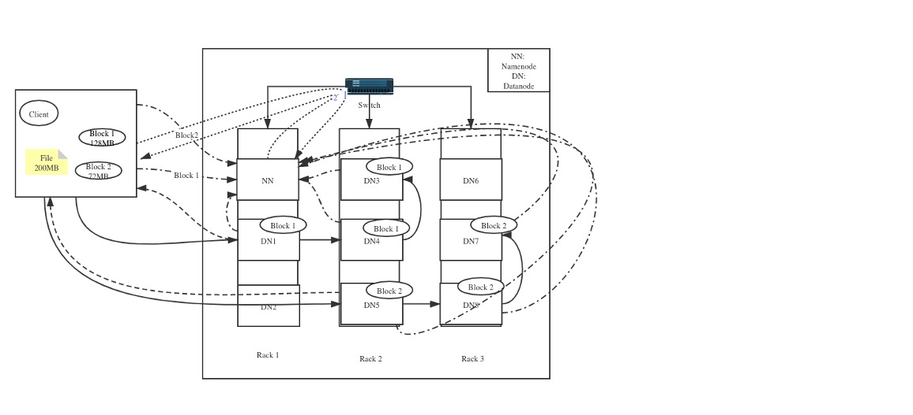
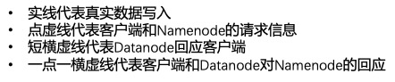

# 大数据技术[b,black,center]

> [TOC]

## 第一章：大数据简介与分布式系统[b,red]

### 第一节：大数据介绍[b,blue]

#### 一、大数据概览[b,black]

什么是**“大数据”** ？通常来说，我们用四个$V$去定义，即：
- Volume：即海量的数据规模
- Variety：多样的数据类型
- Velocity：快速的数据流转
- Value：数据中蕴含巨大的价值

#### 二、大数据处理及意义[b,black]

全球数据总量飞速上升，并且超过 80%的是无结构数据，而传统的数据通常是通过单机处理的，且处理的数据类型通常为结构化数据，当大数据时代来临后，数据规模越来越大，数据类型也越来越复杂，单机对于非结构化数据难以处理，无法储存海量数据，难以提取数据价值。大数据处理能够实现并行处理 ，多个机器一起 工作，可扩展能力强，因此处理速度迅速，可快速处理多种数据格式 ， 文本数据，音频数据

#### 三、大数据应用场景[b,black]

- 移动支付行业
    - 支付宝：欺诈行为检测
    - 微信：钱包理财推荐
    - 京东：白条用户违约分析
- 电商行业
    - 淘宝：个性化商品推荐
    - 拼多多：利用数据精准营销
- 视频行业
    - 抖音：用户短视频数据分析及推荐
    - Youtube：视频个性化推荐及广告精确推送

- - - - - 

### 第二节：分布式架构介绍[b,blue]

#### 一、单机架构[b,black]

所谓的单机架构，是一种最简单的架构，将所有的业务功能都在一个项目中，并且部署到一台服务器上，客户端所有的请求业务都由这一台服务器处理，如下图所示：
[center]
这样的简单架构存在诸多的缺点：
- 所有用户的需求都是一台服务器处理 ，无法满足大量的业务需求
- 所有业务功能（例如：用户管理 +订单+支付+物流）都只能由一台服务器处理 ，无法同时处理大量不同业务并且做业务切割
- 所有业务功能由一台服务器处理，当服务器发生故障时，所有业务将无法处理

#### 二、集群[b,black]
集群架构值的是将单机复制多份，这些单机就构成了集群，每一台服务器就叫做节点，每个节点都提供相同的服务
[center]
在集群架构中，负载均衡服务器非常重要，它能够接收并且处理所有用户请求，同时监控并且查看各个服务器节点的负载，调度用户请求 ，将用户请求发送 给负载小的服务器节点；因此集群机构的优势在于：
- 服务器处理业务需求的能力可以扩展（增加服务器节点）
- 可以处理大量的用户请求
但与此同时，集群结构也存在一定的瓶颈，主要表现为：
- 集群每个节点处理相同任务，每次扩张只是单一增加机器，无法将任务切割成小任务
- 任务本身复杂，简单增加机器无法解决，需要切割划分任务，这是集群架构无能为力的

#### 三、分布式系统[b,black]

分布式系统有以下特点：
- 将完整的系统按照业务划分成各个子系统
- 每个子系统是一个服务
- 每个子系统都是独立部署，互相不受影响
- 服务之间可以互相通信

分布式系统成为主流架构的原因主要在于其子系统独立部署的特点以及高扩展性（可以无限扩张系统性能，性能不再是瓶颈）

- - - - - 

### 第三节：常见的分布式系统[b,blue]

#### 一、分布式存储系统[b,black]
分布式存储系统主要有两类：中间控制节点架构和完全无中心架构
##### 1、中间控制节点架构[b,black]
- 定义：以单独元数据（即描述数据的数据 (包含具体数据的路径，以及相关信息)）服务器为中间控制，具体数据存储服务器为分布式存储的架构存储
- 代表： Hadoop Distributed File System（HDFS）
- 架构图
[center]
从上图可以看出，用户在访问数据之前，必须先访问“元数据服务器节点”，通过元数据服务器节点，查询真实数据的信息，再又用户与数据服务器节点进行交互，HDFS中，元数据服务器节点称之为“NameNode”，而数据服务器节点称之为“DataNode”，其特点主要有以下两点：
- 用户进行数据读写时，先访问存储元数据的节点（NameNode），得到真正数据的储存信息后，去真正存储数据的节点（Datanode）进行读写
- .存储元数据的节点通常为单一的服务器节点，但是因为访问元数据节点的频率和访问量都相对数据节点较小，所以不太可能会出现性能瓶颈

##### 2、完全无中心架构[b,black]
- 定义：客户端通过设备映射关系计算出具体数据的位置，客户端直接与数据存储节点进行交互
- 代表：计算模式（Ceph）
- 架构图
[center]

- 流程介绍：客户端通过Mon服务通信，计算得到客户端需要写到的具体文件路径（注意：Mon服务在客户端和数据端都有，需要通过网络通讯保持信息的一致）
- 特点：
    - 与中间控制架构的相似，真实的数据都是分布式存储在各个服务器节点
    - 与中间控制架构的不同的地方在于，架构中没有类似于Namenode的中心节点，而是客户端通过设备映射关系计算出其读写数据的数据节点位置 ，从而直接访问数据存储节点

#### 二、分布式计算系统[b,black]

分布式计算系统主要介绍三类，即：
- Hadoop Map Reduce
- Spark
- Flink

##### 1、Hadoop Map Reduce [b,black]
- 定义：一种大数据编程模型，将数据处理运用*Map*和*Reduce*的概念进行**分而治之**的处理
- 理念：分而治之，将大任务划分成小任务
- 应用场景：批处理（一次性处理数据）
[center]

- 优点：实现了分布式计算
- 缺点：中间结果都存放在硬盘，导致无法实时查询中间过程结果，因此效率一般，因为这个原因，导致无法进行迭代计算，只能应用于批处理，对于机器学习领域非常不友好

##### 2、Spark[b,black]
- 定义：基于内存优化的分布式大数据计算框架
- 理念：分而治之，将大任务划分成小任务，引入RDD概念
- 应用场景：批处理(效率最好) +流处理（Spark中的流处理不是真正的流处理，而是一种微笑的批处理）
- 应用程序流程图
[center]

##### 3、Flink[b,black]
- 定义：分布式大数据处理框架，真正实现了对流数据进行计算
- 理念：实时处理
- 应用场景：流处理
[center]
- 应用程序流程图
[center]
从上图中可以看出，与Spark，MapReduce相同，Flink也有一个管理器：JobManager，负责任务的调度

**MapReduce、Spark、Flink对比：**

```table
\  | MapReduce  | Spark | Flink 
应用场景 | 批处理 | 批处理+实时处理 | 实时处理
效率 | 中间结果在硬盘，效率一般 |  提供内存优化，批处理效率最好，实时处理为微型批处理 | 真正的实时处理效率最高的开源框架
功能性 | 无法交互式查询 | 可以交互式查询，进行机器学习 | 可以实时进行状态交互式查询
支持语言 | Java，C++ | Java,Scala,Python,R | Java,Scala,Python,R
扩展包 | HDFS，YARN | Spark Graph, Spark ML | Flink Sql

```

#### 三、分布式消息队列系统[b,black]

分布式消息队列系统以**Kafka**为典型代表，它是一个分布式消息队列。具有高性能、持久化、多副本备份、横向扩展能力。 如下图所示，Kafka的特点为**生产者**往队列里写消息，**消费者**从队列里取消息进行业务逻辑

[center]
这里的Broker是存储数据的服务器，可以做备份；如下图所示，Kafka通过Topic定义特定的消息， 可以让生产者和消费者都从 该Topic中进行数据读写，同时一个Topic可以分成好几个分区，这样每个分区就可以在不同的Broker上进行备份
[center]

#### 四、分布式机器学习系统[b,black]
机器学习中最具有代表性的是**Spark ML**，还有一种分布式**TensorFlow**

##### 1、Spark ML[b,black]
- 定义：以Spark 为计算引擎的分布式机器学习框架
- 特点：提供一个分布式的模型训练环境，也能提供一个训练数据集分布式处理的环境

##### 2、分布式 TensorFlow[b,black]

[center]
如上图所示，分布式 TensorFlow 是在分布式集群进行训练，首先创建一个集群$W_1,\ldots, W_n$，然后将任务发送到$W_1$，$W_1$将任务发送给其他的节点，然后进行分布式的计算

- - - - - 


## 第二章：Scala与sbt构建工具[b,red]

### 第一节：Scala 基础[b,blue]


#### 一、Scala 简介[b,black]

- **Scala**是一门基于编译的多范式编程语言，问世于2003年，由*Martin Odersky*和其研究组发明，可快速并且高效运行在Java虚拟机中
- **Scala**语言的特点：
    - 面向对象语言：Scala是一种纯面向对象的语言，每个值都是对象，对象的数据类型以及行为由类和特质描述
    - 函数式编程：Scala也是一种函数式语言，其函数也能当成值来使用
    - 静态类型：Scala具备类型系统，通过编译时检查，保证代码的安全性和一致性
    - 扩展性和并发性：Scala使用Actor作为其并发模型

#### 二、Scala 数据类型和结构[b,black]

```table
数据类型 | 描述
Byte | 8位有符号补码整数。数值区间为 -128 到 127
Short | 16位有符号补码整数。数值区间为 -32768 到 32767
Int | 32位有符号补码整数。数值区间为 -2147483648 到 2147483647
Long | 64位有符号补码整数。数值区间为 -9223372036854775808 到 9223372036854775807
Float | 32 位, IEEE 754 标准的单精度浮点数
Double | 64 位 IEEE 754 标准的双精度浮点数
Char | 16位无符号Unicode字符, 区间值为 U+0000 到 U+FFFF 字符序列
String | 字符序列
Boolean | 布尔变量
Unit | 表示无值，和其他语言中void等同，用作不返回任何结果的方法的结果类型，Unit只有一个实例值，写成()
Null | null或空引用
Nothing | Nothing 类型在 Scala 的类层级的最底端;它是任何其他类型的子类型
Any | Any是所有其他类的超类
AnyRef | AnyRef类是Scala里所有引用类(reference class)的基类
```


#### 三、Scala 方法和函数[b,black]

 - Scala 方法是类的一部分，而函数是一个对象，可以赋值给一个变量； 换句话来说在类中定义的函数即是方法，在Scala中，用`val`定义函数，用`def`定义方法
- 方法声明：`def functionName ([参数列表]) : [return type]`，例如：
```scala
def sumInt( a: Int, b: Iny): Int = {
    var sum:int=0
    sum = a + b
    return sum
}
```

#### 四、Scala 类和对象[b,black]
类是对象的抽象，而对象是类的具体实例。类是抽象 的，不占用内存，而对象是具体的，占用存储空间

```scala
class Point(xc: Int, yc: Int) {
	var x: Int = xc
	var y: Int = yc
	def move(dx: Int, dy: Int) {
		x = x + dx
		y = y + dy
		println ("x 的坐标点：" + x)
		println ("y 的坐标点：" + y)
	}
}

object Test {
	def main(args: Array[String]) {
		val pt = new Point(10, 20)

		// 移到一个新的位置
		pt.move(10, 10)
	}
}
```
### 第二节：sbt简介[b,blue]

$SBT$全称：*Simple Build Tool*，是 Scala 的构建工具， 类似 Maven 或 Gradle，关于$SBT$的入门介绍，参考[此网站](https://www.scala-sbt.org/1.x/docs/zh-cn/Getting-Started.html)

#### 1、项目结构[b,black]


[center]

#### 2、sbt常用命令[b,black]

```table
命令 | 作用
compile | 编译项目
run | 先编译，后运行
tasks | 列出所有的task
clean | 删除编译后生成的target目录下的文件
update | 更新外部依赖
test | 运行测试代码
```

- - - - - 

## 第三章：分布式文件系统[b,red]


### 第一节：分布式文件系统简介[b,blue]
- 定义：所谓的**文件系统**，指的是一种存储和组织计算机数据的方法，利用抽象的文件和目录替代了电脑硬盘或者光盘使用数据块的概念
- 原理：文件系统将硬盘空间以块为单位进行划分，每个文件都占据若干块，然后在通过一个 文件控制块（File Control Block）记录每个文件占据的硬盘数据块
#### 1、单机式文件系统[b,black]
- 定义：单机式文件系统是指将文件存在本地或者一台服务器上的硬盘上，所有的文件都存储在同一个物理设备上
- 特点：
    - 文件都存储在一台机器上，用户可以直接进行访问
    - 文件系统的性能有限，可存储的文件大小以及被访问的频率有很大的限制
    - 无法自动进行备份，需要用户自己复制文件进行备份
    - 一般都是一个客户端进行访问

#### 2、分布式文件系统[b,black]
- 定义：分布式文件系统是将文件存储在不同的服务器上面，用户不能直接访问，而 是通过网络，利用特定的通信协议和文件服务器进行沟通
- 对比：单机式文件系统是用户直接访问，文件存储在一台机器；分布式文件系统用户通过网络，利用通信协议和文件服务器激进型沟通

###### 分布式文件系统的架构
分布式文件系统主要由**客户端**和**文件系统服务器**：
- 客户端
    - 多个客户端可以同时访问
    - 客户端不直接访问服务器，利用网络通信访问
- 文件系统服务器
    - 文件系统服务器是多个机器组成
    - 文件分布存放在不同的机器上面


[center]

#### 3、常见的分布式文件系统[b,black]

常见的分布式文件系统主要是**谷歌文件系统**（Google File System），后面的所有的分布式系统基本都源于此，它是由谷歌公司开发的，运行在Linux平台的分布式系统，主要组成部分为：**GFSMaster**和**GFS Chunkserver**：
- GFSMaster：客户端访问数据和写数据的时候，需要和Master主节点交互，来确定具体数据服务器的位置
- Chunkserver：真正文件存放的位置，文件存放在不同的机器中

#### 4、GFS 谷歌分布式文件系统[b,black]
[center]

### 第二节：HDFS详解[b,blue]

#### 1、HDFS 简介[b,black]
HDFS是Hadoop生态下的分布式文件系统，专门存储超大数据文件，为整个 Hadoop 生态圈提供了基础的存储服务，它来源于**谷歌文件系统**（GFS），是一种常用的大部分分布式文件系统，几乎所有的大数据计算引擎都支持与HDFS的交互。但需要注意的时候，由于HDFS是专门存储超大数据文件，因此，HDFS存在**“小文件”问题**

##### HDFS 设计原则[b,red]
- **硬件故障**：HDFS中的硬件失败应该是常态，并不是意外。因为一个HDFS可能包含大量服务器，每个节点可能会存在硬件故障。 所以， HDFS 需要检测故障、快速和自动回复数据
- **流数据访问**：HDFS是被设计用于批量处理 ，而非普通应用程序的用户交互。 设计重点应该在于支持高的吞吐量
- **大数据集**：HDFS 支持大文件，应该提供高带宽和可扩展的上百个节点，文 件大小应该在GB及TB以上
- **简单一致性原则**：HDFS的文件需要被多个用户多次读写 ，所以其需要一个**“一次写入多次读取”**的文件访问模型。 一个文件一旦创建，写入和关闭后就不再需要改变。 支持在文件的末端进行追加数据而不支持在文件的任意位置进行修改 
- **移动计算比移动数据更划算**：应用的计算在其要操作的数据附近执行那就会更高效。尤其是数据集非常大的时候 ，将最大限度地减少网络拥堵和提高系统的吞吐量
- **轻便的跨异构的软硬件平台**：容易从一个平台跨到另一个平台


- - - - - 


#### 2、HDFS 架构及重要组成部分[b,black]

HDFS的整体架构如下图所示：

[center]

从上图中可以看出，HDFS是一个**主从架构**的分布式 文件系统 ，主要由 Namenode 和Datanode 构成；客户端通过 Namenode 对真实的数据进行 管理客户端首先与Namennode进行交互，然后Namenode与Datanode进行交互，获得数据的具体位置，最后才是客户端与Namenode进行交互；HDFS的主要组成部分如下：
##### （1）Namenode[b,black]
- HDFS 集群必须拥有至少一个Namenode，是HDFS的大脑，其功能主要有以下五个：
    - 存储元数据信息
    - 管理HDFS的命名空间（文件的存储结构）
    - 管理客户端的访问权限
    - 管理Datanode中的文件块映射
    - 接收Datanode的心跳信息和文件块报告
- Namenode的存储机制：Namenode在启动时，会读取fsimage并且与日志文件：eidt logs合并，然后恢复到上次关闭时的状态，而在运行中，所有针对于Namenode的操作（例如元数据的读写）都会被写入到eidt logs，这样，在意外宕机重启后，可以恢复到之前的状态
[center]


##### （2）Secondary Namenode[b,black]

[center]

Secondary Namenode 不是Namenode，它是一个“备份主节点”，是为了更好的容错性，从上图中可以看出，其作用是作为Namenode的助手，把edit logs更新到fsimage中，然后在把fsimage合并，保持了fsimage的实时更新
##### （3）Datanode[b,black]

- HDFS 中真正存储数据的节点 ，通常来说一个 Datanode 指的就是整个集群中的一个节点
- 管理存储在 Datanode 中的数据和文件块，（虽然Datanode并不知道有文件具体有哪些文件块，但是Datanode知道文件块的位置以及数据 ）
- 对文件块进行创建 ，删除和复制(指令来自于 Namenode )
- 向Namenode 汇报文件块信息和节点状态（Datanode需要时刻汇报信息）
- 可以和客户端进行数据交互（大量的交互都发生在客户端和Datanode中，交流非常频繁）

##### （4）The File System Namespace——文件系统命名空间[b,black]

- HDFS 支持传统的文件分层结构，目录文件夹结构，用户可以在其中存储文件，例如：
    - hdfs://www.deepshare .com/demo/file1
    - hdfs://namenodehost/parent/child or /parent/child
- HDFS 命名空间和传统的单机文件系统命名方式很类似
- 任何有关 文件系统命名空间的操作 (新建目录，删除目录等)都是记录在 Namenode 里（fsimage或者eidt logs中）
- HDFS 命名空间的操作包括(打开，关闭以及删除目录文件，重命名目录文件)
- 命名空间的操作是由 Namenode 完成的

##### （5）File Block and Data Replication——文件块和数据复制[b,black]

###### <1> 文件块：一个文件可以可以被划分成很多个数据块
[center]
- 默认值是 128MB ，可以设置
- 文件的所有的 Block 都是同样大小的， 除了最后一个
- 数据块可以使存储变均匀（每个Datanode上的数据大小大致相同）
- 更容易进行故障恢复（只需要回复文件块，而非整个文件）
- 可以进行并行的读写
- 可以设置副本数目

###### <2> 数据复制
文件的**文件块大小**和**副本个数**（通常为3）可以设置
- HDFS 在写操作的时候就会创建多个副 本
- Datanode 会定时发送心跳信息给 Namenode 报告本节点的数据块信息
- 收到 Datanode 的心跳信息和报告说明 Datanode 是正常工作的
[center]

##### （6）Data Replication——数据复制原理[b,black]

复制准则
- 同一个机架（Rack）的 Datanode 数据传输速度会好过跨机架传输
- 副本要放在不同的机架中，防止整个机架损坏后，数据仍然不会丢失
- 如果复制因子是 3, 也就是存放三份的时候，一般将两份放在同一机架的不同的 Datanode 第三份放在另一个机架的  Datanode 之中
[center]

##### （7）节点交流协议[b,black]
- HDFS 各个部分的信息交流协议是基于 TCP/IP之上的
- 客户端和 Datanode 会建立对应的连接
- RPC（远程过程调用）
    - 客户端：客户端协议
    - Datanode: Datanode 协议
- Namenode：只回应 RPC request（不主动请求访问）
[center]
#### 3、HDFS 读写操作[b,black]

##### （1）HDFS写操作[b,black]
[center]
场景：一个文件 200MB，客户端需要将该文件写到 HDFS 上。HDFS 配置：HDFS 分布在三个机架 Rack1, Rack2 和 Rack3 写入配置：文件被分成 128MB 和 72MB 的两个数据块，复制三份

- 第一步：客户端将该文件分成 128MB 和 72MB 的两个 Block, block1 和 block2
- 第二步：
    - 客户端向 Namenode 发送数据写入请求，点虚线1
    - Namenode 节点记录数据节点信息，并且返回可用的 Datanode，点虚线 2
    -  确定写入位置：Block1: DN1 DN3 DN4  Block2: DN5 DN7 DN8
- 第三步：
     - 客户端向 Datanode 发送 block1, 发送过程是流式写入，将 128MB 的 block 按照 64k 的传输包划分
     - 将第一个传输包发送个 DN1, DN1 接受完第一个传输包后，将该传包发送给 DN4, 同时客户端向 DN 发送第二个传输包
     - DN4 接收完第一传输包后，向 DN3 传送第一个传输包，同时接收从 DN1 发来的第二个传输包
     - 此重复，直至 block1 发送完毕
     - DN1, DN4, DN3 向 Namenode 发送消息，DN1 向客户端发送消息，说明 block1 已经传输完毕
     - 客户端收到 DN1 的消息后，向 Namenode 发送消息，说明 block1 已经写完了。到此为止，block1 正式写完
     - 依照以上原理，将 bock2 写入 DN5, DN8, DN7, 写完后，DN5, DN8, DN7 告诉 Namenode 已经写完，DN5 告诉客户端已经写入完毕
     - 客户端会告诉 Namenode，已经写完 bock2, 至此整个文件已经写入完毕
- - - - - 
- Namenode 选择原理
    - 客户端在 datanode 上，第一个副本和客户端相同的节点，第二个副本不同机架上的节点，第三个副本是和第二个副本同一机架的不同节点
    - 客户端不在 datanode 上，第一个副本随机选择，第二个副本选择和第一个副本不同机架上的节点，第三个副本选择和第二个副本同一机架上的相同节点
- - - - - 
- 从上面写的步骤中可以看出，HDFS的写入操作有以下特点：
     - 文件大小 200MB，副本 3, 存储需求 600MB，网络流量带宽 600MB（仅仅是文件传输的带宽）
     - 如果一个 datanode 失效或者整个机架失效，HDFS 仍然可以保证数据的完整性 
     - datanode 不知道整个 HDFS 的状态，只知道本机的 Block 状态

##### （2）HDFS读操作[b,black]
相较于**“写操作”**，读操作更简单，主要的步骤为：
- 第一步：客户端向 Namenode 发送读请求
- 第二步：Namenode 查看元数据信息，返回文件 block 的位置 
    - Bock1: DN1 DN3 DN4  
    - Block2: DN5 DN7 DN8
- 第三步：Block 的位置是有先后序的，先读 bock1, 再读 block2；读取的条件是：先从本机架的 Datanode 上进行数据的读取，如果本机架上没有数据，则从就近的机架的 Datanode 中读取数据

#### 4、HDFS 特点[b,black]
- 经济高效：数据集中存储，经济高效（可以使用多个，但单个成本低廉的物理硬盘）
- 大存储高吞吐：分布式存储
- 容错性可靠性：多个副本，智能的存储方式（支持多备份操作）
- 可扩展性：添加Datanode （通过添加Datanode的方法扩展整个文件系统容量）
- 数据完整性：分布式存储，Datanode 定时汇报数据块状态
-  高可用性：一个Datanode，甚至一个机架故障后，数据仍然可以读取
- 耐用性：故障自我修复 ，数据再次复制， Namenode 也可以有备用节点进行恢复，数据迁移至经常访问的Datanode

- - - - - 
### 第三节：元数据管理[b,blue]

#### 1、元数据简介[b,black]

- 所谓元数据，是指**“描述数据的数据”**，主要是描述数据属性的数据，比如数据存储位置，数据 的编辑记录等
- 元数据的作用：
    - 存储真正数据的描述信息
    - 存储真正数据的位置和操作信息
    - 是为用户提供真正数据信息的接口
- 存储系统的元数据
    - 传统数据库（MySqL）：数据库中的信息，表的属性以及属性的类别等
    - 分布式存储系统：数据的位置，数据的编辑记录，数据的存储目录等
    - Hive（数据仓库工具）：数据仓库中表的信息，表的属性以及表中数据的位置信息
#### 2、分布式储存系统的元数据管理[b,black]

分布式储存系统的元数据管理主要有三类：中心节点管理、分布式节点管理、无元数据节点管理

##### （1）中心节点管理[b,black]
[center]
- 中心节点管理元数据是通过单个 节点去管理元数据，该节点会存储元数据，也会向真正的数据节点发送指令进行相关操作。以普通的HDFS为代表，是应用最为广泛的一种管理方式
- 优点：
    - 数据集中式管理，会很方便地处理用户的数据请求任务
    - 由于元数据都存储在一个节点上，当发生元数据更新的时候，只需要更新该节点上的元数据即可
    - 单个节点易于管理和维护
- 缺点
    - 单个节点故障，整个存储系统不可用 ---- (备份节点)
    - 性能扩容，尽管用户对于元数据的访问量相比真正输入的访问量，要小很多， 但是理论上来说，仍然存在性能瓶颈。 ---- (提高该节点的性能)
##### （2）分布式节点管理[b,black]
[center]
- 分布式节点管理与中心节点管理最多的不同在于通过多个节点去管理元数据，不同的元数据节点会代表不同的命名空间 (文件目录)。以HDFS Federation作为代表
- 优点：
    - 在保证了元数据中心管理的同时，实现了分布式节点存储元数据
    - 根本上解决了性能和容量扩容的问题，理论上可以实现无限扩容
- 缺点
    - 除了数据节点以外，又维护了一个分布式的元数据节点，维护成本较高
    - 分布式元数据节点对于数据的一致性有极高的要求，如何元数据不一致，会导致数据存储出错
    - 所有的元数据节点都要管理和维护数据节点，在数据节点发生问题的时候需要对数据节点做出一致性的决策
    - 增加了用户使用文件系统的难度

##### （3）无元数据节点管理[b,black]
[center]
- 无元数据节点管理并无特别的元数据节点单独存储元数据，客户端使用算法进行计 算相关数据地址。以Ceph作为代表
- 优点：
    - 无单独的节点存储元数据，系统的扩容性相对来说较强
    - 寻址算法的所需要的参数相对来说比较简单，易于计算，并且可以进行缓存
- 缺点：
    - 对于一个现有集群进行更新的时候，客户端需要重新进行计算数据地址
    - 数据地址相对来说较为固定，所以当某个区域的数据发生故障后，重新更新恢复会有较大的难度

#### 3、HDFS元数据管理[b,black]

##### （1）HDFS元数据管理架构[b,black]
[center]
从上图中可以看出，HDFS是利用Namenode进行远数据管理的，HDFS的元数据包括HDFS的文件和目录结构，以及对应的属性。元数据负责与Datanode和Client之间进行交互，而Secondary Namenode负责为Namenode备份

##### （2）HDFS元数据内容[b,black]
- 文件名称，地址，权限，所属者
- 文件的命名空间
- 数据块ID,数据块信息，数据块地址
- 副本个数

##### （3）HDFS元数据持久化储存[b,black]
HDFS元数据持久化储存是通过**“fsimage”**和**“edit file”**实现的
- fsimage：某个时间点的整个文件系统的状态，也就是某个时间点的Namenode的快照。 $T_1$时刻，Namenode的快照为fsiamge1，$T_2$时刻做了一些文件系统的修改，修改ID为1，那么可以说$T_2$时刻，Namenode的快照为 fsimage2，即“fsimage2 = fsimage1 + ID为1的修改”；但是需要注意的是，Namenode并不会实时去对fsimage进行更新，这部分的工作是通过Secondary Namenode实现的，Namenode只有在启动时采用去查看fsimage和edit file并进行合并，在运行过程中并不会进行合并的操作
- edit file：存储了文件系统的修改日志，每一次对于文件系统的修改都有一个修改的ID；根据最近的fsimage和edit file的修改日志，我们可以重现Namenode当时的状态
- 我们以一个例子来说明HDFS的持久化操作
    - $T_0$ 启动 Namenode，使用了初始的 fsimage0
    - $T_1$ 发生了一次修改，修改 ID 为 1, 如果我们此时使用 checkpoint，那么新的 fsimage1 = fsimage + 0
    - $T_2$ 又发生了一次修改，修改 ID 为 2, 如果此时 Namenodei 死机，我们并没有及时Checkpoint 第二个修改，那么在重启后，我们可以利用 fsimage1+ edit file（包含修改 ID 为 2 的记录）重现 Namenode 死机前的状态

##### （4）HDFS元数据节点的可用性[b,black]
HDFS元数据节点的可用性与稳定性有以下两种方式保证：
s
- Secondary Namenode：其原理如下图所示，Secondary Namenode 可以帮助  Namenode 进行恢复，但是如果  Namenode 出现问题，需要手动进行恢复
[center]
- Standby Namenode：Standby Namenode 的工作原理与Secondary Namenode不同，如下图所示，Standby Namenode和主Namenode 共享相关的编辑日志，并且接收 Datanode 的报告，如果主  Namenode 发生了问题，系统会自动切换到 standby Namenode
[center]


